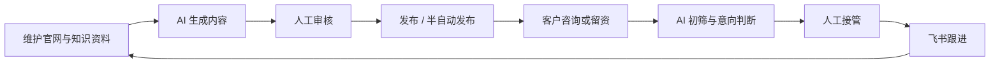
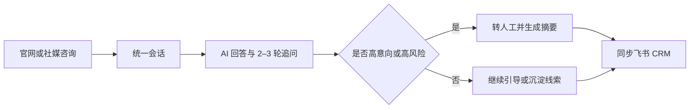

# IVYBM CMS 管理后台 UI 重设计——设计师背景简报

版本：v2.3

日期：2026-07-30

用途：产品设计 / UI 设计 / 交互设计背景输入
项目阶段：一期开发中，后台 UI 进入重新设计阶段

---

## 1. 给设计师的项目摘要

IVYBM 是一套服务建材出海业务的小团队 AI 获客运营系统。它不是单纯的内容管理 CMS，也不是完整 CRM，而是把以下业务串成一条闭环：

> 维护海外官网内容 → AI 生产社媒内容 → 人工审核并发布 → 海外客户咨询 → AI 初筛意向 → 人工接管 → 线索同步飞书持续跟进。

当前底层使用 Payload CMS 管理数据、身份、权限、草稿、版本、多语言和文件，功能可靠，但原生后台仍偏“Collection 列表 + 表单”的技术型 CMS。运营人员在处理会话、线索、审核、发布和异常时，需要频繁跳转、理解内部数据表，并且缺少跨业务对象的上下文。

本轮设计目标是建立“Payload 控制平面 + 自研模块化运营门户”的单一一期产品体验：

- `/dashboard` 是 Admin、Operator、Sales 的日常运营入口，按照本设计稿实现完整 Shell 和模块化工作区；
- Payload Auth、RBAC、数据模型、领域服务和 PostgreSQL 继续作为唯一后端；
- Payload 已有 `/admin` 在新版迁移验收前继续供受限维护人员使用，第一阶段不设计、不导航、不新增 UI，也不作为 Portal 产品回退；验收后再决定维护或下架；
- Portal Core 先统一登录、首页、导航、状态、错误、响应式和 UI contract，业务模块随后按 owner 挂载；
- 所有业务写操作仍必须经过现有 access control 和领域服务，UI 不直接改权威状态、审计字段或平台凭据。

设计师应把它理解为“面向 1–5 人出海团队的轻量 AI Revenue Operations 工作台”，而不是“大而全的企业 SaaS”或“普通文章发布 CMS”。

---

## 2. 系统要解决的业务问题

客户当前的核心问题有五类：

1. **官网内容难以持续维护**：需要运营人员自主维护英文 / 阿语产品、案例、文章、下载资料和 SEO 信息。
2. **咨询分散且容易漏掉**：官网、Facebook Messenger、Instagram DM 需要进入统一会话入口；TikTok 私信当前为 `blocked`，只能显示真实阻塞状态，不能设计成已接通渠道。
3. **业务员接手信息不完整**：AI 需要先回答 FAQ、追问项目背景、判断意向，并把摘要和线索交给人工。
4. **社媒内容生产和发布效率低**：运营需要基于产品资料生成英文 / 阿语内容，经人工审核后再发布或进入半自动发布流程。
5. **异常和平台限制不可见**：平台授权、索引、任务、同步、发布可能失败或受外部审核阻塞，需要明确的状态、原因和恢复动作。

一期成功不等于“所有平台全自动”，而是小团队能稳定完成以下两条闭环：





---

## 3. 核心用户与权限边界

### 3.1 Admin——系统管理员

目标：掌握全局状态、查看配置与能力状态、处理异常；技术配置继续走受限维护流程。

需要：

- 查看全部业务队列和系统异常；
- 查看本人账户、模块可用性、AI / 平台 readiness 和安全设置摘要；
- 查看任务、审计和失败原因；
- 处理危险操作时获得明确确认和结果反馈。

第一阶段 `/dashboard` 不提供用户 / 角色、AI 供应商 / 模型密钥、平台凭据等技术后台配置。
这些能力继续由受限维护人员在既有 `/admin` 中处理；Portal 只消费服务端过滤后的状态和安全摘要，
不得提供 `/admin` 深链或回显 token / key。

### 3.2 Operator——运营人员

目标：维护官网和知识资料，处理会话，生成 / 审核 / 发布内容。

需要：

- 管理页面、产品、案例、文章、下载和媒体；
- 管理知识文档与提示词；
- 处理会话、人工接管和线索；
- 生成、审核、排期和查看发布结果；
- 看到配置受限，但不能接触用户管理、密钥、平台 token 和系统级任务管理。

### 3.3 Sales——销售人员

目标：快速理解并处理分配给自己的高意向客户。

需要：

- 只看到分配给自己的会话和线索；
- 查看 AI 摘要、客户上下文、意向等级和历史消息；
- 在人工接管后回复并解决会话；
- 查看必要的飞书同步 / 跟进状态；
- 不能认领或改派他人会话，不能管理内容、模型、平台和系统配置。

### 3.4 权限设计原则

- 页面隐藏不等于授权，服务端权限才是最终依据；
- 无权限动作应不显示或禁用，并给出原因，不能只在点击后报错；
- Sales 的“我的”是数据级范围，不是简单菜单差异；
- 平台 token、模型 key、Job payload、完整审计敏感信息不应出现在业务工作台；
- 任何接管、发布、重试、删除等高风险动作都要有操作者、结果和审计反馈。

---

## 4. 目标产品结构

运营门户 `/dashboard` 沿用五个稳定导航分组：Workspace、Content、Intelligence、Operations、System。
Portal Core 通过静态 module registry 注册菜单、owner、角色、成熟度和可用状态；只有在服务端权限允许时，
对应模块才显示。内部维护入口不出现在 Portal 菜单或设计稿中。

```text
Operations Portal /dashboard
├── Workspace
│   ├── Operations Dashboard
│   ├── Conversations（xuemusi）
│   └── Leads（jueyunai）
├── Content
│   ├── 页面
│   ├── 产品 / 产品分类
│   ├── 项目案例
│   ├── 新闻文章
│   ├── 下载资料
│   ├── 媒体素材
│   └── AI 内容工作台 / 审核 / 发布任务准备（jueyunai）
├── Intelligence
│   ├── 知识文档 / 知识切片（xuemusi）
│   ├── 提示词模板
│   └── AI 调试与模型 readiness（xuemusi；敏感配置不进入 Portal）
├── Operations
│   ├── 统一会话 / 人工接管（xuemusi）
│   ├── Lead Sources（jueyunai）/ Platform readiness（xuemusi）
│   └── Jobs / Audit Logs（按角色与权限）
└── System（admin）
    ├── 本人账户与安全设置摘要
    ├── 模块可用状态 / 责任人 / 下一步
    └── Site Settings 安全只读摘要
```

P1 模块包括内容审核、发布排期、平台 readiness、飞书同步和异常补偿。它们不改变底层权限和领域服务；
内容审核/发布依赖正式结构，飞书同步依赖 Task 10/11。完整 Pipeline、Cmd+K 和 AI Copilot 仍是 Future。

### 导航原则

- 以任务和业务对象命名，不直接暴露 `Jobs`、`Handoffs`、`VisitorSessions` 等内部表名；
- 默认首页随角色变化：Admin 看全局，Operator 看运营队列，Sales 看“我的会话与线索”；
- `/dashboard` 是第一阶段唯一产品入口；内部维护能力不进入 Portal 导航或任务流；
- 全局搜索 / `Cmd + K` 属于 Future 交互，可优先探索“找客户、找会话、找内容、跳转功能、创建常用对象”，危险动作不建议直接在命令面板执行。

---

## 5. 功能地图与页面设计重点

### 5.1 工作台首页

首页只回答：“现在最应该处理什么？”

当前 Dashboard 第一屏只能把以下真实 read model 作为正式队列：

- 待接管会话；
- 进行中的人工会话；
- 新增 A 类高意向线索；
- 失败 / Dead 任务（Admin 可见）。

“待审核内容”“今日待发布”和排期 / 发布趋势依赖 Task 12 的正式结构与查询，设计稿必须标注为 `dependency-gated`，不得用伪造数量表现为已上线。

每个队列入口至少包含数量、紧急程度、最早或最近一条摘要、可复现筛选的深链。首页不能泄露完整对话、客户联系方式、任务 payload 或密钥。

第二屏可以为 Future / dependency-gated 状态探索今日排期、近期发布、需要人工补偿的异常和轻量趋势。图表不是主角；没有足够数据时，应优先使用数字、列表和明确空态，不做空洞的“大屏化”。

必须覆盖：全 0 空态、部分队列无权限、数据加载失败、管理员异常态、窄屏布局。

### 5.2 官网内容与 CMS

需要管理的公开内容均支持英文 / 阿语；中文只作为后台说明，不公开到网站。

| 对象     | 主要内容                                    | 关键设计点                                   |
| -------- | ------------------------------------------- | -------------------------------------------- |
| 页面     | 标题、slug、摘要、正文、Hero、SEO、内部备注 | 语言切换、草稿 / 发布、预览、SEO 完整度      |
| 产品     | 分类、封面、图库、规格、描述、SEO           | 高密度规格编辑、图库排序、语言对照、发布状态 |
| 产品分类 | 标题、slug、排序、SEO                       | 简洁管理、被产品引用提示                     |
| 项目案例 | 地点、应用、封面、图库、正文、SEO           | 图片优先、项目叙事、区域信息                 |
| 新闻文章 | 类别、发布时间、封面、正文、SEO             | 编辑体验、预览、计划发布时间                 |
| 下载资料 | 类型、文件、封面、启用状态、SEO             | PDF 识别、公开状态、文件版本                 |
| 站点设置 | Logo、导航、联系方式、社媒、默认 SEO        | 全局影响提示、谨慎保存                       |

核心交互建议：

- 列表 + 详情抽屉适合快速浏览；复杂富文本和多语言编辑仍可进入完整页面；
- 产品、文章等重要内容应显示 `draft / published`、最近更新人 / 时间、语言完成度；
- 英文与阿语不应混在同一个富文本内；编辑阿语时提供 RTL 内容预览；
- slug 跨语言稳定，格式为小写拉丁字母、数字和连字符；设计上不应暗示每种语言可独立修改；
- 发布前给出缺失图片 alt、SEO 标题 / 描述、必填翻译等完整度提示；
- 删除、取消发布、覆盖全局设置需确认，不使用乐观伪成功。

### 5.3 媒体素材库

目标是帮助运营找到“正确素材”，不是让长文件名占据整个页面。

建议提供：

- 网格 / 表格切换；
- 图片、PDF、视频素材索引的类型筛选；
- 缩略图、尺寸、来源 / 版权、公开状态、最后使用位置；
- 多选、批量设置、复制引用、预览和跳转编辑；
- 图片与 PDF 安全预览，视频一期只管理素材索引；
- 上传前后明确 MIME、大小限制和失败原因。

当前边界：图片最大 8MB，PDF 最大 20MB；支持 AVIF、JPEG、PNG、WebP、PDF；每项素材需要 alt 与来源；公开状态决定官网是否可匿名访问。

必须覆盖：空素材库、上传中、格式不支持、文件超限、单图预览、PDF 预览失败、不可公开素材、长文件名。

### 5.4 线索与客户

线索来源包括官网表单、AI 会话、社媒、人工录入等。主要字段有姓名 / 公司、国家、联系方式、来源、需求、状态、意向等级、负责人和 UTM。

状态：

- 跟进状态：`new / contacted / qualified / disqualified`；
- 意向等级：`unscored / A / B / C`；
- A 类通常代表高意向，建议优先人工接管。

建议同时提供两种视图：

1. **高效列表 / Data Grid**：用于筛选、比较和批量处理；
2. **Pipeline 看板（Future）**：只有在真实状态、查询和服务端转换守卫就绪后用于理解跟进阶段；看板列不得自行增加“已成交”等系统暂不存在的权威状态。

详情可在 Future 方案中采用 Master–Detail：左侧保留列表，右侧展示客户资料、需求摘要、来源、相关会话、意向依据、负责人、同步状态和允许的下一步。

重要限制：Sales 只能查看和更新分配给自己的线索；来源 URL / UTM / 幂等信息属于系统记录，不应被随意编辑。

### 5.5 会话中心

会话中心是高频工作区，建议采用三栏 Inbox：

- 左栏：筛选和会话列表；
- 中栏：消息流、AI / 人工身份、引用、发送和重试状态；
- 右栏：客户上下文、意向、相关线索、接管状态、审计时间线和下一步动作。

渠道范围：

- 官网聊天：一期确定可用；
- Facebook Messenger、Instagram DM：有条件接入；
- TikTok 私信：当前固定为 `blocked`，原因包括官方 schema、账号资格和地区开放限制；
- LinkedIn 私信、WhatsApp：不在一期自动会话范围。

权威接管状态：

```text
ai_active
  → handoff_requested
  → human_active
  → resolved
```

允许动作：

- `ai_active`：访客发送、请求人工；AI 可以回复；
- `handoff_requested`：Admin / Operator 可以接管；
- `human_active`：已授权人员可以人工回复和解决；AI 必须停止自动回复；
- `resolved`：当前会话不再继续，需要开始新会话。

必须覆盖：启动中、空会话、AI 回复及知识引用、访客消息、人工消息、请求接管、接管中、已接管、已解决、消息失败可重试、不可重试错误、限流、会话过期、无权限、重复点击幂等、发送结果未知。

高风险主题（价格、交期、MOQ、认证、付款条件）默认建议转人工，不能让界面暗示 AI 已做承诺。

### 5.6 知识库与 AI

知识库同时服务官网客服和内容生产。文档来源包括 FAQ、产品手册、技术规格、销售话术、项目案例等。

知识文档有两条并行状态：

- 审核状态：`draft / reviewed / archived`；
- 索引状态：`pending / processing / ready / failed`。

只有“已审核 + 索引完成”的内容可用于正式 AI；面向访客的客服还要求 `customerVisible = true`。

设计重点：

- 不把“审核”和“索引”合成一个模糊状态；
- 文档修改后需明确提示审核 / 索引可能被重置；
- `reviewed` 后提供受控的“开始索引 / 重新索引”动作；
- 索引失败显示可理解原因和恢复路径；
- 自动生成的知识切片以只读检查为主，不设计成普通 CRUD；
- 提示词模板已激活版本不可直接覆盖，应引导“创建新版本”；
- 模型供应商、模型配置、使用路由只对 Admin 可见，API key 只写不可读。

必须覆盖：未审核、待索引、索引中、已就绪、失败、模型未配置、Embedding 维度不匹配、密钥缺失 / 失效、AI 服务不可用。

### 5.7 AI 内容工作台、审核与发布

该模块是本轮需要设计、但部分后端仍未完成的未来主工作区。设计可先行，交互必须遵守真实状态机和平台能力边界。

核心流程：

```text
素材 / 知识来源
  → AI 生成英文 / 阿语文案、配图建议或视频脚本
  → 人工审核与事实核对
  → approved
  → scheduled / publishing
  → published / failed / delivery_unknown
```

一期发布平台：Facebook、Instagram、LinkedIn 图文。TikTok 发布、视频自动发布、WhatsApp 发布不在一期范围。

建议采用“列表 + 详情 + 状态时间线”，并根据任务补充日历：

- 生成视图：选择内容类型、平台、语言、素材和知识来源；
- 审核视图：对比原始素材、生成内容、事实来源和平台格式；
- 发布排期：只展示已批准内容；
- 记录视图：平台、账号、状态、计划 / 实际时间、结果和错误；
- 失败面板：区分可重试、不可重试、平台受阻和结果未知；
- LinkedIn 无自动发布权限时提供复制文案、素材包下载和人工发布 checklist。

严禁：未审核内容进入发布、把 mock / fixture 显示为已发送、把 `accepted` 显示为平台已发布、在 `delivery_unknown` 时自动重复发布。

### 5.8 平台账号与能力状态

平台账号由 Admin 通过受限内部维护流程管理，包含账号类型、外部账号 ID、授权状态、token 是否已配置 / 过期、消息 / 发布能力审核状态和说明。Portal V1 只展示无凭据 readiness、责任人和下一步；token 永远不回显。

需要表达的状态不是简单“已连接 / 未连接”，而是：

- `action-required`：缺少账号、token、授权、allowlist 或审核；
- `ready-for-controlled-test`：具备受控联调条件，但不等于 production 可用；
- `blocked`：官方 schema、资格、地区或 adapter 明确阻塞；
- `available`：只有真实账号、授权和受控环境完成目标操作后才可标记。

应让用户看见“下一步需要谁做什么”，例如甲方提供账号、管理员补录 token、等待 Meta 审核、开发者补 connector，而不是只显示红色失败。

### 5.9 飞书同步

飞书负责详细 CRM 跟进，IVYBM 不重复造完整 CRM。工作台只需呈现：

- 线索是否已同步；
- 飞书记录入口；
- 最近同步时间；
- 同步失败原因和重试 / 人工补偿；
- A / B / C 分级与下次跟进提醒摘要。

该模块尚未正式实现，设计时应避免构造复杂的 CRM、客户归属、提成或自动化营销功能。

---

## 6. 统一状态语言

状态必须同时使用文字、图标和语义色，不得只靠颜色。

| 领域     | 状态                                                                                       | 设计含义                                                              |
| -------- | ------------------------------------------------------------------------------------------ | --------------------------------------------------------------------- |
| 内容     | draft / published                                                                          | 草稿 / 已发布                                                         |
| 线索     | new / contacted / qualified / disqualified                                                 | 新增 / 已联系 / 已确认意向 / 无效或不匹配                             |
| 意向     | unscored / A / B / C                                                                       | 未评分 / 高 / 中 / 低                                                 |
| 会话     | ai_active / handoff_requested / human_active / resolved                                    | AI 服务中 / 待人工 / 人工处理中 / 已解决                              |
| 消息     | pending / sent / failed                                                                    | 发送中 / 已发送 / 失败                                                |
| 知识审核 | draft / reviewed / archived                                                                | 待审核 / 已审核 / 已归档                                              |
| 知识索引 | pending / processing / ready / failed                                                      | 待处理 / 处理中 / 可使用 / 失败                                       |
| Job      | pending / processing / succeeded / failed / dead                                           | 待执行 / 执行中 / 成功 / 失败 / 已停止自动重试                        |
| 平台授权 | not_started / pending / connected / expired / blocked / disabled                           | 未开始 / 处理中 / 已连接 / 已过期 / 受阻 / 已停用                     |
| 发布     | draft / review / approved / scheduled / publishing / published / failed / delivery_unknown | 生成中 / 待审核 / 已批准 / 已排期 / 发布中 / 已发布 / 失败 / 结果未知 |

设计应区分以下概念：

- “配置完成”不等于“平台可用”；
- “请求已受理”不等于“发布成功”；
- “AI 已生成”不等于“内容已审核”；
- “索引完成”不等于“可向客户展示”；
- “任务重试用尽”不等于数据丢失，而是需要人工补偿。

---

## 7. 关键设计原则

1. **任务优先于数据表**：让用户先看到待办、异常和下一步，而不是 Collection 名称。
2. **上下文留在原地**：列表与详情、消息与客户资料、内容与事实来源应尽量同屏。
3. **明确系统真相**：第三方条件受限、AI 不可用、发布结果未知时诚实表达，不伪造成功。
4. **渐进披露**：运营用户先看到业务信息，技术字段、审计和 raw 数据进入高级区域。
5. **动作可恢复**：失败应说明是否可重试、由谁处理、是否会重复产生副作用。
6. **高密度但不拥挤**：适合桌面运营，强调扫描效率、稳定网格和一致状态，不做空洞大卡片。
7. **危险动作保守**：删除、取消发布、改派、重试发布、清除凭据必须二次确认。
8. **AI 是助手，不是权威**：AI 摘要、建议回复、意向判断都要保留来源、可编辑性和人工判断空间。

---

## 8. 视觉方向与参考

### 8.1 已冻结的 Digital Lattice 视觉基线

`Industrial Precision / 工业精密感`、专业、克制、可信、材料感、结构清晰、高信息密度、现代 B2B SaaS。

Portal V1 的 canonical 视觉不再以早期探索色值为准，而以
[`ivybm-admin-portal-digital-lattice.pen`](../designs/ivybm-admin-portal-digital-lattice.pen) 及已落地 token 为准：

- 冷灰画布 `#F7F9FB`，白色 Surface `#FFFFFF`，石墨主文字 `#191C1E`；
- 深色侧栏 `#0F172A`，靛蓝 `#4F46E5` 作为主行动色；
- 成功、警告、危险、信息色只用于状态；
- IBM Plex Sans / IBM Plex Mono；
- 4px 控件圆角、8px 卡片圆角，字距统一为 `0`；
- 细边框优先，浮层才使用克制阴影；
- 避免大面积渐变、过度玻璃拟态、超大圆角和装饰性图表；
- 浅色与深色模式都使用语义 token，不做简单反相。

早期“深青绿、8px/12px 圆角”方向只保留为历史探索，不再作为实现或验收依据。

### 8.2 交互参考（参考方法，不照搬视觉）

| 参考产品            | 借鉴重点                                     |
| ------------------- | -------------------------------------------- |
| Linear              | 高密度导航、快捷键、命令面板、明确状态与焦点 |
| Intercom            | 三栏 Inbox、会话与客户上下文、人工接管       |
| HubSpot / Pipedrive | 线索列表、商机 Pipeline、客户详情层级        |
| Airtable            | 数据网格、字段筛选、视图切换、批量操作       |
| Buffer / Hootsuite  | 内容审核、发布排期、平台状态和失败反馈       |
| Notion              | 知识文档编辑、内容结构和渐进披露             |
| Stripe Dashboard    | 配置状态、错误可恢复性、技术信息的层级       |

不建议直接以 Payload Admin、Directus Studio 或传统 ERP / CRM 作为视觉目标。本项目已验证，更换通用 CMS 并不能解决高频运营工作流问题。

### 8.3 已探索的三个视觉方向

三套视觉稿已作为研究素材归档在仓库外，不进入 Git。后续设计应以方向 A 为主线，B / C 只用于比较取舍，不能把三套方向同时发展为产品主题。

| 方向 | 核心特征 | 适用性与取舍 |
| --- | --- | --- |
| A. 工业精密 / Digital Lattice（已采用） | 冷灰画布、白色面板、石墨文字、深色侧栏与靛蓝行动色；细边框、克制层级和清晰网格 | 已冻结为 Portal V1 canonical 方向，最适合高密度、长期生产使用 |
| B. 石墨指挥舱 | 深石墨导航配浅色主画布，强化关键数字和异常 | 对 Admin / Operator 的“运营中枢”感更强，但需限制深色面积，避免压迫和过度科技化 |
| C. 编辑型工作台 | 更轻、更通透，强调任务、排期和团队协作 | 内容运营体验友好，但密度较低，需要额外提高系统异常的视觉权重 |

共同约束：桌面基准 1440px，并覆盖 1280px 与 768px；中文后台为主，英文 / 阿语是内容语言；正文不小于 14px；状态同时使用文字、图标和颜色；避免大面积渐变、玻璃拟态、夸张阴影和过度圆角。

---

## 9. 多语言、响应式与可访问性

### 后台语言

- 后台 UI 支持中文 / 英文；
- 公开内容 locale 为英文 / 阿语；
- 编辑阿语内容时提供 RTL 字段 / 预览，但后台整体导航不随内容语言自动翻转；
- 不在组件中硬编码中文，所有文案需进入翻译层。

### 响应式

- 核心使用场景是 1280px 以上桌面；
- 需要覆盖常见笔记本宽度和 768px 窄屏；
- 手机端优先支持查看状态、处理紧急会话和基础审批，不要求完整 Data Grid / 大型内容编辑；
- 三栏 Inbox 在窄屏应渐进为列表 → 对话 → 上下文的可返回层级。

### 可访问性

- WCAG 2.2 AA；正文对比度至少 4.5:1；
- 所有操作可键盘完成，焦点清晰；
- Dialog / Sheet 正确管理焦点并返回触发点；
- 状态不只靠颜色；
- 触控目标至少 44px；
- 动效 120–180ms，并支持 `prefers-reduced-motion`；
- 长文本、阿语、客户名称和平台错误不能造成布局溢出。

---

## 10. 当前实现成熟度

设计稿应区分“已有真实功能”“有条件功能”“未来功能”，避免把未实现能力画成已上线事实。

### 已有可靠后端 / 前台能力

- 英文 / 阿语官网内容 CMS、草稿 / 发布、媒体、SEO；
- 询盘入库、幂等、限流和多状态表单；
- 线索模型和 A / B / C 意向；
- 知识文档、审核、切片、向量索引、AI 网关；
- 官网 AI 客服、知识引用、高风险转人工；
- 会话、消息、人工接管权威状态机；
- Jobs、重试、Dead Job 和 Admin 手工重试；
- Meta 入站连接器的签名、幂等、队列和 readiness 基础；
- Payload `/admin` 的自有侧栏和基础 Operations Dashboard 已存在，但只作内部维护遗留能力，不是本轮设计目标；其中的安全查询可作为 Portal read model 的事实参考。

### 有条件或部分完成

- Facebook Messenger / Instagram DM 仍依赖真实账号、授权和 App Review；
- TikTok 私信当前固定为 `blocked`，不应显示为可用、待连接或即将上线；
- 平台发布已有 contract / fake 和 LinkedIn 人工辅助包，但真实发布任务、回调和持久日志未完成；
- 真实 AI 生产质量仍依赖正式知识资料、模型配置和评测；
- 线上生产联调、最终验收和备份恢复仍未完成。

### Portal 当前实施状态（2026-07-30）

- D0 本地开发门禁已通过：独立 worktree、端口、Compose project、PostgreSQL、开发库、volume/network 和本地密钥已完成隔离；本地与 CI 均禁止连接 production；
- P0.1 静态 module registry、owner/角色/路由/成熟度、总开关和模块开关已完成；
- P0.2 Digital Lattice token、Tailwind/shadcn Portal 范围隔离和首批 UI primitives 已完成；
- P0.3 Payload session、自研登录/登出和 `/dashboard` 受保护路由已完成定向验证；
- P0.4 Shell、角色导航、账户菜单和基础设置 Hub 已完成实现与 checkpoint 验收；首页和业务模块继续按 Implementation Plan 推进。

本地 app、migration、seed、E2E、worker 和脚本只允许使用该 worktree 的独立开发库或 `_test` / `_ci`
测试库，不得连接 production PostgreSQL，也不得读取 production media、uploads、备份、URL 或真实 token。

### 尚未正式实现或仍受依赖限制

- 飞书 CRM 同步与提醒；
- 完整 AI 内容工作台、内容审核和发布排期；
- `PublishJobs` / `PublishLogs` 的正式后台流程；
- 社媒 AI 自动出站与 `delivery_unknown` 人工补偿界面；
- 后续角色首页、官网内容、素材、知识、会话、内容工作台、平台 readiness 和线索页面仍按 checkpoint 实现，不应在设计稿中表现为已交付。

设计可以覆盖未来状态，但需在 Figma 标注“P1 / Future / dependency-gated”，便于研发分阶段实现。

---

## 11. 一期明确不做

- 多企业多租户 SaaS；
- 替代飞书的完整 CRM；
- 电商下单、支付和订单管理；
- 全球客户数据库采购；
- 广告投放代运营；
- 大规模 Email 营销；
- 客户归属、提成和复杂审批；
- 完全无人审核自动发布；
- 智能混剪、视频自动生成 / 转码 / 发布；
- TikTok 图文 / 视频发布；
- LinkedIn 私信自动化；
- WhatsApp 系统接入；
- 绕过平台权限、验证码、审核或账号风控；
- 在 UI 中直接展示或编辑平台 token、模型 key、数据库内部字段。

---

## 12. 建议优先设计的页面与顺序

### P0：先建立 Portal Core，再按 owner 挂载模块

1. `/dashboard` 自研登录、Payload session 复用和服务端角色守卫；
2. Portal Shell、静态模块 registry、五组导航、Header、账户入口和通用状态；
3. 基于真实四类队列的 Admin / Operator / Sales 角色首页；
4. 官网内容 Hub、产品/案例/文章入口；未实现的复杂编辑显示明确受阻态；
5. 媒体素材库网格 / 预览；
6. 知识文档、审核/索引和 AI 调试模块（xuemusi）；
7. 会话中心三栏 Inbox 与 AI 客服模块（xuemusi）；
8. 线索列表与详情；Pipeline 在真实状态和查询就绪前标为 Future。

### P1：补齐内容获客和平台状态

9. AI 内容生成工作台（jueyunai）；
10. 内容审核详情；
11. 发布排期和发布记录；
12. 平台账号 / readiness；
13. 飞书同步状态；
14. 系统异常 / Job 人工补偿。

全局 `Cmd + K`、完整 Pipeline、复杂 Data Grid、AI Copilot 和装饰性图表属于 Future，
不进入当前 P0 基座承诺。

### 设计交付建议

- 先交付低保真 IA 和 5 条关键任务流，再进入视觉；
- 建立基础组件、语义状态和密度规范；
- 高保真至少覆盖桌面 1440px、笔记本 1280px、窄屏 768px；
- 同一页面必须给正常、空、加载、失败、无权限和受阻状态；
- 对话、发布、平台 readiness 应提供可点击原型；
- 标注哪些字段由系统只读、哪些动作受角色限制、哪些页面是未来依赖。

---

## 13. 设计验收建议

设计方案应能回答以下问题：

1. Admin、Operator、Sales 登录后，10 秒内是否知道自己最该处理什么？
2. Operator 能否在 `/dashboard` 完成第一阶段日常工作，且未实现能力能否诚实显示受阻和下一步？
3. Sales 是否只看到自己的会话和线索，并能在同一上下文中完成回复 / 解决？
4. 用户能否清楚区分“待审核、已批准、已受理、已发布、失败、结果未知”？
5. 平台被审核、账号、token 或地区限制时，是否能看懂下一步责任人和动作？
6. 英文 / 阿语内容编辑是否清晰，阿语 RTL 是否不会破坏后台布局？
7. 复杂列表、长内容、长错误和窄屏下是否仍可扫描和操作？
8. 危险动作、重复点击和失败重试是否不会造成用户误判或重复副作用？
9. 视觉是否体现专业、克制和工业精密，而不是通用模板或消费级 App？
10. 设计是否允许按 P0 / P1 分阶段实现，而不依赖所有未来模块同时完成？

---

## 14. 设计前仍需补充的素材

以下输入不阻塞低保真方案，但在高保真视觉定稿前需要确认：

- 后台最终产品名和 Logo 组合方式；
- Portal 产品品牌与官网品牌的色彩关系；Portal 交互主色已冻结为 Digital Lattice 靛蓝；
- 设计师可使用的正式产品、案例、工厂图片；
- 中文 / 英文后台文案语气；
- 运营人员日常设备分布和最常用分辨率；
- 真实运营团队人数、各角色人数和任务频率；
- 是否需要正式深色模式；
- Future `Cmd + K` 若进入实施范围时的首批命令清单；
- Pipeline 是否只映射现有状态，或业务确认新增成交阶段后再扩展；
- 平台与飞书模块在一期高保真中的展示优先级。

在这些信息确认前，设计师可以先用本简报给出的业务对象、状态和角色完成 IA、任务流和低保真原型。

---

## 15. 附录：核心业务对象速查

| 对象                                       | 设计中最重要的信息                                        |
| ------------------------------------------ | --------------------------------------------------------- |
| User                                       | 角色、账号状态、本人 / 他人数据范围                       |
| Page / Product / Project / Post / Download | locale、草稿 / 发布、媒体、SEO、更新时间                  |
| Media                                      | 预览、类型、尺寸、alt、来源、公开状态、使用位置           |
| Lead                                       | 客户、国家、来源、需求、状态、意向、负责人、相关会话      |
| Conversation                               | 渠道、接管状态、意向、负责人、摘要、最后消息时间          |
| Message                                    | 发送人、内容、引用、发送状态、错误                        |
| Handoff                                    | 来源、原因、申请 / 接受 / 解决时间、负责人                |
| Knowledge Document                         | 来源、语言、审核状态、索引状态、客户可见性                |
| Prompt Template                            | 场景、语言、版本、状态；激活版本不可覆盖                  |
| Platform Account                           | 平台、账号类型、授权、token 配置状态、能力审核、readiness |
| Job                                        | 类型、状态、重试、下次执行、最后错误、是否需人工补偿      |
| Generated Content                          | 语言、平台、内容、素材、事实来源、审核状态                |
| Publish Job / Log                          | 平台账号、排期、状态、结果、错误、是否可重试              |
| Feishu Mapping                             | 本地线索、飞书记录、同步状态、最后同步时间                |

---

## 16. 本简报的依据与实现约束

本简报综合了当前需求基线、技术架构、实施计划、后台改造方案、现有代码和自动化测试。设计阶段可以重新组织页面和交互，但以下约束必须保留：

- Payload CMS / PostgreSQL 继续作为数据、身份、权限和唯一控制平面；
- `/dashboard` 是第一阶段模块化运营门户；Payload 已有 `/admin` 在迁移验收前继续供受限维护人员使用，不属于设计或产品验收，验收后再决定维护或下架；
- Portal 页面和命令不得绕过服务端 access control；
- 会话接管必须经过 ConversationService；
- 发布必须经过 PublishingService，且未审核内容不得发布；
- 平台 token、模型 key 只写不可读；
- 当前未实现的 Collection / migration 不得为 UI 临时造替代结构；
- Portal Core 与 AI 内容工作台由 jueyunai 负责；知识/AI、AI 客服/会话、海外社媒账号/连接器和真实平台发布服务由 xuemusi 负责；
- 第三方平台状态必须诚实区分可用、受控测试、需要动作和受阻；
- 设计交付应明确 P0 / P1 / Future，支持研发渐进落地。
