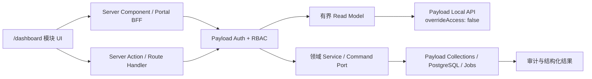
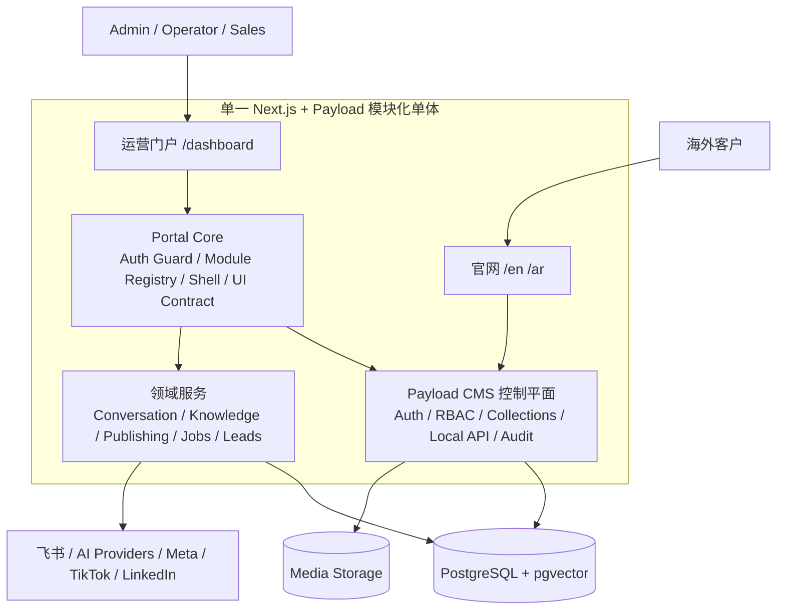
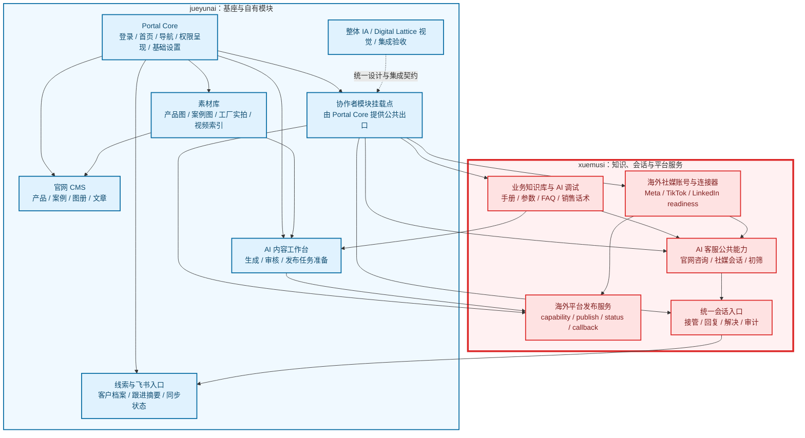

# ADR-0004：Payload 控制平面与模块化运营门户架构

## 状态

Accepted，2026-07-29；2026-07-30 补充明确 PR 任务边界、维护态术语、技术后台非一期范围和 Portal V1 十模块本地功能闭环。

Supersedes [ADR-0002](0002-admin-ui-composition.md) 中“`/admin` 是一期唯一后台入口”的决策。
ADR-0002 已落地的 Payload Nav、Operations Dashboard、账户菜单和安全约束继续保留。

## 背景

IVYBM 已经具备可靠的 Payload CMS / PostgreSQL 后端、认证、三角色权限、内容草稿与版本、
媒体、知识索引、AI 网关、会话状态机、线索、Jobs 和平台连接器基础。Payload 自带的
`/admin` 已作为内部维护入口存在，但高频运营流程仍然受 Collection 信息架构、跨页跳转
和 Payload UI 扩展边界限制。第一阶段不继续建设或设计这套内部界面。

新的 Pencil 设计稿覆盖登录、工作台、官网内容、媒体、知识库、内容生产、会话、平台状态、
异常补偿和响应式状态。直接继续改造 Payload DOM 会让设计系统受制于上游 Admin 结构；
完全重写后端、认证或数据模型又会复制已经可靠的能力并扩大安全风险。

团队同时存在明确的模块分工：门户基座、官网/CMS/素材/线索和 AI 内容工作台由 jueyunai 负责；
知识库、AI 客服、统一会话、海外社媒连接器与真实平台发布服务由 xuemusi 负责。
基座必须允许模块负责人独立迭代，同时保持统一视觉、权限和领域边界。

## 决策

### 1. 一个控制平面，一个一期运营入口

- Payload CMS、PostgreSQL、Auth、RBAC、Collections、migration、审计和领域服务仍是唯一后端与控制平面。
- `/dashboard` 是自研运营门户，服务 Admin、Operator、Sales 的日常任务。
- 第一阶段只设计、开发和验收 `/dashboard`；Portal 导航、模块注册和故障处理均不依赖 `/admin`。
- Payload 已有 `/admin` 在 `/dashboard` 迁移验收前继续供受限维护人员使用，不新增 UI、不进入 Portal 导航，也不作为 Portal 的业务回退路径。
- `/dashboard` 覆盖目标流程、权限、数据、回滚和运营培训并完成迁移验收后，再用单独决策决定 `/admin` 继续维护或下架；在此之前不得删除、破坏或降低其现有维护能力。
- 官网和 `/dashboard` 在同一个 Next.js / Payload 模块化单体中部署，不增加第二个服务、数据库或用户体系。

内部维护入口的存在不构成第二条一期产品体验线。

### 2. 门户基座采用编译期模块注册

新增一个项目自有的 Portal Core，负责：

- Payload session 复用、受保护路由和角色守卫；
- 左侧导航、Header、账户、语言、主题和响应式 Shell；
- 模块注册表、模块状态、功能开关和 Portal 内受阻/维护状态；
- 统一状态、错误、空态、加载、无权限和受阻体验；
- 共享 UI 组件、设计 token、可访问性和视觉回归契约；
- 结构化日志上下文和相关 ID 传递。

模块通过 TypeScript manifest 注册。注册表只描述导航和呈现，不是授权真相：

```ts
export type PortalModuleManifest = {
  id: string
  owner: 'jueyunai' | 'xuemusi'
  navGroup: 'workspace' | 'content' | 'intelligence' | 'operations' | 'system'
  href: `/dashboard/${string}`
  labelKey: string
  allowedRoles: Array<'admin' | 'operator' | 'sales'>
  availability: 'available' | 'dependency-gated' | 'blocked' | 'admin-only'
  featureFlag: string
}
```

Next.js 文件路由仍是页面真相；注册表负责菜单、状态和治理元数据。每个页面和命令必须在
服务端重新认证与授权。当前团队规模不建设运行时插件市场、动态代码加载或数据库驱动菜单。

### 3. 认证和权限只复用 Payload

- `/dashboard/login` 只做自研登录界面，调用 Payload Users Auth；不创建第二套用户表、密码、JWT 或 session。
- `/dashboard` Server Component / Route Handler 使用 `payload.auth({ headers })` 获取用户。
- Local API 面向当前用户读取时必须显式 `overrideAccess: false` 并传入正确的用户或请求上下文。
- 客户端隐藏菜单只改善体验；Collection access、字段 access、领域服务守卫和命令授权才是安全边界。
- 登录 return target 只允许 `/dashboard` 下的站内绝对路径；登出、过期 session 和角色变更必须在 Portal 内安全收敛。

### 4. 读取与写入分离



- 页面不直接把 Payload document 当长期 UI contract；模块先映射为最小 DTO。
- Dashboard、列表和搜索必须有字段白名单、排序、分页和查询预算。
- 会话接管、发布、索引、重试、改派等写操作必须调用既有领域服务或受保护命令接口。
- 禁止 Portal 直接写 `handoffStatus`、`assignedTo`、审计字段、Job lease、索引 owner 或平台凭据。
- 模块依赖缺失时显示 `dependency-gated`；不得创建临时 Collection、migration 或伪成功数据。

### 5. 视觉系统与 Payload Admin 隔离

- `/dashboard` 使用项目自有设计 token、Tailwind CSS 和按需引入的 shadcn/ui 源码组件。
- Tailwind 样式只从 Dashboard route layout 引入；不导入到 root layout 或 Payload `custom.scss`。
- Portal CSS 禁用 Tailwind Preflight，使用组件前缀和 `.portal-shell` 作用域变量，避免污染官网或 Payload 既有内部维护界面。
- 优先继续使用现有 `@tabler/icons-react`，不为同类图标引入第二套库。
- 第一阶段不引入 Framer Motion、Tremor/Recharts、TanStack Table、DND 或 Cmd+K；由实际模块需求单独评审。
- Pencil 的 Digital Lattice 设计 token 是视觉基线，代码 token 必须有映射测试。

### 6. 模块与负责人

| 模块                                           | 主要负责人 | 基座方责任                                | 模块方责任                                         |
| ---------------------------------------------- | ---------- | ----------------------------------------- | -------------------------------------------------- |
| Portal Core、登录、首页、导航、基础设置入口    | jueyunai   | 架构、实现、测试、发布                    | 协作者 review 公共契约                             |
| 官网 CMS、产品/案例/文章、素材库               | jueyunai   | 模块实现与领域集成                        | 协作者只消费公开内容                               |
| 线索、飞书入口与跟进摘要                       | jueyunai   | 模块实现                                  | 会话模块提供稳定关联                               |
| AI 内容工作台、生成/审核、发布任务结构         | jueyunai   | 页面、状态机、共享结构与持久化            | 平台服务通过冻结 contract 接入                     |
| 业务知识库与 AI 调试                           | xuemusi    | 提供统一 Shell、UI primitive、设计 review | 读模型、命令、页面和迭代                           |
| AI 客服公共能力、统一会话                      | xuemusi    | 提供模块插槽和共享组件                    | 会话读模型、命令、UI 和迭代                        |
| 海外社媒账号、连接器、readiness 与真实发布服务 | xuemusi    | 工作台消费接口与集成验收                  | capability/publish/status、adapter、回调与真实执行 |
| Jobs 系统异常外壳                              | jueyunai   | Admin-only 通用列表与安全摘要             | 各模块 owner 提供类型化补偿动作                    |

共享的 Portal Core、`src/payload.config.ts`、migration、公共 contract 和跨模块 DTO 仍需另一名开发者 review。

### 7. 渐进交付、维护态和生产启用

- Portal Core 使用总开关 `ADMIN_PORTAL_ENABLED`，模块使用独立 feature flag。
- 第一阶段不因 Portal Shell 创建数据库 migration；关闭总开关时 `/dashboard` 显示维护状态，不重定向到内部入口。
- 每个模块必须定义 `dependency-gated`、`blocked` 或局部错误态，不能因一个模块失败拖垮整个门户。
- `/admin` 在迁移验收前维持现有内部维护能力和安全回归，不属于本计划的新增开发或 Portal 产品验收；它是并行维护入口，不是 Portal 页面失败时的导航 fallback。
- Portal V1 使用一个 Draft PR 分 checkpoint 完成十个导航模块及其本地核心工作流（P0.1–P1.4）；只有 P1.5–P2 的真实平台、production enablement 和上线演练进入 Feature Expansion & Production Enablement PR。方案、实现、测试和验证记录不再机械拆 PR，owner 与强制 review 边界也不因 PR 合并而改变；执行编号以 Implementation Plan 为准。
- 本地功能跑通期允许只运行定向验证；转 Ready、合并 main 和生产启用前必须补齐各自完整门禁。Auth/RBAC、数据隔离、migration、凭据、幂等、feature flag 和外部副作用 kill switch 不得延期。
- local/CI 只允许连接当前 worktree 的独立 PostgreSQL/Compose 开发库和 `_test` / `_ci` 测试库；任何本地 app、migration、seed、E2E、worker 或脚本不得连接 production 或读取 production 数据、media/uploads、备份、真实 token 和 production URL。
- PR-1 的本地/受控预览完成不构成 production 授权；PR-2 生产启用前必须对最新 head 重跑完整门禁，并追加受控外部平台、补偿、灰度、回滚和 `/admin` 共存 smoke。

## 总体架构



## 责任边界图

完整可维护源文件：
[管理后台模块化架构与责任边界](../管理后台模块化架构与责任边界.mermaid)。
责任边界以本次校正后的 owner 为准；原图红圈只是早期草案，数据依赖不改变 owner。



## 非功能约束

- 目标团队为 1–5 人，不为假设性的多租户和大规模并发过度设计。
- Dashboard 初始查询预算继续不超过 7 次有界查询；列表默认分页不超过 50 条。
- 首屏在 production-like 本地环境的目标为 p95 2 秒内可交互；慢模块必须局部降级。
- WCAG 2.2 AA；覆盖 1440、1280、768、390 视口和键盘操作。
- 业务错误必须有稳定 error code、用户可见反馈和不含敏感数据的结构化日志。
- Portal Core 不增加 production 服务、数据库、Redis 或新备份边界。

## 后果

### 正面

- 保留 Payload 成熟后端能力，同时获得完整 UI 所有权。
- 模块可以在同一 Portal V1 Draft PR 内按负责人和业务优先级独立 checkpoint，不要求一次完成所有后台页面。
- 协作者能在稳定基座上持续迭代，不需要修改 Shell 或复制权限逻辑。
- Portal 模块可以通过总开关、模块开关和受阻态灰度启用；Portal 不依赖 `/admin`，但迁移期保留其既有维护能力。

### 负面

- 需要维护 Portal 产品体验，同时保证 Payload 既有内部维护能力不被 Portal 样式或认证改动破坏。
- 自研登录、路由守卫和 UI contract 必须承担额外测试成本。
- 第一期纳入范围的流程必须在 Portal 内完成或诚实受阻，不能用内部入口深链冒充产品完成。
- 原有 `/admin` Custom View 计划只保留为历史和内部维护代码，不再扩展。

### 中性

- 后端、数据库和部署拓扑不变。
- 现有 Payload Admin Nav、Dashboard 和账户菜单在迁移验收前不删除，作为受限维护能力保留，不进入一期 Portal 范围；迁移验收后再决定维护或下架。

## 考虑过的替代方案

### 继续只做 Payload Custom Views

实现风险最低，但设计系统仍受 Payload runtime、DOM 和组件边界约束；跨负责人模块难以形成稳定、自主的 UI 基座。

### 一次性重写全部后台

能获得最一致的视觉，但会同时复制认证、复杂 CMS 表单、媒体上传、版本、多语言和权限，风险与当前团队规模不匹配。

### 运行时插件平台

动态模块安装不是当前业务问题。静态 TypeScript registry 已足够提供 ownership、导航、状态和按模块迭代能力。

### 迁移到 Directus / React-admin / Refine

既有 POC 已证明会增加数据适配、权限映射和迁移成本，且无法替代当前领域服务。

## 失败与回滚

| 失败                       | 用户表现                                 | 处理                        | 回滚                                    |
| -------------------------- | ---------------------------------------- | --------------------------- | --------------------------------------- |
| 未认证或 session 过期      | 跳转 Portal 登录并保留安全 return target | Payload auth 重新认证       | 显示可重试的认证错误，不导航到 `/admin` |
| Portal Core 构建或样式异常 | `/dashboard` 不可用或局部错位            | CI 阻止；CSS isolation 回归 | 关闭 `ADMIN_PORTAL_ENABLED`             |
| 单模块依赖缺失             | 显示 dependency-gated / blocked          | 模块不注册命令，不伪造数据  | 隐藏副作用命令并给出责任人与下一步      |
| Read model 失败            | 局部错误态和 request ID                  | 结构化日志；允许重试        | Portal 内重试或转内部运维处理           |
| 命令冲突或重复点击         | 明确“状态已变化/请求处理中”              | 领域幂等与最新状态回读      | 不做客户端盲目重试                      |
| 外部平台结果未知           | 显示 delivery_unknown                    | 停止自动重发，进入人工补偿  | 由平台模块 runbook 处理                 |

## 重新评估条件

- `/admin` 默认不向普通运营用户暴露；内部维护权限、路径和 runbook 与 Portal 产品体验分离。
- 当 `/dashboard` 完成目标流程覆盖、权限/数据/回滚验证和运营迁移培训后，单独评估 `/admin` 的访问记录、剩余维护场景和下架风险，再形成继续维护或下架 ADR。
- 当出现第三个独立开发团队或需要外部模块安装时，再评估更强的 package / plugin 边界。
- 当后台并发、数据规模或部署拓扑显著增长时，再评估独立服务、缓存或专用 BFF。

## 参考

- [管理后台现代化 UI 重构与双轨架构规划](../管理后台现代化UI重构与双轨架构规划.md)
- [一期技术选型与部署架构规划](../一期技术选型与部署架构规划.md)
- [一期需求说明文档](../../requirements/一期需求说明文档.md)
- [模块化管理后台实施计划](../../plans/2026-07-29-modular-admin-portal-implementation.md)
- [Digital Lattice Pencil 设计稿](../../../designs/ivybm-admin-portal-digital-lattice.pen)
