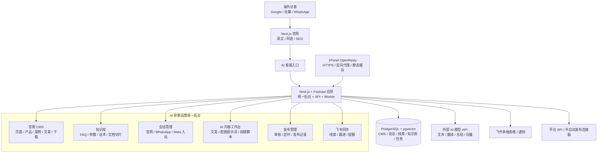

# 建材出海 AI 获客系统一期技术选型与部署架构规划

版本：v1.1

日期：2026-07-16

适用范围：一期上线版本，单台腾讯云轻量应用服务器 2C4G，Docker 部署  
核心目标：官网 SEO、CMS、AI 客服、会话管理、内容工作台放在同一个后台，先跑通获客闭环

说明：前期仅使用一台 2C4G 服务器，PostgreSQL 不使用云托管，文件先落本机，后续系统盘容量不足再迁移 COS。

---

## 1. 结论先行

一期推荐采用 **Next.js + Payload CMS + PostgreSQL + 1Panel OpenResty + Docker Compose** 的模块化单体架构。

| 层级             | 推荐选型                               | 说明                                                                                     |
| ---------------- | -------------------------------------- | ---------------------------------------------------------------------------------------- |
| 架构模式         | 模块化单体                             | 2C4G 单机不适合微服务；代码按模块拆，部署仍是一套应用                                    |
| 官网前台         | Next.js App Router                     | 支持服务端渲染、静态生成、动态 metadata、sitemap、robots，适合 SEO                       |
| 统一后台 / CMS   | Payload CMS                            | 内置 Admin、账号权限、内容模型、文件上传、草稿、版本、多语言，可扩展 AI 客服和内容工作台 |
| 数据库           | PostgreSQL + pgvector                  | 一库承载 CMS、会话、线索、任务、知识库向量，不额外部署 Qdrant / Elasticsearch            |
| 基础镜像         | 1Panel Linux 面板应用模板              | 2C4G 单机全包时，优先拿到 Docker、OpenResty、证书、备份、日志、文件管理能力              |
| 反向代理 / HTTPS | 1Panel OpenResty                       | 不再额外跑 Caddy，避免 80/443 端口冲突                                                   |
| 部署方式         | Docker Compose                         | 只保留 app、db、1Panel/OpenResty 三类核心运行面；避免 Kubernetes、微服务网关、重型监控   |
| AI 能力          | 外部模型 API + 模型网关封装            | 不在 2C4G 本地跑大模型、生图、视频转码                                                   |
| 后台任务         | PostgreSQL 任务表 + 单进程 worker/cron | 一期不引入 Redis、BullMQ、n8n，降低内存和运维成本                                        |
| 文件资源         | 本机 uploads 起步，预留 COS/EdgeOne    | 一期先本机存储；图片、PDF 多起来后迁移对象存储和 CDN                                     |

一句话判断：**这台 2C4G 服务器适合跑官网、后台、CMS、本机 PostgreSQL、轻量会话、AI API 编排；不适合跑本地 AI 模型、浏览器集群、视频处理和重型数据中间件。**

1Panel 结论：在“单台 2C4G + 本机 PostgreSQL + 本机文件存储”的前期约束下，**创建服务器时建议直接选择应用模板里的 `1Panel Linux 面板`**。1Panel 仍不进入业务代码架构，但作为这台服务器的运维底座更合适。

---

## 2. 为什么这样选

### 2.1 选模块化单体，不选微服务

一期真实用户量是小团队内部使用 + 海外客户访问官网，不是高并发 SaaS。微服务会带来服务发现、网关、队列、链路追踪、部署编排等额外成本，在 2C4G 单机上没有收益。

模块化单体的做法是：

- 一个 Next.js/Payload 应用进程；
- 代码按 `website`、`cms`、`ai-chat`、`conversations`、`content-workbench`、`publishing`、`feishu-sync` 拆模块；
- 数据统一进 PostgreSQL；
- 未来流量或功能变重时，再把发布 worker、AI worker、数据库拆出去。

### 2.2 选 Next.js + Payload，不选 WordPress / Strapi / Directus

| 方案               | 优点                                                          | 问题                                                                         | 一期判断     |
| ------------------ | ------------------------------------------------------------- | ---------------------------------------------------------------------------- | ------------ |
| WordPress          | CMS 和 SEO 插件成熟，上线快                                   | AI 客服、统一会话、内容工作台会变成大量插件/自定义 PHP；长期安全和维护压力高 | 不推荐       |
| Strapi + Next.js   | Headless CMS 成熟                                             | 至少两个 Node 应用 + 数据库；后台还要另做 AI 工作台；2G 内存偏紧             | 不推荐一期   |
| Directus + Next.js | 数据后台强，配置快                                            | 更像数据管理后台，复杂 AI 工作流和内容生成体验需要大量定制                   | 备选         |
| Laravel + Filament | 单体后台强，资源占用可控                                      | 当前项目已有 Node/前端原型；AI/前端生态与 TypeScript 统一性弱一些            | PHP 团队可选 |
| Next.js + Payload  | 官网、CMS、后台、API、AI 工作流都能放在一个 TypeScript 工程里 | 需要控制构建和运行内存；后台复杂度要克制                                     | 推荐         |

推荐 Next.js + Payload 的关键原因：

- 官网 SEO 和后台共用一套代码与类型；
- Payload 原生提供 Admin、集合模型、权限、上传、草稿、版本、多语言；
- 后台可以在 Payload Admin 内扩展自定义视图，把 CMS、AI 客服、会话、内容工作台放在一个入口；
- PostgreSQL 适合同时承载结构化数据、JSONB 对话数据和知识库向量。

---

## 3. 一期目标架构



---

## 4. 后台模块规划

统一后台不做成多个系统，而是在 Payload Admin 内按菜单拆分。

| 菜单        | 一期能力                                                 | 技术实现                            |
| ----------- | -------------------------------------------------------- | ----------------------------------- |
| 工作台首页  | 待处理会话、待审核内容、待发布内容、新线索、同步失败提醒 | Payload 自定义 Dashboard            |
| 官网内容    | 首页、产品、案例、文章、下载资料、SEO 字段               | Payload Collections + Localization  |
| 媒体素材    | 产品图、工厂图、案例图、PDF、视频素材索引                | Payload Upload Collection           |
| 知识库      | FAQ、技术参数、销售话术、文档切片、向量索引              | PostgreSQL + pgvector               |
| AI 客服     | 提示词、回复规则、意向判断、转人工规则                   | Next API Route + 模型网关           |
| 会话管理    | 官网会话、WhatsApp/Meta 入站消息、人工接管、摘要         | Conversation / Message Collections  |
| AI 内容生产 | 多语言文案、SEO 文章草稿、社媒图文、视频脚本             | Prompt Template + Generated Content |
| 发布管理    | 审核、定时发布、发布日志、失败重试                       | Publish Job + Worker                |
| 飞书同步    | 线索入库、A/B/C 分级、跟进提醒、同步状态                 | Feishu Connector + Sync Job         |
| 平台账号    | WhatsApp、Facebook、Instagram、LinkedIn 等授权状态       | Account Connector Collection        |

---

## 5. 数据模型骨架

一期先保持模型清晰，不做过度抽象。

| 领域       | 核心表 / Collection                                                         | 说明                                               |
| ---------- | --------------------------------------------------------------------------- | -------------------------------------------------- |
| 账号权限   | `users`、`roles`                                                            | 管理员、运营、销售；一期权限可简单，但模型要留扩展 |
| 官网 CMS   | `pages`、`products`、`product_categories`、`projects`、`posts`、`downloads` | 支持英文 / 阿语、多语言 SEO 字段                   |
| 媒体       | `media`、`assets`                                                           | 图片、PDF、视频素材索引；大文件后续迁 COS          |
| SEO        | `seo_keywords`、`redirects`、`sitemap_entries`                              | 关键词、URL、重定向、结构化数据配置                |
| 知识库     | `knowledge_docs`、`knowledge_chunks`、`embeddings`                          | 文档切片和向量检索                                 |
| 会话       | `visitor_sessions`、`conversations`、`messages`、`handoffs`                 | 会话、消息、转人工记录                             |
| 线索       | `leads`、`lead_sources`、`lead_scores`                                      | 客户资料、来源渠道、意向分级                       |
| 内容工作台 | `prompt_templates`、`generated_contents`、`content_reviews`                 | 提示词模板、生成结果、审核状态                     |
| 发布       | `platform_accounts`、`publish_jobs`、`publish_logs`                         | 平台账号、定时任务、发布结果                       |
| 飞书同步   | `feishu_mappings`、`sync_jobs`、`sync_logs`                                 | 本地记录和飞书记录的映射                           |

### 5.1 Task 9 / Task 12 跨开发者接口边界

| 接口                | 消费方                                    | 提供方                             | 边界                                                                                                         |
| ------------------- | ----------------------------------------- | ---------------------------------- | ------------------------------------------------------------------------------------------------------------ |
| `ChatService`       | jueyunai 的官网 ChatWidget                | xuemusi 的会话 / AI / 人工接管服务 | 前端只提交会话和消息请求，消费回复、引用、handoff 和稳定错误码；不直接访问模型 SDK 或会话表                  |
| `PublishingService` | jueyunai 的内容工作台发布页面和内部工作流 | xuemusi 的第三方平台发布服务       | 工作台查询平台能力、提交已审核发布任务、读取发布状态；平台 SDK、token、限流和结果回调封装在服务端 adapter 内 |

两个接口都必须先提供 TypeScript port/interface、请求响应 schema、错误码、状态枚举、fake service 和 contract fixture。jueyunai 可以在真实后端完成前使用 mock 实现完整 UI 状态和 E2E；xuemusi 可以在页面完成前使用 fake repository 和官方结构 fixture 实现服务、验签、幂等与 adapter。真实实现接入时不得改变已冻结 contract；如需破坏性变更，必须由双方 review 并同步更新 mock、contract test 和消费者。

Task 12 仍由 jueyunai 定义内容生成、审核状态机以及 `PublishJobs` / `PublishLogs` 共享结构；xuemusi 的平台服务消费该结构并回写发布结果。Task 13 的平台账号、Webhook 和发布 adapter 不进入前端代码，也不阻塞 Task 12 页面使用 mock 完成开发和验收。

---

## 6. SEO 与多语言方案

官网必须以 SEO 为第一优先级，不要做成纯客户端 SPA。

同时，`references/website-prototype/` 是客户提供并确认的正式官网 UI / 交互验收基准。Next.js / Payload 是生产级技术重写，不是视觉重设计：实现必须高保真还原原型的视觉层级、版式、色彩、字体、间距、组件状态、导航、Hero 轮播、产品筛选、规格表、询盘状态、桌面 / 平板 / 移动响应式，以及英文 LTR 和阿拉伯语 RTL 效果。技术上允许采用 locale-prefixed URL、SSR / SSG、CMS 和服务端 API，但不得借此改变客户已确认的用户体验；任何主动视觉或交互调整必须先获得客户确认。

一期建议：

- 产品页、案例页、文章页使用 SSG/ISR 或服务端渲染，保证搜索引擎能直接拿到 HTML；
- 每个页面在 CMS 里维护 `title`、`description`、`canonical`、`og:image`、图片 `alt`；
- 英文和阿语使用稳定 URL，例如 `/en/products/curved-aluminum-panel`、`/ar/products/...`；
- 输出 `sitemap.xml`、`robots.txt`、`hreflang`；
- 产品、案例、FAQ 使用 JSON-LD 结构化数据；
- 阿语页面必须支持 RTL，但后台内容仍按字段管理，不混在一个富文本里；
- 图片统一生成 WebP/AVIF 小图，首屏图限制体积，避免 SEO 首屏变慢；
- News/Blog 不是摆设，要承接长期关键词内容和 GEO/AI 搜索引用。
- 正式素材必须进入 Payload Media 管理，禁止保留 Unsplash 等外部图片热链、占位联系方式、demo / fake 内容或模拟提交成功；询盘成功态必须对应真实持久化结果。
- Task 6 使用 Playwright 对客户原型的关键页面和状态执行截图 / 视觉回归，覆盖英文 / 阿语和桌面 / 平板 / 移动视口；同时验证导航、轮播、筛选、移动菜单、语言切换和表单状态。

---

## 7. AI 客服与知识库方案

一期 AI 客服不是“万能客服”，而是业务初筛工具。

推荐流程：

1. 访客从官网或平台会话进入；
2. 系统识别语言和来源渠道；
3. AI 基于知识库回答常见问题；
4. 通过 2-3 轮追问收集国家、项目类型、数量、图纸、预算、联系方式；
5. 生成客户摘要和意向等级；
6. 高意向进入飞书并提醒业务员；
7. 中低意向继续引导或沉淀为待跟进线索。

技术边界：

- 文本生成、翻译、摘要、向量全部调用外部 API；
- 本地只存知识库、会话记录、向量索引、提示词模板；
- 每次 AI 回复都要记录 prompt 版本、引用知识、模型、成本估算，方便后续优化；
- AI 回复必须支持人工接管，不能让模型一直自作主张报价或承诺交期；
- 价格、交期、认证、付款条款等高风险回答要设置“建议转人工”规则。

---

## 8. 会话管理与发布接入边界

### 8.1 会话接入

一期优先级：

| 渠道                 | 一期建议           | 原因                                                  |
| -------------------- | ------------------ | ----------------------------------------------------- |
| 官网聊天             | 必做               | 自有入口，无平台审核                                  |
| WhatsApp             | 优先做             | 客户已有大量沟通场景，官方 Cloud API 可承接入站消息   |
| Facebook / Instagram | 做 Meta 体系 PoC   | 需要资产、权限、App Review，适合分阶段验收            |
| LinkedIn             | 人工主导 + AI 辅助 | 官方私信 API 不适合普通自助接入，不应承诺自动读写私信 |
| TikTok / YouTube     | 后续验证           | 一期只做内容引导，不做私信统一入口承诺                |

### 8.2 自动发布

2C4G 服务器不适合常驻浏览器自动化。发布策略建议分三档：

| 档位            | 方式                                  | 一期建议                           |
| --------------- | ------------------------------------- | ---------------------------------- |
| 官方 API 发布   | Meta 等支持的渠道走官方接口           | 优先                               |
| 半自动发布      | 生成内容、复制/下载素材、人工确认发布 | 作为兜底                           |
| 浏览器 RPA 发布 | Playwright/浏览器模拟操作             | 只做低频、串行、可关闭任务；不常驻 |

不要在这台服务器上跑多账号浏览器矩阵、视频剪辑、批量转码、批量生图。这些能力放到二期独立 worker 或运营电脑执行。

---

## 9. 基础镜像选择与 Docker 部署拓扑

### 9.1 创建服务器时选择什么

在腾讯云轻量应用服务器创建页面，推荐：

```text
应用创建方式：使用应用模板
应用模板：1Panel Linux 面板
不要选择：Docker CE、Node.js、WordPress、宝塔、Dify、n8n、K3s
```

理由：

- `1Panel Linux 面板` 更适合一台机器承载应用、数据库、反向代理、证书、备份和日志；
- 2C4G 已经比 2C2G 有足够余量，1Panel 的常驻开销可接受；
- 后续客户或非开发人员需要查看服务状态、日志、证书、备份时，不必完全依赖命令行；
- 仍然使用标准 `docker-compose.yml` 部署业务，不把项目锁死在面板界面里。

不选 `Docker CE` 的原因：

- Docker CE 更干净、更省资源，但只提供容器运行环境；
- 反向代理、HTTPS、备份、日志、文件管理都要手工配置；
- 本项目只有一台服务器且 PostgreSQL 也在本机，运维可视化的收益更高。

如果后续不想使用面板，才选择 `Docker CE` 应用模板，底层通常基于 Ubuntu Server 24.04 LTS，并已配置腾讯云 Docker 镜像源。

### 9.2 推荐部署拓扑

一期推荐只保留核心容器和 1Panel 运维底座：

```text
server
├── 1Panel
│   ├── Docker / Compose 可视化管理
│   ├── OpenResty 网站与 HTTPS
│   ├── 文件 / 日志 / 计划任务
│   └── 面板端口仅允许白名单访问
├── app
│   ├── Next.js standalone
│   ├── Payload Admin
│   ├── API Routes
│   └── lightweight worker/cron
└── db
    ├── PostgreSQL
    ├── pgvector
    └── daily backup
```

注意：启用 1Panel 后，不建议再同时启用 Caddy 做公网反向代理，避免 OpenResty 和 Caddy 抢 80/443 端口。应用仍必须保留标准 `docker-compose.yml`，不要把部署逻辑只写在 1Panel 界面里。

建议资源控制：

| 服务               | 内存策略                                           | 说明                                 |
| ------------------ | -------------------------------------------------- | ------------------------------------ |
| app                | 限制 Node 老生代内存，生产只运行构建产物           | 不在服务器上执行大型构建             |
| db                 | 控制 shared_buffers / work_mem，并设置容器内存上限 | 4GB 单机需为应用、面板和系统保留余量 |
| 1Panel / OpenResty | 只开放必要入口，面板限制白名单                     | 不把面板端口裸露给公网               |
| backup             | 定时执行后退出                                     | 不常驻重型备份服务                   |

部署原则：

- 使用 Next.js standalone 构建，镜像尽量小；
- 构建放在本地或 CI，服务器只拉镜像/启动容器；
- `.env` 只放服务器，不进 Git；
- 数据库和 uploads 挂载 Docker volume；
- 每日 `pg_dump`，至少保留 7 天本机备份；后续启用 COS 后同步到 COS；
- Docker 日志开启轮转，避免磁盘被日志打满；
- 只开放 80、443、必要 SSH 端口；1Panel 面板端口必须限制来源 IP。

---

## 10. 2C4G 单机可做与不可做清单

### 可以做

- 官网前台 + CMS；
- 英文 / 阿语多语言页面；
- SEO 基础设施；
- AI 客服入站初筛；
- 会话记录和人工接管；
- 内容生成工作台；
- 飞书 CRM 同步；
- 低频定时发布任务；
- 小规模知识库 RAG；
- 1-5 个内部后台用户同时使用。
- 1Panel + OpenResty + Docker Compose 单机部署。

### 谨慎做

- 多平台官方 API 接入：取决于账号资产和审核；
- Meta App Review：周期不完全可控；
- 大批量图片上传：需要控制图片尺寸和压缩；
- 复杂报表：先做列表和基础统计，不上 BI；
- RPA 自动发布：只能串行低频，失败要可人工接管。
- 本机 PostgreSQL 和本机 uploads 同时增长：需要设置备份和磁盘告警，容量不足再迁 COS。

### 不建议一期做

- 本地大模型推理；
- 本地 AI 生图；
- 视频自动剪辑/转码；
- 浏览器账号矩阵常驻运行；
- Elasticsearch / Qdrant / Kafka / RabbitMQ / Redis 常驻全家桶；
- Kubernetes；
- 多租户 SaaS；
- 完整 CRM 替代飞书；
- 全平台私信自动读写承诺。

---

## 11. 1Panel 是否需要

结论：一期业务代码 **不依赖 1Panel**，但这台服务器创建时 **推荐选 `1Panel Linux 面板` 应用模板**。它解决的是单机运维问题：Docker Compose、OpenResty 反代、HTTPS、日志、备份、文件管理、计划任务。

| 选项                                     | 适用情况                      | 优点                                   | 代价                                    | 建议     |
| ---------------------------------------- | ----------------------------- | -------------------------------------- | --------------------------------------- | -------- |
| 装 1Panel + OpenResty + Docker Compose   | 2C4G、单机承载 app/db/uploads | 容器、日志、证书、备份、文件管理更直观 | 多一个常驻面板和公网管理风险            | 默认推荐 |
| 不装 1Panel，直接 Docker Compose + Caddy | 纯开发者命令行维护            | 最省资源、攻击面小、配置透明           | 运维全靠命令行                          | 备选     |
| 宝塔 / 其他面板                          | 传统 PHP/WordPress 运维       | 上手简单                               | 与本项目 TypeScript/Docker 栈契合度一般 | 不推荐   |

如果采用 1Panel，必须满足以下边界：

- 面板端口不直接裸露公网，至少开启强密码、安全入口、IP 白名单；更稳妥是只允许 VPN / 固定办公 IP 访问；
- 1Panel 只负责运维，不负责业务逻辑，应用代码、环境变量模板、Compose 文件仍归 Git 管理；
- 反向代理统一使用 1Panel OpenResty，不再额外跑 Caddy；
- PostgreSQL 一期放本机 Docker volume，必须配置每日备份；
- 对象存储暂不前置采购，系统盘容量不足或图片/PDF 变多后再迁 COS/S3；
- 监控告警可用飞书机器人 + `/api/health` 健康检查，不需要上重型监控。

阶段建议：

1. 创建服务器：选择 `1Panel Linux 面板` 应用模板。
2. 首次上线：用 1Panel 管理 OpenResty/HTTPS，用标准 Docker Compose 部署 app + PostgreSQL。
3. 试运营：观察磁盘、内存、PostgreSQL 备份体积和 uploads 增长。
4. 后续扩容：系统盘容量紧张时，优先迁移 uploads/PDF/图片到 COS，不急着拆数据库。

---

## 12. 一期开发顺序

按 23 个工作日控制节奏，建议如下：

| 阶段                      |  天数 | 目标                                                                                                      |
| ------------------------- | ----: | --------------------------------------------------------------------------------------------------------- |
| 1. 工程与部署底座         |   1-3 | Next.js + Payload + PostgreSQL + Docker Compose + 1Panel OpenResty 基础跑通                               |
| 2. CMS 数据模型           |   4-6 | 页面、产品、案例、文章、媒体、下载、SEO 字段                                                              |
| 3. 官网前台               |  7-10 | 高保真还原客户确认原型，交付英文/阿语官网、响应式/RTL、SEO metadata、sitemap、表单、AI 客服入口和视觉回归 |
| 4. 知识库与 AI 客服       | 11-14 | xuemusi 提供知识库、RAG、意向筛选、转人工和会话服务；jueyunai 基于 `ChatService` contract 实现官网客服 UI |
| 5. 会话管理与飞书同步     | 15-17 | 会话后台、线索入库、飞书表同步、提醒规则                                                                  |
| 6. AI 内容工作台          | 18-20 | jueyunai 实现文案生成、图片提示词、视频脚本、审核状态、发布页面和内部发布任务                             |
| 7. 发布管理与平台 PoC     |    21 | xuemusi 提供第三方发布接口、平台 adapter、发布结果回调和首批平台可行路径                                  |
| 8. 上线、培训、试运营修复 | 22-23 | 部署上线、培训、关键问题修复                                                                              |

---

## 13. 风险与预案

| 风险                | 表现                         | 预案                                                                       |
| ------------------- | ---------------------------- | -------------------------------------------------------------------------- |
| 4GB 单机内存紧张    | app/db OOM、后台卡顿         | 不在服务器构建；限制 Node/PG 内存；必要时升级 4C8G 或拆数据库              |
| 平台 API 审核不可控 | Meta/WhatsApp 权限卡住       | 官网聊天和飞书先闭环；平台接入按 PoC 验收                                  |
| AI 回复不稳定       | 错答、过度承诺               | 知识库引用、敏感问题转人工、prompt 版本管理                                |
| SEO 上线慢          | 短期没排名                   | 一期只承诺 SEO 基建，不承诺排名；持续内容更新                              |
| 图片/PDF 占磁盘     | 40-60GB 磁盘快速增长         | 图片压缩、本机清理策略、迁 COS/EdgeOne                                     |
| RPA 发布不稳定      | 验证码、登录失效、平台改版   | 只作为辅助，不作为核心验收；官方 API 和人工确认优先                        |
| 1Panel 面板暴露     | 面板被扫、弱密码、配置误操作 | 安全入口、强密码、IP 白名单、关闭不必要端口；核心配置保留在 Git 和 Compose |

---

## 14. 架构决策记录

### ADR-001：一期采用模块化单体

决策：使用一个 Next.js + Payload 应用承载官网、后台、API 和轻量 worker。  
原因：一期团队小、预算低、服务器小，模块化单体的交付和运维成本最低。  
代价：部分模块不能独立扩容。  
后续：当会话、发布或 AI 任务负载明显升高，再拆独立 worker。

### ADR-002：CMS 与统一后台使用 Payload

决策：用 Payload 作为 CMS 和后台底座。  
原因：它和 Next.js/TypeScript 统一，内置 Admin、权限、上传、多语言、草稿和版本能力，适合扩展内容工作台和会话管理。  
代价：需要按 Payload 的集合模型组织后台，不适合完全自由拖拽式低代码。  
后续：如二期做 SaaS 化，可继续保留 Payload 作为后台核心，也可拆管理端。

### ADR-003：PostgreSQL 一库多用

决策：PostgreSQL 承载 CMS、会话、线索、任务和知识库向量。  
原因：减少容器数量和内存占用；PostgreSQL 的 JSONB、全文检索、pgvector 能覆盖一期需求。  
代价：搜索体验不如 Elasticsearch，向量规模不能无限大。  
后续：当文章/会话/知识库规模上来，再拆 Meilisearch/Qdrant。

### ADR-004：AI 能力全部外部 API 化

决策：文本、翻译、总结、向量、生图、视频均调用外部模型或外部工具。  
原因：2C4G 不能稳定承载本地 AI 推理和多媒体处理。  
代价：依赖第三方 API 稳定性和费用。  
后续：通过模型网关统一适配，方便替换供应商。

### ADR-005：发布自动化先轻后重

决策：官方 API 优先，半自动兜底，浏览器 RPA 只做低频辅助。  
原因：多账号浏览器自动化是资源、稳定性和平台风控三重风险。  
代价：一期不能承诺所有平台“一键全自动”。  
后续：若 ROI 跑通，再独立部署发布 worker 或运营端自动化工具。

### ADR-006：1Panel 作为运维可选项

决策：服务器基础镜像选择 `1Panel Linux 面板` 应用模板；1Panel 不进入业务代码架构，只作为运维底座。  
原因：前期只有一台 2C4G，PostgreSQL 和文件也在本机，1Panel 对容器、OpenResty、HTTPS、日志、备份、文件管理的收益大于额外资源开销。  
代价：多一个面板安全面，必须限制面板端口访问。  
后续：业务仍保留标准 Docker Compose，未来可以迁移到纯 Docker CE、CVM 或多机部署。

---

## 15. 最终推荐版本

一期技术栈锁定如下：

```text
Frontend / Fullstack: Next.js App Router + TypeScript
Admin / CMS: Payload CMS
UI: Tailwind CSS + Payload Admin custom components
Database: PostgreSQL 18.4 + pgvector 0.8.5
Base Image: 1Panel Linux Panel application template
Reverse Proxy: 1Panel OpenResty
Runtime: Node.js LTS
Deploy: Docker Compose
AI: OpenAI-compatible model gateway + provider adapters
Storage: local uploads first, migrate to COS/EdgeOne when disk pressure appears
CRM: Feishu Bitable / Webhook sync
Monitoring: structured logs + uptime check + Feishu bot alerts
Ops Panel: 1Panel for Docker Compose, OpenResty, HTTPS, logs, backups
```

验收口径：**客户能从同一个后台维护官网内容、更新 SEO 内容、管理知识库、查看会话、让 AI 初筛客户、生成内容草稿、同步飞书线索，并完成第一批上线试运营。**

---

## 16. 实施级技术约束

### 16.1 版本与依赖管理

- Node.js 选择工程初始化时仍受维护、且被 Payload 官方兼容矩阵支持的 LTS 主版本，并写入 `.nvmrc` 与容器基础镜像；生产、CI、本地保持一致。
- Next.js、Payload、React 按 Payload 官方脚手架生成的兼容组合初始化，不跨兼容矩阵手工拼版本。
- 使用 `pnpm`，在 `package.json#packageManager` 固定 pnpm 版本，提交 `pnpm-lock.yaml`；CI 使用 frozen lockfile。
- PostgreSQL 固定 18.4，pgvector 固定 0.8.5，镜像使用与 PostgreSQL 18 匹配的具体 tag 和 digest。
- Renovate / Dependabot 只创建升级 PR，不自动合并；框架主版本升级必须经过迁移、单元、集成和构建验证。

### 16.2 环境划分与域名

| 环境       | 用途                               | 数据                | 建议入口                      |
| ---------- | ---------------------------------- | ------------------- | ----------------------------- |
| local      | 本地开发和自动化测试               | 本地容器 / 种子数据 | `localhost`                   |
| staging    | 客户验收、Webhook 联调、发布前验证 | 脱敏或专用测试数据  | `dev.ivybm.com`               |
| production | 正式官网和后台                     | 正式业务数据        | `ivybm.com` / `www.ivybm.com` |

- staging 与 production 使用独立数据库、uploads、密钥和平台应用；禁止直接复制正式客户会话到测试环境。
- 后台默认沿用同一应用的 `/admin`，由 Payload 鉴权保护；如后续使用 `admin.ivybm.com`，仍需应用层鉴权，不依赖隐藏域名。
- 根域名与 `www` 只保留一个 canonical 主站，另一个做 301；`dev` 设置 `noindex` 并限制访问。

### 16.3 认证、授权与审计

一期角色最少包括：

| 角色     | 权限                                                       |
| -------- | ---------------------------------------------------------- |
| admin    | 用户、配置、平台账号、全部内容和业务数据                   |
| operator | 内容、素材、知识库、会话、发布任务；不能管理用户和系统密钥 |
| sales    | 查看 / 接管分配给自己的会话和线索，填写跟进信息            |

- 后台只允许受邀账号注册；密码至少 12 位，登录失败限流，生产环境使用安全 Cookie、HTTPS、CSRF 防护和合理会话过期。
- 平台令牌和模型密钥只从环境变量或部署端 secret 注入；数据库只存必要的加密令牌，不在日志、错误信息和后台列表回显完整值。
- 用户登录、内容发布、平台授权变更、人工接管和高风险配置修改写入审计记录。

### 16.4 Webhook、任务和一致性

- 所有平台 Webhook 必须校验签名、时间戳和来源；请求体大小受限，解析失败返回明确状态。
- 以 `platform + externalEventId` 建唯一约束实现幂等；重复事件不得产生重复消息、线索或发布结果。
- 外部事件先落库再异步处理；任务状态统一使用 `pending / processing / succeeded / failed / dead`。
- 可重试错误采用指数退避，默认最多 5 次；鉴权失败、参数错误等不可重试错误直接进入人工处理。
- worker 使用数据库抢占锁和租约避免并发重复执行；进程异常后过期任务可回收。
- 飞书同步、AI 调用、平台发布必须保存请求关联 ID、重试次数、最后错误和人工补偿入口；日志不得保存完整密钥或不必要的客户隐私。

### 16.5 AI 网关与安全边界

- 业务模块只调用内部模型网关接口，不直接依赖具体供应商 SDK；网关统一处理模型映射、超时、重试、用量和错误。
- 文本请求建议 30 秒超时，向量请求建议 15 秒超时；超时或供应商异常时给用户可理解的降级提示，不阻断人工接管。
- 每次回复记录模型、prompt 版本、知识引用、token / 成本估算和安全结果；不记录供应商密钥。
- 价格、交期、认证、付款条件等高风险主题默认转人工或要求基于已审核知识回答。
- 建立固定问答测试集；关键事实回答需有知识引用，高意向样本优先控制漏判，最终阈值在客户提供样本后锁定。

### 16.6 数据、备份与恢复

- PostgreSQL 与 uploads 使用独立持久化卷；部署更新不得重建业务卷。
- 每日执行 `pg_dump`，至少保留 7 个日备份和 4 个周备份；uploads 每日增量备份。备份文件不得只保存在同一 Docker volume。
- 一期目标：RPO 不超过 24 小时，RTO 不超过 4 小时；上线前至少完成一次从空数据库恢复的演练并记录耗时。
- 数据库变更只通过可追踪 migration 执行；破坏性变更采用“先扩展、再迁移、后删除”，部署前备份。
- 客户数据导出、保留期限和删除流程在试运营前与甲方确认；默认不采集完成业务目的所不需要的信息。

### 16.7 可观测性与非功能指标

| 类别       | 一期目标                                                                                                            |
| ---------- | ------------------------------------------------------------------------------------------------------------------- |
| 健康检查   | `/api/health/live` 检查进程，`/api/health/ready` 检查数据库和关键依赖                                               |
| 日志       | JSON 结构化日志，包含 requestId / jobId，Docker 单文件 10MB、最多 5 个轮转文件                                      |
| 告警       | 官网不可达、磁盘超过 80%、容器反复重启、备份失败、dead job 通过飞书通知                                             |
| Web 性能   | 生产首页 Lighthouse Performance / SEO / Accessibility 在约定测试环境目标均不低于 85 / 90 / 90                       |
| 视觉一致性 | 客户确认原型的核心页面与交互状态在英文 / 阿语、桌面 / 平板 / 移动视口通过截图评审和自动化视觉回归；不得自行重新设计 |
| API 性能   | 排除外部 AI / 平台耗时，普通后台读取接口在低并发测试下 p95 小于 800ms                                               |
| 可用性     | 试运营期目标 99.5%，不含计划维护和第三方平台故障                                                                    |
| 安全       | HTTPS、最小权限、登录限流、Webhook 验签、依赖高危漏洞为 0                                                           |

这些是一期工程目标，不构成对公网网络、搜索排名、模型供应商或社媒平台可用性的无限责任承诺。

### 16.8 CI/CD 与发布回滚

- Pull Request / 合并前依次执行格式检查、lint、类型检查、单元测试、集成测试和 production build。
- 镜像在 CI 或受控本地环境构建，使用 Git commit SHA 标记并推送私有镜像仓库；服务器只拉镜像，不安装开发依赖、不现场构建。
- staging 先部署并执行迁移、健康检查和 smoke test，通过后再人工批准 production。
- 发布前记录数据库备份和当前镜像 SHA；应用异常时回滚到上一镜像。若包含不兼容数据库变更，按 migration 回滚方案或备份恢复处理。
- 生产配置只存在部署环境；仓库提交 `.env.example`，列出变量名、用途和是否必填，不包含真实值。

### 16.9 测试策略与验收层级

| 层级     | 覆盖内容                                                                                                                                         |
| -------- | ------------------------------------------------------------------------------------------------------------------------------------------------ |
| 单元测试 | 权限、意向评分、平台格式化、状态机、幂等键、重试策略                                                                                             |
| 集成测试 | Payload + PostgreSQL、询盘入库、知识检索、任务处理、飞书 / 平台适配器 mock                                                                       |
| E2E      | 英文 / 阿语官网、RTL、客户原型高保真视觉回归、桌面 / 平板 / 移动响应式、导航 / 轮播 / 筛选 / 表单交互、后台登录和内容发布、询盘、AI 客服人工接管 |
| 契约测试 | Webhook 签名、平台 payload fixture、飞书字段映射、AI 网关响应                                                                                    |
| 运维测试 | Docker 启动、健康检查、备份恢复、部署回滚、磁盘和日志轮转                                                                                        |

第三方平台验收分级：P0 自有能力必须在 staging / production 实测；P1 条件性交付在甲方前置条件满足时实测，否则以 sandbox / mock、配置说明和阻塞证据验收；P2 调研项以书面结论和 PoC 记录验收。

---

## 17. 参考依据

- 腾讯云轻量应用服务器 Docker CE 应用镜像说明：<https://cloud.tencent.com/document/product/1207/60423>
- 腾讯云轻量应用服务器常见问题与适用场景：<https://cloud.tencent.com/document/product/1207/44569>
- 腾讯云 Docker 镜像源配置说明：<https://cloud.tencent.com/document/product/1207/45596>
- Next.js Docker / standalone 部署文档：<https://github.com/vercel/next.js/blob/canary/docs/01-app/01-getting-started/17-deploying.mdx>
- Next.js standalone 输出配置：<https://github.com/vercel/next.js/blob/canary/docs/01-app/03-api-reference/05-config/01-next-config-js/output.mdx>
- Payload CMS 官方能力说明：<https://github.com/payloadcms/payload/blob/main/packages/payload/README.md>
- 1Panel Compose 管理说明：<https://1panel.pro/docs/v1/user_manual/containers/composes/>
- 1Panel OpenResty 应用说明：<https://1panel.pro/docs/v2/user_manual/appstore/openresty/>
