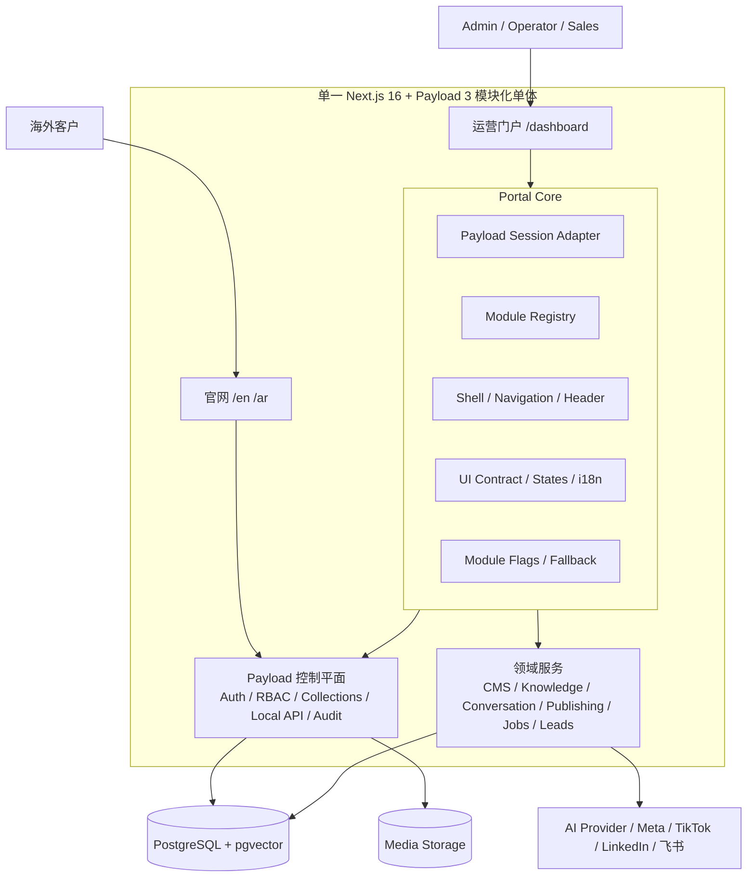
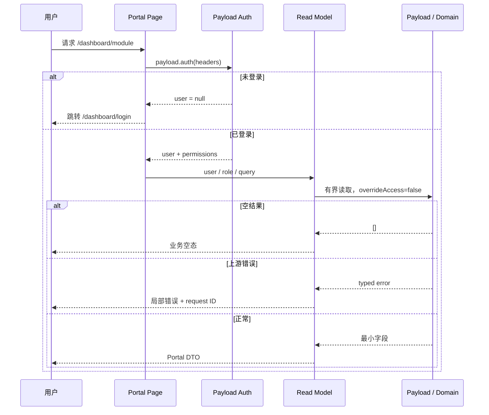
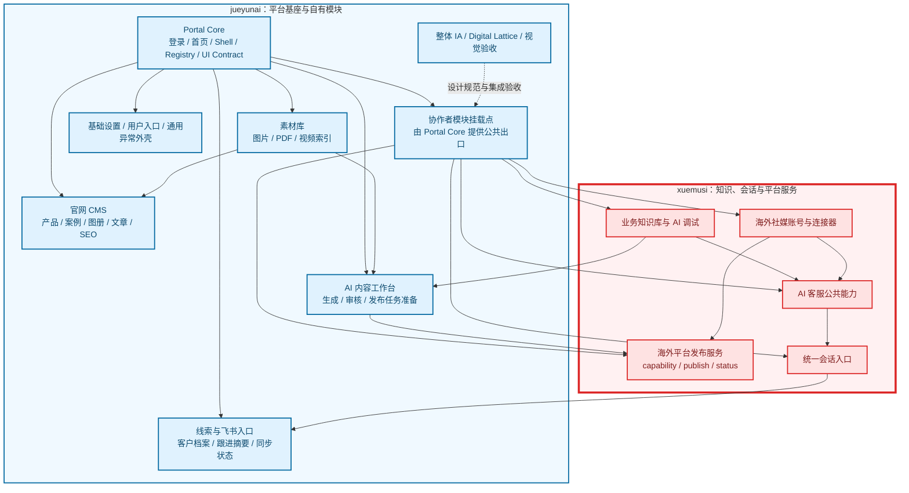

# IVYBM 管理后台现代化 UI 重构与模块化架构规划

版本：v2.1

日期：2026-07-29

状态：Accepted

决策依据：[ADR-0004](adr/0004-modular-admin-portal.md)

## 1. 结论

IVYBM 管理后台采用“一个后端控制平面、一个一期运营入口、一个模块化门户基座”的架构：

- Payload CMS 继续负责数据模型、Auth、RBAC、Collections、migration、审计、媒体和 Local API；
- `/dashboard` 是根据 Digital Lattice 设计稿自研的日常运营门户；
- 第一阶段只设计、开发和验收 `/dashboard`；
- Payload 已有 `/admin` 仅作为内部维护能力存在，不进 Portal 导航、不新增 UI、不作为产品回退；
- 官网和运营门户仍运行在同一个 Next.js + Payload 模块化单体中；
- 门户基座先交付，业务模块按价值、依赖和负责人逐个挂载，不追求一次完成全部页面。

数据库、账号、权限、领域状态机、Jobs 和外部平台接口只有一套。内部维护路径不属于一期产品形态。

## 2. 第一性原理

### 2.1 真正需要解决的问题

后台改造的目标不是“把 Payload 换皮”，而是让 1–5 人团队能在一个稳定入口中：

1. 登录后立即知道现在最该处理什么；
2. 在同一上下文里完成内容、素材、客户、会话和异常任务；
3. 只执行自己有权限且领域状态允许的动作；
4. 看见真实的可用、受阻、失败和待补偿状态；
5. 让不同开发者能在统一基座上独立迭代模块。

### 2.2 必须复用的已有资产

- Payload Users Auth、session、三角色 access control；
- 英文 / 阿语 CMS、草稿、版本、多语言、媒体和 SEO；
- ConversationService、知识索引、AI Gateway、PublishingService contract、Jobs 和 Leads；
- 已有 Payload Auth、RBAC、Collections 和内部维护能力；
- PostgreSQL / pgvector、单一 production 部署和现有审计边界。

### 2.3 必须拒绝的重复建设

- 第二套用户、密码、JWT、session 或角色模型；
- 第二套数据库、CMS、媒体存储或 migration；
- 浏览器直接接触模型 key、平台 token、Job payload 或内部状态字段；
- 为尚未完成的模块创建临时 Collection、假接口或伪造成功状态；
- 为当前团队建设运行时插件市场、微前端或多服务 BFF。

## 3. 总体架构



### 3.1 三层职责

| 层 | 入口 | 责任 | 不负责 |
| --- | --- | --- | --- |
| 官网 | `/en`、`/ar` | 对外内容、询盘、ChatWidget | 内部运营与技术配置 |
| 运营门户 | `/dashboard` | 日常工作流、跨对象上下文、业务命令 | 密钥、底层 Collection 调试、migration |

Payload 已有 `/admin` 只由内部维护人员按 runbook 使用，不进入上述产品分层，也不属于第一阶段 Portal 设计、开发或验收。

## 4. Portal Core：真正的可插拔基座

模块化的核心不是左侧菜单本身，而是一组所有模块必须遵守的公共契约。

### 4.1 Core 能力

- Auth：读取 Payload session，处理未登录、过期、登出、角色变化；
- Guard：页面、读模型和命令的服务端角色检查；
- Registry：模块 ID、路由、菜单、负责人、成熟度、feature flag；
- Shell：侧栏、Header、账户、语言、主题、窄屏导航；
- UI Contract：按钮、表单、表格、Sheet、Dialog、Badge、状态页；
- State Contract：loading、empty、error、forbidden、blocked、dependency-gated；
- Error Contract：稳定 error code、用户提示、request ID、结构化日志；
- Quality Contract：可访问性、视觉快照、权限矩阵、性能预算；
- Governance：模块 owner、共享文件、Review 和发布边界。

### 4.2 静态模块 Manifest

```ts
export type PortalRole = 'admin' | 'operator' | 'sales'
export type PortalAvailability =
  | 'available'
  | 'dependency-gated'
  | 'blocked'
  | 'admin-only'

export interface PortalModuleManifest {
  id: string
  owner: 'jueyunai' | 'xuemusi'
  navGroup: 'workspace' | 'content' | 'intelligence' | 'operations' | 'system'
  href: `/dashboard/${string}`
  labelKey: string
  allowedRoles: PortalRole[]
  availability: PortalAvailability
  featureFlag?: string
}
```

约束：

- Registry 是编译期 TypeScript 数据，不从数据库动态加载代码；
- Registry 决定菜单和状态，但不构成授权；
- Next.js 文件路由仍决定页面是否存在；
- manifest ID、href 和 i18n key 必须有唯一性测试；
- 模块未满足依赖时只注册受阻说明，不注册可产生副作用的命令。

### 4.3 建议目录

```text
src/
├── app/
│   └── (dashboard)/
│       └── dashboard/
│           ├── layout.tsx
│           ├── login/page.tsx
│           └── (protected)/
│               ├── layout.tsx
│               ├── page.tsx
│               ├── settings/page.tsx
│               └── <module>/page.tsx
├── admin-portal/
│   ├── core/
│   │   ├── auth/
│   │   ├── modules/
│   │   ├── navigation/
│   │   ├── i18n/
│   │   ├── ui/
│   │   ├── states/
│   │   └── styles/
│   └── modules/
│       ├── overview/
│       ├── website-content/
│       ├── media/
│       ├── knowledge/
│       ├── content-studio/
│       ├── conversations/
│       ├── leads/
│       ├── platforms/
│       └── operations/
├── admin/                 # 既有内部维护代码；本 Portal 计划不新增或改造
└── modules/               # 既有领域服务和 adapters
```

依赖方向只能是：

```text
app/dashboard
  -> admin-portal/core
  -> admin-portal/modules/<module>
  -> modules/<domain> / access / Payload Local API
```

领域模块不得反向依赖 Portal 页面；协作者模块不得直接修改 Core 私有实现。

## 5. 认证、权限和数据流

### 5.1 登录

- `/dashboard/login` 使用 Digital Lattice 登录视觉；
- 表单调用 Payload `users` login endpoint，成功后使用同一 HttpOnly session cookie；
- 不在 localStorage/sessionStorage 保存 token；
- return target 必须是本站以 `/` 开头且不以 `//` 开头的路径；
- 401 显示凭据错误，429 显示锁定/稍后再试，网络与 5xx 保留输入并允许重试；
- Portal 登录失败必须在 `/dashboard` 内提供明确错误、重试和维护状态，不切换产品入口。

### 5.2 页面读取



### 5.3 命令写入

- UI 只提交意图，不提交内部权威字段；
- Server Action / Route Handler 再次认证；
- 命令调用现有领域 Service / Port；
- 领域层处理状态机、幂等、权限、审计和事务；
- UI 根据 typed outcome 显示成功、冲突、受阻、失败或结果未知；
- 重复点击、离开页面、慢请求和 stale state 均不得伪造成功。

## 6. 视觉和前端技术栈

### 6.1 采用

- Next.js App Router + React Server Components；
- Tailwind CSS，仅 Portal route 引入；
- shadcn/ui 源码组件，按需复制并映射到 IVYBM token；
- CSS variables，基于 Digital Lattice 的颜色、间距、半径、字体和状态；
- `@tabler/icons-react`，与现有项目保持一致；
- Vitest + React Testing Library + Playwright。

### 6.2 隔离规则

- 不在 root layout 或 Payload `custom.scss` 中导入 Tailwind；
- 禁用 Tailwind Preflight；Portal 不依赖浏览器全局 reset；
- shadcn 配置使用组件前缀，主题变量放在 `.portal-shell` 下；
- 不使用 Payload 内部 DOM class 或私有 UI API；
- Portal CSS 只能作用于 `.portal-shell`，不得污染官网或其他应用路由。

### 6.3 暂缓引入

- Framer Motion：基础 CSS transition 足够；
- Recharts/Tremor：真实指标和决策场景出现后再加；
- TanStack Table：只有高复杂 Data Grid 模块确认需要时再加；
- DND/Kanban：只有领域转换守卫稳定后再加；
- Cmd+K：只有搜索索引、权限过滤和查询预算明确后再加；
- WebSocket：一期使用普通请求/刷新，不为内部小团队提前增加连接复杂度。

## 7. 责任边界

### 7.1 架构图

可单独维护和渲染的源文件：
[管理后台模块化架构与责任边界](管理后台模块化架构与责任边界.mermaid)。
责任边界以本次用户校正为准：AI 内容工作台归 jueyunai；箭头表示数据或业务依赖，不改变模块所有权。



### 7.2 协作规则

- jueyunai 先交付 Core、示例模块、开发指南和 UI contract，并负责 AI 内容工作台；
- jueyunai 负责内容工作台页面、生成/人工审核流程、状态机和 Generated/Review/Publish 共享结构；
- xuemusi 负责知识/AI 调试、统一会话/AI 客服、平台账号/连接器/readiness 和真实发布服务；
- jueyunai 对协作者模块做 IA、视觉一致性和集成验收，不接管平台或会话领域逻辑；
- 共享 Core 变更必须由双方 review；
- 模块只能依赖 Core 公共出口，禁止跨模块导入私有组件；
- 共享 Collection、migration、`src/payload.config.ts` 和跨模块 contract 继续强制另一人 review。

## 8. 模块优先级

| 阶段 | 模块 | 价值 | 前置条件 | 负责人 |
| --- | --- | --- | --- | --- |
| P0-1 | Portal Core、登录、Shell、首页、设置 Hub | 建立所有后续模块基座 | 现有 Payload Auth/RBAC/Dashboard | jueyunai |
| P0-2 | 官网内容 Hub、产品/案例/文章入口 | 支撑已上线官网日常维护 | CMS 已完成 | jueyunai |
| P0-3 | 素材库 Workspace | 支撑官网和 AI 内容的共同资料源 | Media 已完成 | jueyunai |
| P0-4 | 协作者开发指南与示例模块 | 冻结 Core 公共出口和接入契约 | P0-1 基座稳定 | jueyunai |
| P0-5 | 知识库与 AI 调试 | AI 客服和内容生产共同基础 | 知识/AI 后端 + P0-4 | xuemusi |
| P0-6 | 统一会话与 AI 客服 | 直接支撑询盘接待和人工接管 | P0-5 + ConversationService | xuemusi |
| P1-1 | AI 内容工作台：生产、审核与发布任务准备 | 建立可追溯的内容流 | 素材/知识 + 正式 Generated/Review/Publish 结构 | jueyunai |
| P1-2 | 海外社媒账号与 readiness | 支撑连接器和发布 | 真实账号/授权/受控联调 | xuemusi |
| P1-3 | 线索、飞书同步与提醒 | 形成销售跟进闭环 | Task 11 Feishu + P0-6 会话 read model | jueyunai |
| P1-4 | Jobs 异常与人工补偿 | 提升可运营性 | 各模块补偿 contract | jueyunai + 模块 owner |
| P1-5 | 受控真实对外发布 | 在不伪造成功的前提下闭环 | P1-1 + P1-2 + P1-4 | xuemusi |
| Future | Pipeline、Cmd+K、Copilot、复杂图表 | 提升效率 | 真实使用数据证明价值 | 按模块归属 |

## 9. 分阶段交付

### 阶段 A：基线和基座

交付新 ADR、Portal 路由骨架、设计 token、模块 registry、登录、权限守卫、Shell、首页、
设置 Hub、通用状态和第一批视觉回归。无数据库 migration。

### 阶段 B：jueyunai 自有业务模块

先交付官网内容 Hub 和素材库。Portal 首版先解决发现、筛选、预览、完整度和任务上下文；
未纳入首版的复杂编辑显示明确受阻态和后续责任，不通过内部入口深链冒充完成。

### 阶段 C：协作者模块接入

由 jueyunai 先交付模块开发指南、示例 manifest、权限/状态测试工具和 UI primitive，并负责 AI 内容工作台。
xuemusi 先接知识库与 AI 调试，再接统一会话；这些模块能尽早验证基座是否真的可插拔。

### 阶段 D：依赖受限模块

发布正式结构、素材与知识读模型就绪后，先做内容生产/审核/发布准备；真实账号 readiness 和类型化补偿 contract 都具备后，才启用对外发布命令；
飞书模块完成后再做线索同步与提醒。依赖未满足时只显示受阻说明。

### 阶段 E：效率增强

基于真实使用频率决定 Cmd+K、Pipeline、复杂 Data Grid、图表和 AI Copilot，不提前承诺。

## 10. 失败模式和用户反馈

| 场景 | Portal 行为 | 服务端行为 | 记录 |
| --- | --- | --- | --- |
| 未认证/过期 | 安全跳转登录 | Payload auth 返回 unauthenticated | 不记录密码/token |
| 无角色权限 | 403 页面或隐藏模块 | 服务端 guard 拒绝 | actor/module/route |
| 依赖未完成 | dependency-gated | 不调用命令 | dependency code |
| 模块读取失败 | 局部重试，不拖垮 Shell | typed read error | request ID + module |
| stale state | 提示状态已变化并刷新 | 领域服务拒绝非法 transition | domain error code |
| 重复点击 | 按钮 pending/禁用 | 幂等 command | idempotency/result |
| 外部结果未知 | 停止盲目重发 | delivery_unknown | correlation ID |
| CSS/构建回归 | CI 阻止发布 | 无运行副作用 | visual/build report |

禁止使用“吞掉异常后显示空列表”的降级方式。空数据与读取失败必须是不同状态。

## 11. 安全与性能

- 所有 Portal 页面都在服务端认证；Client Context 只用于展示；
- Local API 对用户读取必须 `overrideAccess: false`；
- 首页不展示完整 transcript、联系方式、Job payload、模型 key 或平台 token；
- 密钥继续由受限内部维护流程写入且不可回显；Portal 不提供入口或深链；
- 查询必须分页、字段选择和确定排序；首页查询预算不超过现有 7 次；
- 结构化日志使用稳定内部 ID，不记录客户消息正文和凭据；
- Portal 总开关和模块开关支持分钟级切换到 Portal 维护态或模块受阻态；
- Core 不引入新数据库表、缓存服务或异步 worker。

## 12. 质量门禁

每个 Core 或模块 PR 至少包含：

- registry/guard/DTO 单元测试；
- 当前角色与 Collection access 的集成测试；
- 成功、空、失败、无权限、受阻状态；
- 重复点击、慢请求、stale state 和返回导航测试；
- 1440、1280、768、390 视觉回归；
- 键盘、焦点返回、44px 触控目标、reduced motion；
- Portal CSS 作用域、官网路由与全局样式隔离回归；
- lint、typecheck、定向 unit/integration/E2E、production build 和 `git diff --check`。

## 13. 明确不在首轮范围

- 一次性重做全部 Payload 表单；
- 动态插件市场或微前端；
- 全局 Cmd+K、跨 Collection 搜索；
- Kanban 拖拽与系统不存在的“已成交”状态；
- AI Copilot、自动开发信和自动事实承诺；
- 完整 CRM、提成、复杂审批和多租户；
- WhatsApp 接入、LinkedIn 私信、TikTok 发布；
- 未经人工审核的全自动内容发布；
- 任何临时发布 Collection、伪平台成功或测试 fixture 冒充可用。

## 14. 验收标准

1. 用户只登录一次即可在 `/dashboard` 完成第一阶段日常运营；
2. 关闭 Portal 总开关后可以无数据迁移地进入明确维护态；
3. Admin、Operator、Sales 看见不同模块和数据范围，且服务端测试证明不是仅隐藏菜单；
4. Portal Core 加入一个示例模块不需要修改 Shell 私有代码；
5. 协作者能按文档独立挂载知识库模块并通过统一视觉、权限和状态测试；
6. 官网 CMS、素材、知识、会话等模块只消费已有后端，不复制 Collection；
7. 未完成/受阻模块不会显示伪造数量、伪成功或可点击危险动作；
8. Digital Lattice 设计在桌面和窄屏无溢出，官网与其他路由未被 Portal 样式污染；
9. production 部署拓扑、数据库、媒体和 worker 不因 Portal Core 增加新服务；
10. 文档中不再把内部 `/admin` 维护能力描述成一期产品入口、交付物或回退路径。

## 15. 关联文档

- [ADR-0004：Payload 控制平面与模块化运营门户架构](adr/0004-modular-admin-portal.md)
- [模块化管理后台实施计划](../plans/2026-07-29-modular-admin-portal-implementation.md)
- [CMS 管理后台 UI 重设计设计师简报](../IVYBM-CMS管理后台UI重设计-设计师背景简报.md)
- [一期技术选型与部署架构规划](一期技术选型与部署架构规划.md)
- [一期需求说明文档](../requirements/一期需求说明文档.md)
- [Digital Lattice Pencil 设计稿](../../designs/ivybm-admin-portal-digital-lattice.pen)
