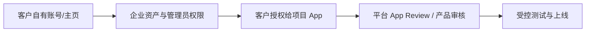
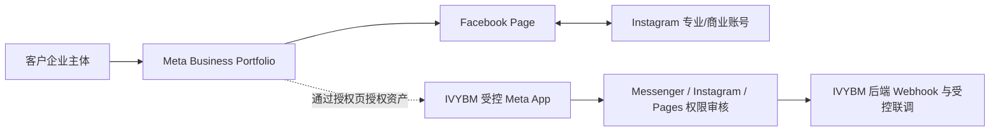
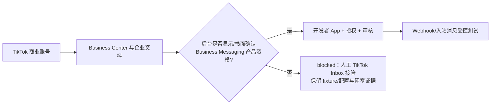
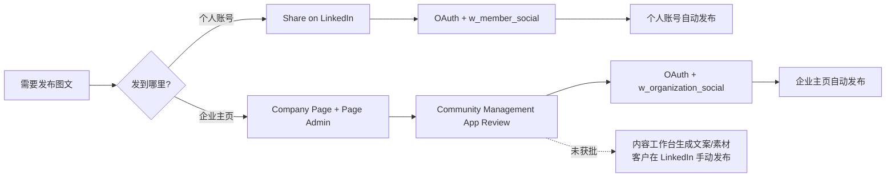

# IVYBM 一期海外社媒账号与 API 开通指南（客户版）

更新日期：2026-07-22
适用对象：甲方账号所有人、企业管理员、市场/运营负责人
用途：为一期 Facebook、Instagram、TikTok、LinkedIn 的受控联调准备客户自有账号资产和授权条件。

> 本手册只覆盖账号、企业资产、管理员授权及平台申请准备。网站系统、Webhook、App 配置、接口开发、验签、令牌安全、审核演示录屏和联调由 IVYBM 技术团队负责。
>
> 一期范围已冻结：Facebook Messenger、Instagram DM、TikTok 私信；Facebook、Instagram、LinkedIn 图文发布。**WhatsApp、LinkedIn 私信和 TikTok 图文发布不在一期系统接入范围。**

---

## 先看结论

账号注册不是 API 开通。每个平台都至少包含四层条件：

| 平台     | 一期目标                                                   | 客户可先完成                                                             | 仍需平台审核/确认                                  | 当前交付口径                                        |
| -------- | ---------------------------------------------------------- | ------------------------------------------------------------------------ | -------------------------------------------------- | --------------------------------------------------- |
| Meta     | Facebook Messenger、Instagram DM、Facebook、Instagram 图文 | Page、Instagram 专业/商业账号、Meta Business Portfolio、管理员及企业验证 | Meta App Review、Advanced Access、Webhook/权限     | `conditional`，审核和真实联调通过后才可用           |
| TikTok   | 商业账号私信                                               | TikTok Business Account、Business Center、开发者/企业资料                | 目标地区的 Business Messaging 产品资格、应用审核   | `conditional`；没有书面或后台权限证据时按 `blocked` |
| LinkedIn | 个人或企业主页图文发布                                     | 个人账号；如发企业主页还需 Company Page 和 Page 管理员                   | 企业主页自动发布需 Community Management App Review | 个人可走自助授权；企业主页自动发布为 `conditional`  |

`available` 只表示已在真实受控环境完成账号授权、Webhook 和目标操作实测；注册账号或通过 mock 测试都不能视为 `available`。

---

## 共同准备：先由一位账号所有人完成

请指定一位客户侧“平台资产负责人”。此人应使用公司长期保留的邮箱和个人实名账号登录，而不是临时员工、外包人员或项目组个人账号。

### 请先准备这些资料

- 企业法定名称、注册国家/地区、统一社会信用/注册编号和可验证的官网域名。
- 官网首页、隐私政策、服务条款和“删除个人数据/联系邮箱”页面链接。平台审核时可能要求展示。
- 可公开的公司 Logo、简介、主营业务、目标市场、客服邮箱及联系地址。
- Facebook Page、Instagram、TikTok、LinkedIn Page 的公开 URL；没有的先按本手册创建。
- 可用于审核演示的测试内容、测试图片和一名可测试私信的真实账号。
- 客户侧至少两名长期管理员。避免一人离职后全部资产失控。

### 30 秒公开页面预检

在电脑浏览器的无痕窗口中，依次打开官网首页、隐私政策、服务条款和数据删除/联系页面。四个页面都应无需登录即可打开，并显示企业名称和可用的联系邮箱。任何一个页面打不开、跳转到个人账号或信息明显不一致时，先把 URL 和页面截图发给 IVYBM，不要急着提交平台审核。

### 安全边界

1. 客户始终保有业务账号、Business Portfolio/Business Center、Page/主页与最高管理员权限。默认 Meta 使用 IVYBM 受控 App，客户不需要拥有该 App；TikTok、LinkedIn 及合同约定的客户自持 App 应由客户保有最终 Owner。
2. 客户通过“添加人员/合作伙伴/开发者”的方式给我方最小权限；**不要发送 Facebook、Instagram、TikTok、LinkedIn 密码**。
3. App Secret、Access Token、refresh token、私钥和验证令牌不得发到微信、邮件、群聊、GitHub 或文档；由客户在部署环境中安全录入，或在联调时通过受控方式临时注入。
4. 未取得平台书面确认前，不购买“绕过审核”的第三方工具，不用浏览器挂机/RPA 代替正式 API，也不承诺陌生人群发私信。
5. 未收到 IVYBM 的书面《授权请求单》前，不要邀请任何技术人员、合作伙伴或开发者。该请求单会列明受邀邮箱或 Partner Business ID、要访问的具体资产、角色/权限、用途、有效期和撤销入口；口头指令或陌生私信均不作为授权依据。
6. 开通完成包仅上传到 IVYBM 提供的受控文件夹，或发送给 IVYBM 指定的企业账号单聊；未收到明确的交付地址时，先不要在群聊发送。截图只保留页面标题、资产名称/ID、角色和状态，必须遮住个人邮箱/手机号、Client Secret、二维码、登录态、私信正文和任何 Token。

---

## 客户与 IVYBM 的分工

| 客户负责                                                                            | IVYBM 负责                                                                              |
| ----------------------------------------------------------------------------------- | --------------------------------------------------------------------------------------- |
| 账号注册、企业资产归属、企业/身份验证、保留最终管理员、同意平台条款                 | 创建/维护集成配置、回调地址、Webhook、OAuth、验签、幂等、接口开发和受控测试             |
| 关联 Facebook Page、Instagram、LinkedIn Company Page、TikTok Business Center 等资产 | 准备 App Review 的技术说明、权限最小化说明、演示视频、测试路径和整改材料                |
| 向我方授予可撤销的人员/合作伙伴/开发者权限，确认正式授权范围                        | 不保存客户密码；令牌后端加密/脱敏；日志不记录密钥；协助核对审核状态                     |
| 提供官网、隐私政策、法定主体和业务资料；在必要时提交或确认企业验证                  | 验证入站消息、发布、失败重试和人工补偿，并记录 `available / conditional / blocked` 状态 |

## 如何使用截图和视频

本手册中的截图均来自平台的**公开官方帮助/文档页**，用于让客户确认入口、页面标题和关键菜单词。它们不是某一家客户的后台，也不包含账号、密码或令牌。客户登录后的菜单名称、顺序和是否显示某个产品，会受到地区、账号资格、角色与平台版本影响；请以登录后的实际页面为准。

视频只作为操作前的概念培训或界面熟悉材料，**不会替代**当前 App Dashboard 的权限申请、企业验证或审核结果。尤其 TikTok 的通用 Business/Ads 教程不代表 Business Messaging/DM API 已获批准。

### 找不到按钮时先这样做

本手册会在每一步标题中标注“手机 App”或“电脑浏览器”。菜单名称不同、没有按钮或提示权限不足时，不要反复尝试“移除资产”“认领资产”“删除资产”等操作。请记录平台名称、使用设备、当前页面标题、左侧菜单路径和报错原文；按上面的脱敏规则截图后交给 IVYBM 判断。

---

# 一、Meta：Facebook Messenger、Instagram DM、Facebook/Instagram 图文

## 1. Meta 的资产关系图

建议按以下顺序操作。界面名称会因语言和 Meta 更新略有不同；遇到相近名称时，以“Business Portfolio / Settings / Accounts / Page access”为准。

### Meta-0：先确认默认 App 路径（电脑浏览器）

默认路径中，客户只在**自己公司的** Meta Business Portfolio、Facebook Page、Instagram 设置页和 IVYBM 发出的官方授权页中操作。客户**不需要、也不应**登录或创建 IVYBM 的 Meta App，更不应索要 IVYBM 的 App Dashboard 账号。

只有合同明确写明“客户自持 Meta App”时，IVYBM 才会另发一份客户自持 App 的书面操作单；收到该单之前，请继续按默认路径准备客户资产即可。

## 2. 客户操作步骤

### Meta-1：创建或确认 Facebook Page（电脑浏览器）

1. 使用客户侧长期保留的 Facebook 个人账号登录 [Facebook Pages](https://www.facebook.com/pages/create/)。
2. 创建公司 Page，填写公司名称、类别、简介、官网、联系方式、Logo 和封面图。
3. 发布后记录 Page 公开 URL，确认页面能正常打开。
4. 在 Page access/页面访问权限中，保留至少两名客户侧人员的**完全控制权（Full control）**；用于关联 Instagram 的客户授权人也应具备该权限。

**完成证据：** Page URL、客户侧管理员名单截图。

### Meta-2：将 Instagram 切换为专业账号并绑定同一 Page（手机 App；关联 Page 时可能跳转电脑浏览器）

1. 用 Instagram App 登录公司账号，进入“设置和隐私/专业人士工具/账户类型”，切换到 Professional Account。
2. 一期建议选择 **Business（商业）**，不要使用个人账号。
3. 按引导绑定上一步创建的 Facebook Page；若已经有 Page，选择现有 Page。
4. 在 Instagram profile 中确认账号已显示商业/专业类别，并记录 Instagram 公开 URL。
5. 在 Instagram App 的“设置和隐私 > 消息和快拍回复 > 消息控制 > 已连接的工具”（文字会随版本变化）中，打开“允许访问消息/Allow access to messages”。此项只在相关账号和接入路径下显示；若找不到，截图当前页面交由 IVYBM 核对。

绑定前请确认：Facebook Page 与 Instagram 专业账号会归入**同一个**客户 Meta Business Portfolio；同一个 Instagram 账号不能同时归属多个 Business Portfolio。不要因临时协作把 Page/Instagram 资产转入我方或其他个人的 Portfolio。

### Meta-2A：官方操作页面截图

<figure class="official-screenshot">
  
  <figcaption><strong>官方公开页面截图（2026-07-21）。</strong>这是 <a href="https://www.facebook.com/business/help/898752960195806">Meta Business 帮助中心的关联指引</a>，先核对“Instagram 专业账户”“Facebook 公共主页的完全控制权”“同一业务资产组合”三项前期条件，再按页面步骤完成关联。登录后的具体资产列表会因客户账号而不同。</figcaption>
</figure>

**完成证据：** Instagram 账号显示为专业/商业账号、已关联 Facebook Page、已开启消息访问（如页面可见）的截图。

> Instagram 的“专业账号”可包含 Business/Creator。为了同时覆盖本一期的消息与内容发布，默认以 Business + 已关联 Facebook Page 的路径准备；本期 OAuth 代码固定使用独立的 Instagram Login for Business，Facebook Messenger / Page 授权继续使用 Facebook Login for Business。具体消息与发布权限仍以 App Review 和当前官方产品要求为准。

### Meta-3：创建或确认 Meta Business Portfolio（电脑浏览器）

**先处理资产归属冲突：** 如果“添加 Page/Instagram”时提示资产已归属另一个 Business Portfolio、没有权限或无法认领，请立即停止。不要点击移除、认领、删除，也不要重复创建新的 Page/Portfolio。按脱敏规则截取报错原文、资产 URL/ID 和当前 Portfolio 名称，交给 IVYBM 判断资产归属后再继续。

1. 进入 [Meta Business Suite](https://business.facebook.com/)，按页面提示创建公司自己的 Business Portfolio（旧界面可能称 Business Manager）。
2. 在 Settings/设置中把 Facebook Page 加入“Accounts/账户 > Pages/主页”。
3. 把 Instagram 账号加入“Accounts/账户 > Instagram accounts/Instagram 账号”，并确认它显示为已连接的公司资产；Page 与 Instagram 必须在同一个客户 Business Portfolio 中。
4. 在 Users/用户中保留客户侧两名 Business Admin；收到 IVYBM《授权请求单》后，才按其中指定的邮箱或 Partner Business ID 添加最小范围的人员/合作伙伴权限。

**完成证据：** Business Portfolio 名称、ID、Page 与 Instagram 均出现在资产列表中的截图。

### Meta-4：按提示完成企业验证并授权我方人员（电脑浏览器）

1. 只在**客户自己的** Business Portfolio 的 Security Center/安全中心、Page/Instagram 设置页，或 IVYBM 发出的官方授权页中处理实际出现的 Business Verification/PPA 提示；资料必须与官网、Page 名称及业务主体一致。默认路径下不要进入或创建 IVYBM 的 App Dashboard。
2. 收到 IVYBM《授权请求单》后，才在 Business Settings 中给指定技术邮箱/合作伙伴分配其中列出的资产权限。不要给个人 Facebook 密码，也不要为了“先试试”授予全量管理员权限。
3. Page 侧请保证用于授权的客户管理员同时具备消息、内容、管理/审核等所需 Page task；Meta 审核和接口权限会据此校验。

**完成证据：** 企业验证状态（已验证/待审/被拒）和授权成员名单截图。被拒时请保留拒绝原因原文，不要反复盲目提交。

### Meta-5：把客户业务资料交给 IVYBM 完成 App 与审核配置

请把本节所列**非敏感信息**上传到 IVYBM 提供的受控文件夹，或发送给指定企业账号单聊；不要发送到项目群：

- Meta Business Portfolio ID、Facebook Page URL/ID、Instagram URL/用户名；
- 企业验证状态；
- 目标功能：Facebook 入站私信、Instagram 入站私信、Facebook 图文、Instagram 图文；
- 官网、隐私政策、服务条款、数据删除说明链接；
- 可以配合审核演示的一位客户管理员和一位测试咨询账号；
- 账号地区、语言及是否已有 Page Publishing Authorization（PPA）提示。

默认由 IVYBM 的受控 Meta App 配置 Messenger/Instagram/Pages 产品、回调域名、Webhook 订阅、OAuth redirect URI、隐私资料和 App Review；客户通过官方授权页选择并授权自己的资产。客户 Business Portfolio、Page 和 Instagram 资产必须始终归客户所有，不能与 IVYBM 的 App 所属 Portfolio 混用。若合同另行要求客户自持 Meta App，则客户需承担该 App 对应的企业验证和 App Review，IVYBM 提供技术材料与联调协助。

## 3. Meta 权限与限制：客户需要理解的版本

| 能力                         | 客户侧最小前提                                                     | IVYBM 的技术工作                                | 平台关口                                               |
| ---------------------------- | ------------------------------------------------------------------ | ----------------------------------------------- | ------------------------------------------------------ |
| Facebook Messenger 入站/回复 | Facebook Page；授权管理员有消息/审核相关 Page task                 | Messenger use case、Webhook、签名校验、消息去重 | 面向非 App 角色用户通常需 Advanced Access + App Review |
| Instagram DM 入站/回复       | Instagram Professional，建议 Business；按选定登录路径完成关联/授权 | Instagram Messaging 产品、Webhook、统一会话映射 | 面向真实客户消息通常需 Advanced Access + App Review    |
| Facebook 图文                | Page；授权管理员有创建内容、管理和审核 Page task                   | Page token、发布/回调、失败补偿                 | 相关 Pages 权限和真实发布授权                          |
| Instagram 图文               | 专业/商业账号；图片有公网可访问 URL；若提示 PPA 先完成             | 内容发布 API、素材校验、状态回写                | 相关 Instagram 内容发布权限和真实发布授权              |

**不要把权限名称当作客户自行勾选清单。** Facebook Messenger 使用 Facebook Login for Business，当前配置包含 `pages_show_list`、`pages_manage_metadata`、`pages_messaging`、`pages_read_engagement`；Facebook 发布 Token 还必须包含 `pages_manage_posts`。Instagram 使用独立的 Instagram Login for Business，当前配置包含 `instagram_business_basic`、`instagram_business_content_publish`、`instagram_business_manage_comments`、`instagram_business_manage_messages`。权限名称和登录路径会随 Graph API 和 App 产品更新，IVYBM 会按审核时的官方 App Dashboard 提交最小范围。

### Meta 业务规则提醒

- 用户通常需要先发起消息；客服回复应遵守 Meta 的消息窗口和适用例外，不能把私信 API 当陌生人群发工具。
- Webhook 是后端能力：必须使用公网 HTTPS、有效 TLS、签名验真、及时响应和幂等处理。客户不需要自行填写回调地址或把 verify token 发到聊天工具。
- 通过开发模式只代表 App 角色成员可以测试；真实客户可用前，仍以 App Review/Advanced Access 和真实测试结果为准。
- Advanced Access 的企业验证通常属于**集成 App 所有者**；客户仅在自己的 Security Center、PPA 或授权页面实际提示时完成对应验证，不需要为 IVYBM 的 App 代填企业验证。

## 4. Meta 推荐视频/官方学习入口

| 资源                                                                                                                              | 适合什么时候看                                           | 说明                                                                                                                         |
| --------------------------------------------------------------------------------------------------------------------------------- | -------------------------------------------------------- | ---------------------------------------------------------------------------------------------------------------------------- |
| [Meta 官方视频：How to create a Messenger experience](https://developers.facebook.com/videos/2019/how-to-create-a-messenger-bot/) | 了解从 Page 到 Messenger 体验的总体流程                  | Meta for Developers 公开视频，约 32 分钟；视频年份较早，当前权限、审核与 API 版本仍以文档和 Dashboard 为准                   |
| [Meta 官方 Messenger 视频目录](https://developers.facebook.com/videos/messenger/)                                                 | 需要进一步熟悉 Messenger/App Review 相关概念时           | Meta for Developers 视频合集；可按当前页面搜索 Messenger 主题                                                                |
| [Meta 官方视频：Messenger Handover Protocol](https://developers.facebook.com/videos/2019/messenger-handover-protocol/)            | 了解系统与人工客服之间的交接概念                         | 面向技术/运营协作的背景视频；不是客户自行开通权限的替代步骤                                                                  |
| [Meta Blueprint 课程目录](https://www.facebookblueprint.com/student/catalog)                                                      | 创建 Page、Business Suite、广告/业务资产初学者           | Meta 官方学习库；在目录搜索 `Business Suite`、`Facebook Page` 或 `Instagram professional account`，账号/地区可能决定可见课程 |
| [Meta Business Help Center](https://www.facebook.com/business/help)                                                               | 页面访问权限、Business Portfolio、企业验证界面发生变化时 | 官方图文帮助入口；优先按当前界面搜索关键词，不依赖旧教程截图                                                                 |
| [Messenger Platform Overview](https://developers.facebook.com/documentation/business-messaging/messenger-platform/overview)       | 技术审核与消息 API 条件核对                              | 开发者官方入口，非面向普通运营的操作视频；审核演示视频由 IVYBM 按具体 App 录制                                               |

---

# 二、TikTok：商业账号私信（条件性能力）

## 1. 先确认这一点

**TikTok Business Account/Business Center 已创建，不等于 TikTok 私信 API 已开通。** 目前没有可靠官方公开流程证明所有普通商业账号都可自助获得通用 Business Messaging/DM API。它可能受目标市场、产品资格、应用审核或合作计划限制。

因此，本项目对 TikTok 私信的正确状态是：

## 2. 客户操作步骤

### TikTok-1：创建或转换为商业账号（手机 App）

1. 使用公司长期保留的邮箱/手机号注册或登录 TikTok 公司账号。
2. 在 App 的“设置和隐私/账户”中选择切换为 Business Account（菜单文字会因地区/版本不同）。
3. 填写真实的公司名称、类别、官网和业务资料；记录账号用户名、公开主页 URL 与账号注册/运营地区。
4. 保留至少两名客户侧账号管理人，不把密码交给项目组。

**完成证据：** 商业账号类型、账号用户名/主页 URL、账号地区截图。

### TikTok-2：创建 Business Center 并保留客户侧 Owner（电脑浏览器）

1. 打开 [TikTok for Business / Marketing API 文档入口](https://ads.tiktok.com/marketing_api/docs?id=1738855099573250)，按当前地区页面创建 TikTok for Business 账户和 Business Center。
2. 使用客户企业法定资料完成后台要求的公司/身份验证；不要用代理商或外包个人作为唯一 Owner。
3. 在成员/资产管理中保留两名客户侧 Owner；待 IVYBM 提供邮箱后，再按最小权限添加技术协作者。

**完成证据：** Business Center 名称/ID、客户侧 Owner 列表、验证状态截图。

### TikTok-3：先确认“私信”产品资格（电脑浏览器；未确认就先停止）

在 Business Center 的产品/资产页面中检查是否明确显示 Business Messaging、Direct Message 或同等命名产品；若当前后台没有该入口，请向 TikTok 客户经理或官方工单一次性确认企业、目标市场和商业账号是否可申请私信 API。请把以下任一证据发给 IVYBM：

- 产品已显示为可申请/已批准的后台截图；
- TikTok 客户经理、官方工单或平台邮件明确支持该企业和目标市场的书面回复；
- 若被拒绝/不可见，提供拒绝原因和目标地区信息。

**决策门：** 只有拿到“可申请”或“已批准”的证据，才进入下一步创建 Developer App。没有该证据时，立即把 TikTok 私信标为 `blocked`：不创建 App、不设置 OAuth/Webhook、不承诺联调；IVYBM 会保留配置说明和接口 fixture，客户暂时在 TikTok Inbox 人工处理私信，不以非官方自动化替代。

### TikTok-4：仅在资格确认后，申请开发者资格并创建客户名下的应用（电脑浏览器）

请由客户侧 Owner 在 TikTok 当前后台完成或确认：

1. [Register as a developer](https://ads.tiktok.com/marketing_api/docs?id=1738855176671234)；
2. [Create a developer app](https://ads.tiktok.com/marketing_api/docs?id=1738855242728450)；
3. 按当前后台完成 [Obtain authorization](https://ads.tiktok.com/marketing_api/docs?id=1738373141733378) 与 [Obtain authentication](https://ads.tiktok.com/marketing_api/docs?id=1738373164380162) 的前置条件。

应用、Business Center 与最终授权必须属于客户企业。IVYBM 负责后续 OAuth redirect URI、Webhook、隐私页面、数据删除说明、签名/时间戳/幂等处理和最小权限技术配置。未收到 IVYBM 的书面配置请求前，不要自行填写 redirect URI、Webhook、Client Secret 或任何技术回调地址。

### TikTok-4A：官方操作页面截图

<figure class="official-screenshot">
  
  <figcaption><strong>官方公开页面截图（2026-07-21）。</strong>这是 <a href="https://business-api.tiktok.com/portal/docs/create-a-tiktok-for-business-account/v1.3">TikTok for Business Developers 的企业账号创建文档</a>。左侧的 Step-by-step workflow 依次包含创建企业账号、注册开发者、创建 App、授权和认证。此图只证明通用开发者准备入口可见，<strong>不代表 DM/Business Messaging API 已获资格</strong>。</figcaption>
</figure>

## 3. TikTok 需要客户确认的材料

- TikTok Business Account 和 Business Center 的最终所有权；
- 企业主体、目标市场/账号地区、业务类别；
- 仅在通过 TikTok-3 决策门后：Developer App 的所有权、审核/产品资格状态；
- 官网、隐私政策、服务条款、数据删除联系方式；
- IVYBM 指定技术成员的最小、可撤销权限；
- Business Messaging/DM 产品资格的截图或平台书面回复。

## 4. TikTok 官方学习入口

| 资源                                                                                                            | 用途                                                | 说明                                                                                                        |
| --------------------------------------------------------------------------------------------------------------- | --------------------------------------------------- | ----------------------------------------------------------------------------------------------------------- |
| [TikTok Business API SDK](https://github.com/tiktok/tiktok-business-api-sdk)                                    | 核对官方基础接入顺序和文档链接                      | TikTok 官方 GitHub；覆盖账户、开发者、应用、授权、认证等基础路径，不代表 DM 权限已自助开放                  |
| [TikTok for Business 账户创建文档](https://ads.tiktok.com/marketing_api/docs?id=1738855099573250)               | 创建企业账户/Business Center                        | 官方页面可能因账号地区、登录状态而改变或要求登录                                                            |
| [TikTok Academy](https://www.tiktokacademy.com/)                                                                | 了解 TikTok for Business/Business Center 的官方培训 | 官方学习入口；先用企业账号登录，按所在地区检索 Business Center/Account Setup；DM 审批通常不提供通用教学视频 |
| [TikTok for Business 官方 YouTube 频道](https://www.youtube.com/@TikTokForBusiness)                             | 熟悉商业账号、广告后台和内容运营界面                | 已核验的官方频道；适合作为通用后台/业务培训，不能用于判断私信 API 产品资格                                  |
| [TikTok Ads Manager 官方视频播放列表](https://www.youtube.com/playlist?list=PLgprgjF5vCzYJ3rWbY7YnnTy2YBp6yyUM) | 先了解 TikTok for Business 控制台概念               | 官方频道播放列表；与本项目的 TikTok 私信权限申请是不同产品范围                                              |

> 本轮未发现可公开、可核验且专门讲解 TikTok Business Messaging/DM API 审核的官方视频。客户仍应以 Dashboard 产品资格截图或 TikTok 官方工单/客户经理的书面确认作为进入联调的唯一依据。

---

# 三、LinkedIn：图文发布（个人路径与企业主页路径分开）

## 1. 选择哪条路径

项目一期并不限制 LinkedIn 个人账号类型；限制的是**是否有企业主页管理员角色，以及开发者 App 是否获得对应 API 产品/审核**。

### 先选一条路径（电脑浏览器）

| 目标路径                                                         | 客户现在要做什么                                                                                                         | 此时不要做什么                                             |
| ---------------------------------------------------------------- | ------------------------------------------------------------------------------------------------------------------------ | ---------------------------------------------------------- |
| 个人账号发布 + IVYBM 受控 App（仅在 IVYBM 书面确认采用此路径时） | 保留个人账号最终控制权，等待 IVYBM 发出受控测试授权链接                                                                  | 不需要为此路径创建 Company Page 或 Developer App           |
| 个人账号发布 + 客户自持 App（仅在合同/IVYBM 书面确认要求时）     | 创建客户名下的 Developer App，并添加 Share on LinkedIn                                                                   | 不需要仅为了个人发布而创建 Company Page 或申请组织发布权限 |
| 企业主页自动发布                                                 | 创建/确认 Company Page、保留两名 Super admin、创建客户名下的 Developer App，并按要求申请 Community Management App Review | 审核未通过时不绕过，改用人工发布兜底                       |

如果无法判断自己属于哪一行，先把计划发布的目标（个人账号或 Company Page）告诉 IVYBM，收到书面确认后再继续。不要因为“先建一个 App 试试”而创建无主或个人名下的业务资产。

## 2. 客户操作步骤

### LinkedIn-1：创建或确认公司主页（仅企业主页发布需要；电脑浏览器）

1. 用客户侧长期保留的 LinkedIn 个人账号登录，进入 [Create a LinkedIn Page](https://www.linkedin.com/company/setup/new/)。
2. 创建公司主页，填写真实公司名称、公司 URL、官网、行业、规模、Logo 与简介。
3. 在 Page admin/主页管理员中保留两名客户侧 Super admin；此角色可管理主页、管理员和账号归属。
4. 如需我方协助日常内容操作，客户可按最小权限给指定成员 Content admin。不要提供个人账号密码。

**完成证据：** Company Page URL、客户侧 Super admin 列表截图。

> LinkedIn 官方帮助说明：Super admin 能管理全部主页管理员权限；Content admin 能创建和管理主页内容。企业主页 API 发帖所用授权成员还须具有 `ADMINISTRATOR`、`CONTENT_ADMIN` 或 `DIRECT_SPONSORED_CONTENT_POSTER` 这类合格角色之一。

### LinkedIn-1A：官方操作页面截图

<figure class="official-screenshot">
  
  <figcaption><strong>官方公开页面截图（2026-07-21）。</strong>这是 <a href="https://www.linkedin.com/help/linkedin/answer/a541981">LinkedIn 帮助中心的公司主页管理员角色说明</a>。客户应先确保至少两名长期人员是 Super admin，再视协作需要授予 Content admin；进入 Developer App 和企业主页发布审核前，请先完成这一资产归属检查。</figcaption>
</figure>

### LinkedIn-2：创建客户名下的 Developer App（仅客户自持 App 路径需要；电脑浏览器）

企业主页自动发布必须完成本步骤。个人账号路径只有在合同或 IVYBM 书面确认要求“客户自持 App”时才做本步骤；若 IVYBM 确认使用受控 App，请跳过本步骤并等待授权测试链接。

1. 客户侧 Page Super admin 进入 [LinkedIn Developer Portal - My Apps](https://www.linkedin.com/developers/apps)。
2. 创建公司自己的 App，并在可选项中关联正确的 Company Page；App 所有权不得长期挂在外包人员个人名下。
3. 在 Auth/认证设置中，IVYBM 提供精确的 HTTPS redirect URI；客户/技术方必须逐字匹配录入，不能自行改写。
4. 在 App 的团队/角色配置里，按 IVYBM 指定账户添加开发协作权限；客户保留 Owner/管理员。
5. 不让单名员工或外包人员成为唯一 App 管理员。至少两名客户长期账号应持有当前 Developer Portal 可提供的最高管理角色；如平台只允许一个 Owner，则再添加一名客户侧管理员/开发者，并记录交接路径。

**完成证据：** App 名称、Client ID（可提供给 IVYBM）、关联 Page（如有）、两名客户侧管理账号的角色列表截图。**不要发送 Client Secret。**

### LinkedIn-3：按发布目标添加产品或申请审核（电脑浏览器）

| 发布目标           | 申请/产品路径                                                                                                                                                                                 | 关键权限                | 结果                                                 |
| ------------------ | --------------------------------------------------------------------------------------------------------------------------------------------------------------------------------------------- | ----------------------- | ---------------------------------------------------- |
| 发布到授权个人账号 | 在 Developer Portal 的 Products 添加 [Share on LinkedIn](https://learn.microsoft.com/en-us/linkedin/consumer/integrations/self-serve/share-on-linkedin?context=linkedin%2Fconsumer%2Fcontext) | `w_member_social`       | 可走 OAuth 授权后自动发布个人图文                    |
| 发布到企业主页     | 按 [Community Management App Review](https://learn.microsoft.com/en-us/linkedin/marketing/community-management-app-review) 提交开发者和 App 的 access request                                 | `w_organization_social` | 只有审核通过、管理员授权成功后才启用自动企业主页发布 |

企业主页自动发布的审核材料与演示路径由 IVYBM 准备，客户负责确认企业主页、管理员、官网/隐私资料和业务真实性。审核没通过时不阻塞内容生产：系统会生成已审核文案和素材包，客户在 LinkedIn Page 手动发布后回填状态。

### LinkedIn-4：确认 OAuth 授权与测试发布（电脑浏览器）

1. IVYBM 提供一个受控测试链接；客户选择正确的个人账号或合格的企业主页管理员完成授权。
2. 客户确认授权页展示的是预期 App 和最小 scope；不确定时先退出并联系 IVYBM。
3. 先发布一条测试图文到约定的测试目标，确认落点、图片、文本和发布记录。
4. 若企业主页 API 审核未通过，不反复绕过；转入“内容工作台 + 人工发布”兜底，并保留审核状态。

**完成证据：** 测试帖 URL、发布时间、目标个人账号/Company Page、发布成功截图。不要提交 OAuth 授权码、回调地址、Cookie 或 access token。

## 3. LinkedIn 官方学习入口

| 资源                                                                                                                        | 用途                                                | 说明                                                                                  |
| --------------------------------------------------------------------------------------------------------------------------- | --------------------------------------------------- | ------------------------------------------------------------------------------------- |
| [LinkedIn Page admin roles](https://www.linkedin.com/help/linkedin/answer/a541981)                                          | 让客户理解 Super admin 与 Content admin             | 官方帮助图文；适用于创建/分配主页管理员                                               |
| [LinkedIn Marketing Labs](https://www.linkedin.com/business/marketing/learning)                                             | 主页内容与营销工具官方培训                          | LinkedIn Marketing Solutions 的学习入口，课程可含视频，登录/地区会影响可见性          |
| [LinkedIn for Marketing 官方 YouTube 频道](https://www.youtube.com/@LinkedInMktg)                                           | 熟悉 LinkedIn Marketing/Company Page 的官方视频资料 | 已核验的 LinkedIn 官方营销频道；更适合主页、内容和营销工具培训，不替代开发者 App 审核 |
| [LinkedIn Pages 官方 YouTube 播放列表](https://www.youtube.com/playlist?list=PLOiWp3quz2WUN1wzg_2YMl8Ceop27agj5)            | 学习 Company Page 的运营与管理基础                  | 来自上述官方频道的 LinkedIn Pages 播放列表；API scope 和审核仍以 Microsoft Learn 为准 |
| [Posts API](https://learn.microsoft.com/en-us/linkedin/marketing/community-management/shares/posts-api?view=li-lms-2026-01) | 核对个人与组织发布 scope、角色要求                  | 官方开发文档；App 审核与实现由 IVYBM 处理                                             |

---

# 四、提交给 IVYBM 的“开通完成包”

完成各平台步骤后，请一次性提供下列**非敏感**资料。可用本页末尾的勾选清单核对。

| 项目     | 需要提供                                                                                                                        | 不要提供                                          |
| -------- | ------------------------------------------------------------------------------------------------------------------------------- | ------------------------------------------------- |
| Meta     | Business Portfolio ID、Page URL/ID、Instagram 用户名、企业验证状态、是否默认 IVYBM App/客户自持 App、授权成员截图               | Facebook/Instagram 密码、App Secret、Page Token   |
| TikTok   | Business Account URL、Business Center ID、目标地区、DM 资格截图/官方工单；仅通过 TikTok-3 后再提供 Developer App 状态           | TikTok 密码、Client Secret、Access/refresh token  |
| LinkedIn | 已选择的个人/企业路径、个人/Company Page URL、Super admin/Content admin 状态、App Client ID（如适用）、Products/App Review 状态 | LinkedIn 密码、Client Secret、OAuth access token  |
| 通用     | 官网、隐私政策、条款、数据删除链接、企业主体信息、测试联系人                                                                    | 任何生产密钥、身份证/营业执照原件在公开群聊中发送 |

### 统一交付方式与截图规则

1. 只使用 IVYBM 提供的受控文件夹或指定企业账号单聊，不在项目群、邮件转发链或公开网盘中交接后台截图。
2. 每张截图只展示完成证据：页面标题、资产名称/ID、角色、审核/产品状态。遮住个人邮箱、手机号、Client Secret、二维码、私信正文、Cookie、Token 和授权码。
3. 文件按 `[平台]_[资产或步骤]_[状态]_[YYYY-MM-DD].png` 命名，例如 `Meta_BusinessPortfolio_verified_2026-07-22.png`、`TikTok_DM-eligibility_pending_2026-07-22.png`。同一平台的截图和官方工单/邮件放入同一文件夹。
4. 找不到某项时也可交付一张脱敏后的当前页面截图，并在文件名中写 `blocked` 或 `need-help`；不要为了得到“成功”截图去移除、认领或重建资产。

## 发起联调前最后核对

  

<strong>1.</strong> 客户企业是所有平台资产的最终 Owner，至少有两名客户侧长期管理员。

  

<strong>2.</strong> Facebook Page 已创建；Instagram 为专业/商业账号并关联同一 Page。

  

<strong>3.</strong> Meta Business Portfolio 已纳入 Page 与 Instagram 资产；企业验证状态已截图。

  

<strong>4.</strong> TikTok 为商业账号，Business Center 与目标地区已确认；DM 产品资格已截图或有官方书面回复。只有该证据存在时才创建 Developer App。

  

<strong>5.</strong> LinkedIn 发布路径已由客户和 IVYBM 书面确认；如发企业内容，Company Page 已创建且客户保留两名 Super admin；如需客户自持 App，至少两名客户侧账号具有当前可用的管理角色。

  

<strong>6.</strong> 官网、隐私政策、服务条款和数据删除说明可公开访问。

  

<strong>7.</strong> 客户只通过人员/合作伙伴/开发者权限授权给 IVYBM，未发送密码或生产 token。

  

<strong>8.</strong> 已知 App Review/产品审核未通过时，接受 Facebook/Instagram/TikTok/LinkedIn 按 <code>conditional</code> 或 <code>blocked</code> 交付，并启用人工发布/人工 Inbox 接管兜底。

---

# 五、客户只需认识的几个术语

| 术语                                 | 通俗含义                                        | 客户要做什么                                                                                 |
| ------------------------------------ | ----------------------------------------------- | -------------------------------------------------------------------------------------------- |
| Business Portfolio / Business Center | 企业用来归属 Page、账号和成员权限的后台         | 由客户企业持有，保留两名长期最高管理员                                                       |
| Full control / Super admin / Owner   | 当前平台可提供的最高资产管理角色                | 至少两名客户长期账号拥有该角色或等价最高角色                                                 |
| App                                  | 让系统通过官方 API 连接平台的集成程序           | 默认 Meta App 由 IVYBM 管理；TikTok/LinkedIn 是否客户自持，以本手册路径和 IVYBM 书面确认为准 |
| OAuth / scope                        | 平台弹出的正式授权页和本次允许 App 做什么的范围 | 客户只核对 App 名称、所选资产和用途；不填写技术参数、不发送授权码或 Token                    |
| redirect URI / Webhook               | 系统接收授权结果或平台消息的技术地址            | 全部由 IVYBM 提供、配置和验证；客户不要自行猜填                                              |

---

# 六、官方依据与版本说明

本手册以 2026-07-21 可访问的官方公开资料为准。平台后台、审核条件、权限名称、地区与账号资格会变化；具体提交时以客户账户中的平台 Dashboard 和官方审核回复为准。

## Meta

- [Messenger Platform Overview](https://developers.facebook.com/documentation/business-messaging/messenger-platform/overview)：Messenger/Instagram messaging 的 App、Page、专业账号、访问级别与真实用户审核条件。
- [Webhooks for Messenger Platform](https://developers.facebook.com/documentation/business-messaging/messenger-platform/webhooks)：HTTPS callback、订阅、签名、5 秒响应与重试相关技术要求。
- [Instagram Messaging Getting Started](https://developers.facebook.com/documentation/business-messaging/instagram-messaging/get-started)：Instagram Professional + 关联 Page 的 Facebook Login 路径，以及“允许访问消息”客户侧开关。
- [Instagram Messaging Webhooks](https://developers.facebook.com/documentation/business-messaging/instagram-messaging/webhooks)：Instagram DM 的 Webhook、已发布 App 与审核条件。
- [Instagram Messaging App Review](https://developers.facebook.com/documentation/business-messaging/instagram-messaging/app-review/apps-for-other-businesses)：IG 入站 App Review 的客户测试路径、屏录与审核材料要求。
- [Pages API - Posts](https://developers.facebook.com/documentation/pages-api/posts)：Facebook Page 图文发布、Page task 与相关权限。
- [Instagram Content Publishing](https://developers.facebook.com/documentation/instagram-platform/content-publishing)：Instagram Login/Facebook Login 两条路径、内容发布的账号/素材/PPA 要求。
- [Graph API Access Levels](https://developers.facebook.com/docs/graph-api/overview/access-levels)：Standard/Advanced Access、Business Verification、App Review 与 Data Use Check。
- [Pages API Overview](https://developers.facebook.com/documentation/pages-api/overview)：Page token、Page 选择与授权注意事项。
- [关联 Instagram 专业账户与 Facebook Page](https://www.facebook.com/business/help/898752960195806)：客户侧 Page 完全控制权、同一 Business Portfolio 与账号关联操作说明。
- [Instagram 设置专业账户](https://help.instagram.com/502981923235522)：将企业 Instagram 切换为 Professional/Business 的官方图文帮助。

## TikTok

- [TikTok Business API SDK](https://github.com/tiktok/tiktok-business-api-sdk)：官方 SDK README 中列出的账户、开发者、App、授权、认证前置顺序。
- [TikTok for Business account creation](https://ads.tiktok.com/marketing_api/docs?id=1738855099573250)：TikTok for Business 开户入口。
- [Register as a developer](https://ads.tiktok.com/marketing_api/docs?id=1738855176671234)、[Create a developer app](https://ads.tiktok.com/marketing_api/docs?id=1738855242728450)、[Obtain authorization](https://ads.tiktok.com/marketing_api/docs?id=1738373141733378)、[Obtain authentication](https://ads.tiktok.com/marketing_api/docs?id=1738373164380162)：官方开发者基础路径。

## LinkedIn

- [Share on LinkedIn](https://learn.microsoft.com/en-us/linkedin/consumer/integrations/self-serve/share-on-linkedin?context=linkedin%2Fconsumer%2Fcontext)：`w_member_social` 的个人发布自助产品。
- [Posts API](https://learn.microsoft.com/en-us/linkedin/marketing/community-management/shares/posts-api?view=li-lms-2026-01)：`w_member_social` 与 `w_organization_social`、企业主页合格角色。
- [Organization Access Control by Role](https://learn.microsoft.com/en-us/linkedin/marketing/community-management/organizations/organization-access-control-by-role?view=li-lms-2026-01)：组织主页角色的权限边界。
- [Community Management App Review](https://learn.microsoft.com/en-us/linkedin/marketing/community-management-app-review)：企业主页自动发布的 access request/审核入口。
- [OAuth 2.0 Authorization Code Flow](https://learn.microsoft.com/en-us/linkedin/shared/authentication/authorization-code-flow?context=linkedin%2Fcontext)：redirect URI 精确匹配和 OAuth 安全要求。

---

## 需要帮助时请提供

联系 IVYBM 前，请附上平台名称、账号/主页 URL、当前所在页面截图、报错原文、目标地区和已完成步骤。不要截图或发送任何密码、Secret、Token、二维码登录态或身份证件原件。
