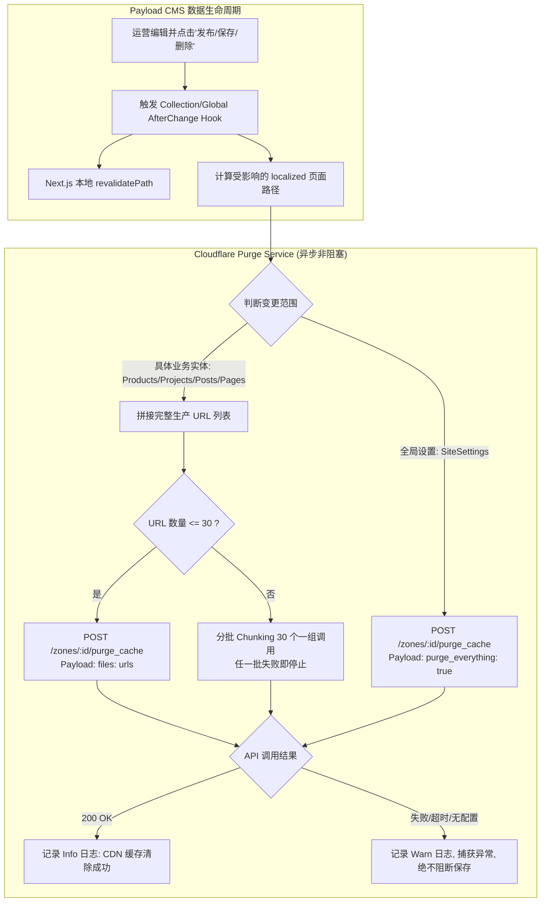

# Cloudflare CDN 缓存自动清除方案设计

> **文档状态**：本地实现完成，待创建 Draft PR（分支 `fix/cloudflare-cache-purge`）
> **创建日期**：2026-08-17
> **涉及范围**：官网 CDN 边缘缓存同步、Payload CMS 发布 Hook、Cloudflare API 集成、运维与应急控制

---

## 1. 背景与目标

### 1.1 现状与问题

- **拓扑结构**：访客浏览器 $\rightarrow$ Cloudflare CDN 边缘节点（Free 计划） $\rightarrow$ 源站 OpenResty $\rightarrow$ Next.js Standalone 应用（Payload CMS + 官网前台）。
- **痛点**：目前官网已在 Cloudflare 开启静态/HTML 缓存。当运营人员在后台（Portal / Payload CMS）更新产品、案例、新闻或页面后，Next.js 服务端内部虽然触发了 `revalidatePath`（更新了 Node.js 内存与数据缓存），但 **Cloudflare 边缘节点的缓存未被同步失效**。导致外部访客在 Cloudflare Edge TTL 没过期前，依然会命中旧的 HTML 缓存（`HIT`），无法即时查看到新发布的内容。

### 1.2 目标

- **自动联动**：管理后台内容发布/更新/删除后，自动调用 Cloudflare API 清理对应的边缘缓存，5 秒内全球生效。
- **阶梯策略**：**优先精准局部清理（Purge by URL）**；只有修改 `SiteSettings` 这类全局配置时才执行 **Purge Everything**。局部请求失败时 fail-open，不自动扩大为全站清理。
- **健壮与安全**：采用 Fail-Open 容错设计（API 波动不阻断内容保存），采用最小权限 Token 鉴权。
- **双轨设计**：以 **方案一（CMS Hook 自动局部清理）** 作为核心落地实现，将 **方案二（管理后台手动 CDN 面板）** 作为备选与后续优化项归档。

---

## 2. Cloudflare Free 计划能力边界与契约

| 清理能力                    | 接口参数                 |         Free 套餐支持情况          | 性能与影响                                                                             | 适用场景                                              |
| :-------------------------- | :----------------------- | :--------------------------------: | :------------------------------------------------------------------------------------- | :---------------------------------------------------- |
| **单 URL / 单文件局部清除** | `files: string[]`        |            ✅ **支持**             | **单次最多 30 个 URL**，毫秒级失效指定页面，其余页面缓存不受影响，源站无突发回源压力。 | **默认首选**。产品、案例、新闻、单页增删改。          |
| **全量全部清除**            | `purge_everything: true` |            ✅ **支持**             | 瞬间清空全站边缘缓存，全网请求全部回源，源站瞬时负载上升。                             | **兜底/全局**。全局配置变更、紧急排障、局部清理异常。 |
| **按标签/前缀清除**         | `tags` / `prefixes`      | ❌ **不支持**<br>_(需 Enterprise)_ | 免费版调用返回 `403 / 10000 Authentication or enterprise tier required`。              | **禁止在免费版调用**。                                |

> [!IMPORTANT]
> **Cloudflare URL 规范要求**：
>
> 1. 局部清除时传入的 URL 必须是带协议和域名的**完整绝对 URL**（如 `https://ivybm.com/en/projects`）。
> 2. 多语言站点（当前包含 `/en` 与 `/ar`）在清除时必须将**全部受影响的语言路径**同时纳入清理列表。
> 3. 清理请求区分 Query 参数与协议，需确保源站 Canonical URL 与传入 URL 一致。

---

## 3. 方案一：CMS Hook 自动局部清理（核心实施方案）

### 3.1 架构设计



### 3.2 模块职责与代码规划

#### (1) `src/lib/cloudflare.ts`（Cloudflare CDN 客户端服务）

负责封装与 Cloudflare 官方 API 通信的底层逻辑：

- 读取环境变量：`CLOUDFLARE_CACHE_PURGE_ENABLED`、`CLOUDFLARE_ZONE_ID`、`CLOUDFLARE_API_TOKEN`、`NEXT_PUBLIC_SERVER_URL`。
- `purgeCloudflareUrls(urls: string[])`:
  - 过滤空值与非法 URL，去重。
  - 单批次超 30 个时按 30 条顺序分批；任一批失败时停止本轮，不回退全量。
  - 设置 5000ms 超时控制。
  - 执行 `fetch('https://api.cloudflare.com/client/v4/zones/{ZONE_ID}/purge_cache', ...)`。
- `purgeCloudflareEverything()`:
  - 执行 `{ "purge_everything": true }`。
- **环境自适应**：
  - 只有 `CLOUDFLARE_CACHE_PURGE_ENABLED=true` 才允许调用；本地和 CI 默认 `false`。
  - 开启后若 Token、Zone ID 或正式 HTTPS Origin 缺失，记录不含凭据的告警并 fail-open。

#### (2) `src/hooks/revalidateContent.ts`（内容变更钩子联动）

扩展既有的 revalidate 机制：

- 在 `revalidateContentAfterChange` / `revalidateContentAfterDelete` 中：
  - 复用现有的 `localizedPaths(collectionSlug, doc)` 计算出相对路径（如 `['/en/projects', '/ar/projects', '/en/projects/slug-a', '/ar/projects/slug-a']`）。
  - 将相对路径通过 `NEXT_PUBLIC_SERVER_URL` 转为完整 URL。
  - 异步派发 `purgeCloudflareUrls(absoluteUrls)`，使用 `void` 非阻塞调用，避免拖慢后台保存响应速度。
- 在 `revalidateSiteSettingsAfterChange` 中：
  - 异步派发 `purgeCloudflareEverything()`，确保全站导航、页脚、品牌信息即刻全网刷新。

### 3.3 各实体 URL 影响映射矩阵

| 实体 Collection / Global          | 变更操作       | 本地 Next.js Revalidate                                                            | Cloudflare 局部清理 URL 列表                                                                                                                           |
| :-------------------------------- | :------------- | :--------------------------------------------------------------------------------- | :----------------------------------------------------------------------------------------------------------------------------------------------------- |
| **Products**（产品）              | 新增/修改/删除 | `/en/products`<br>`/ar/products`<br>`/en/products/[slug]`<br>`/ar/products/[slug]` | `https://ivybm.com/en/products`<br>`https://ivybm.com/ar/products`<br>`https://ivybm.com/en/products/[slug]`<br>`https://ivybm.com/ar/products/[slug]` |
| **ProductCategories**（产品分类） | 新增/修改/删除 | `/en/products`<br>`/ar/products`<br>`/en/products/[slug]` (all)                    | `https://ivybm.com/en/products`<br>`https://ivybm.com/ar/products`                                                                                     |
| **Projects**（工程案例）          | 新增/修改/删除 | `/en/projects`<br>`/ar/projects`<br>`/en/projects/[slug]`<br>`/ar/projects/[slug]` | `https://ivybm.com/en/projects`<br>`https://ivybm.com/ar/projects`<br>`https://ivybm.com/en/projects/[slug]`<br>`https://ivybm.com/ar/projects/[slug]` |
| **Posts**（新闻动态）             | 新增/修改/删除 | `/en/news`<br>`/ar/news`<br>`/en/news/[slug]`<br>`/ar/news/[slug]`                 | `https://ivybm.com/en/news`<br>`https://ivybm.com/ar/news`<br>`https://ivybm.com/en/news/[slug]`<br>`https://ivybm.com/ar/news/[slug]`                 |
| **Pages**（独立页面）             | 新增/修改/删除 | `/en/[slug]`<br>`/ar/[slug]`<br>_(若为 home 则为 `/en`、`/ar`)_                    | `https://ivybm.com/en/[slug]`<br>`https://ivybm.com/ar/[slug]`<br>_(若为 home 则为 `https://ivybm.com/en` 等)_                                         |
| **Downloads**（资料下载）         | 新增/修改/删除 | `/en`<br>`/ar`                                                                     | `https://ivybm.com/en`<br>`https://ivybm.com/ar`                                                                                                       |
| **SiteSettings**（全局设置）      | 修改           | 全局 Layout Revalidate                                                             | **触发 `purge_everything: true`（全站清除）**                                                                                                          |

---

## 4. 方案二：管理后台 CDN 手动控制面板（备选与后续优化项）

### 4.1 方案定位

作为自动化 Hook 的补充，为管理员提供一个可视化的应急维护入口，主要解决以下非常规场景：

1. 突发样式/脚本 Bug 修复发布后，需要立即让全网访客加载最新资产。
2. 批量数据库导入或底层 Migration 变更后，需要一键刷新全站。
3. 运营人员临时排查特定 URL 的边缘缓存状态。

### 4.2 功能规划（后续演进需求）

1. **页面入口**：位于管理后台 Portal `/dashboard/settings`（系统设置）内的 **“CDN 与缓存管理”** 卡片。
2. **操作能力**：
   - **指定 URL 局部清除**：输入框允许输入单个或多个 URL 路径（如 `/en/projects/demo`），点击【清除指定缓存】。
   - **全站缓存一键清除**：高危操作按钮【清除全站 CDN 缓存】，点击后弹出二次确认弹窗（“此操作将导致全网访客回源，请确认”）。
3. **安全与审计**：
   - 仅限 `admin` 角色访问。
   - 每次手动清除操作写入系统的 `AuditLogs`（审计日志），记录操作人、操作时间、清理类型和目标 URL。

---

## 5. 环境变量与安全凭据规范

### 5.1 环境变量定义

需在生产环境 `.env.production` 中补充以下配置（`.env.example` 同步占位）：

```bash
# ==============================================================================
# Cloudflare CDN Cache Purge Configuration
# ==============================================================================
# Cloudflare 区域 ID (可在 Cloudflare 控制台对应域名 Overview 页面右下角获取)
CLOUDFLARE_CACHE_PURGE_ENABLED=false

CLOUDFLARE_ZONE_ID=

# Cloudflare API Token (仅需 Zone - Cache Purge - Purge 最小权限)
CLOUDFLARE_API_TOKEN=
```

### 5.2 权限创建标准（最小权限原则）

- **Token 类型**：自定义令牌（Custom Token）。
- **权限策略**：
  - 类别：`Cache & Performance`
  - 权限项：`Cache` $\rightarrow$ `Purge`（清除缓存权限）。
- **区域资源**：
  - `指定域名` $\rightarrow$ `ivybm.com`。
- **安全红线**：严禁使用全局 Global API Key，禁止授予 DNS、SSL、Zone Settings 等无关写权限。

---

## 6. 容灾与质量保障策略

1. **Fail-Open 原则**：
   CDN 清除属于次要副作用。若 Cloudflare 接口返回 4xx/5xx 或请求超时，必须捕获异常，输出标准 `logger.warn`，**绝对不可抛出异常导致 Payload CMS 的内容保存失败**。
2. **幂等与限频控制**：
   短时间内对同一个 URL 连续保存时，请求合并或直接顺序提交，Cloudflare 对 Purge API 具备幂等性。
3. **多环境隔离**：
   - 本地开发与 CI 使用显式 `CLOUDFLARE_CACHE_PURGE_ENABLED=false`，不依赖真实凭据。
   - Production 开启时由 preflight 强制校验开关、Zone ID 与 Token，并只把凭据注入 app。

---

## 7. 验收与验证标准

1. **自动化测试**：
   - `tests/unit/cloudflare-cache-purge.test.ts`：Mock Cloudflare API 响应，验证局部 URL 构造、批处理分割（>30 条）、跨域拒绝、全量清除 payload、超时和 API 异常容错。
   - `tests/unit/hooks/revalidate-content.test.ts`：验证 Collection / Global Hook 触发正确的 URL 清理或显式全站清理；媒体 Hook 不扩大本次范围。
2. **线上真实验收步骤**：
   1. 浏览器访问 `https://ivybm.com/en/projects`，检查响应头 `cf-cache-status: HIT`。
   2. 在管理后台修改该页面某案例标题并点击“发布”。
   3. 再次请求该页面，首个请求响应头应变为 `cf-cache-status: MISS`（回源更新），且页面呈现最新内容；后续请求变为 `HIT`。
   4. 检查系统日志，确认打印 `Purged 4 Cloudflare cache URLs in 1 batch(es)`。

## 8. 2026-08-25 PoC 证据

- 只读检查确认目标 Zone 对应 `ivybm.com` 且状态为 `active`。
- 使用一个不存在的 `ivybm.com` 专用探针 URL 执行单 URL Purge，Cloudflare 返回 HTTP 200、`success=true`；未清理真实业务页面，也未调用 `purge_everything`。
- PoC 只证明 Zone 与 Cache Purge 权限可用，不替代实现后的 CMS Hook 验收。正式上线仍使用新生成的最小权限 Token，并在 production `.env` 中显式开启。
