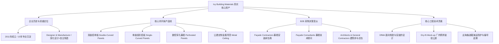
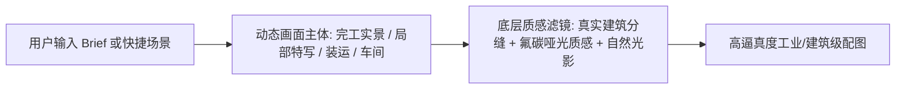

# AI 内容工作台社媒专业度提升与提示词改造方案

- **文件归档**: `docs/plans/2026-09-10-ai内容工作台社媒专业度与提示词改造方案.md`
- **状态**: 已实施（代码级 Prompt 改造、快捷场景胶囊、物理质感滤镜及实机测试均已完成；PR #130）
- **制定日期**: 2026-09-10（根据架构与业务边界审议修订）
- **Owner**: jueyunai
- **强制 Reviewer**: xuemusi（本方案修改 `contentStudioCommands.ts` / `messages.ts`，涉及跨人契约与提示词行为）
- **适用模块**: Portal AI 内容工作台 (`ContentStudio`)、AI 网关提示词引擎 (`contentStudioCommands.ts`)
- **参考来源**:
  1. 客户官方 Facebook 主页 1: `https://www.facebook.com/profile.php?id=61551877498582` (Foshan Ivy Building Material Co., Ltd.)
  2. 客户官方 Facebook 主页 2: `https://www.facebook.com/ivybuildingmaterials` (Guangzhou Triple Decoration Materials CO., Ltd)
  3. 客户车间标杆工程文案: 《Façade Mock-up 预拼装与公差校对 7 大工程质检指标》

---

## 一、 方案背景与痛点诊断

### 1. 现有问题诊断
- **泛营销腔严重（B2C 套路）**：通用大模型默认生成的社媒文案充斥“奢华重塑 (`redefining luxury`)”、“令人惊叹的视觉 (`stunning visuals`)”等空洞修辞，并滥用火花、火箭等 emoji。
- **缺乏工业级实战血肉**：海外幕墙工程的真实买家是**建筑师（Architect）、幕墙顾问（Façade Consultant）和幕墙总包安装商（Façade Contractor）**。这类专业受众极其务实，核心关注“公差是否可控”、“安装节点是否合理”、“能否按期安全交付”，空洞文案会大幅削弱企业专业度与信任感。
- **产品核心壁垒未凸显**：生成的文案未能精准带出客户真正的高难度、高客单价核心产品（如**双曲铝单板**、**数控冲孔幕墙**、**异型金属吊顶**）。

### 2. 改造核心目标
将 AI 内容工作台从“通用图文生成器”升级为**“专为外立面金属幕墙与高端异型金属定制出海量身定制的工业级 B2B 内容引擎”**。

---

## 二、 客户真实品牌画像与专业基准提炼

基于客户两个 Facebook 账号及一线资料，提炼出不可替代的真实企业资产：

### 关键工程逻辑（核心武器：Façade Mock-up 7 大拷问）
在所有生成的专业文案中，融入客户在车间质检的核心拷问维度：
1. **几何形状是否契合设计意图？** (*Geometry matches design intent*)
2. **接缝与留缝是否视觉一致？** (*Joint consistency & alignment*)
3. **龙骨与内部支撑是否与幕墙系统完美咬合？** (*Internal support compatibility*)
4. **制造公差是否对现场施工安装足够包容？** (*Realistic tolerances for site installation*)
5. **相邻异型板块是否能平整严密对齐？** (*Adjacent panel alignment*)
6. **现场吊装施工顺序是否合理经济？** (*Practical installation sequence*)
7. **大批量流水线生产能否保持高一致性？** (*Repeatable mass-fabrication consistency*)

---

## 三、 核心改造实施规划

### 维度 1：服务端 Prompt 系统重塑（`contentStudioCommands.ts`）

#### 1. 注入官方技术人设与语调规则
- **人设定位**：Ivy Building Materials 拥有 15 年幕墙金属加工与深化经验的技术代表/工程总监。
- **行文准则**：
  - **冷静严谨**：用事实、数据、工艺名词说话，坚决禁用 `groundbreaking`、`jaw-dropping`、`luxurious masterpiece` 等虚浮夸大词汇；
  - **严禁滥用 Emoji**：正文最多保留 1-2 个引导段落的小标记（如实心小圆点或无标记），禁止大面积堆砌表情符号；
  - **制造者视角**：突出“从工厂车间（Shop Floor）为现场施工（Job Site）提前排雷”的伙伴价值。

#### 2. 差异化平台输出策略
- **LinkedIn（深度行业洞察 / 工程师技术流）**：
  - 结构：提出工程痛点（如现场安装错位） $\rightarrow$ 分析车间打样/公差校正方案 $\rightarrow$ 总结 DfMA 价值 $\rightarrow$ 引导图纸交流；
  - 核心标签侧重：`#FacadeEngineering` `#DryFitMockup` `#FaçadeContractor` `#ArchitecturalDetail`。
- **Facebook / Instagram（视觉工艺 / 车间实录 / 交付实况）**：
  - 结构：以车间试拼装、数控打孔、高光/哑光氟碳喷涂质感为切入点 $\rightarrow$ 说明板块规格与成型技术 $\rightarrow$ 简明 CTA；
  - 核心标签侧重：`#AluminiumFaçade` `#DoubleCurvedAluminium` `#MetalCeiling` `#FoshanManufacturer`。

#### 3. 固化“3+2+2+1”工业品标签与专业 CTA 体系
- **Hashtags 标准公式**：
  $$\text{Hashtags} = \text{3个产品工艺词} + \text{2个专业品控词} + \text{2个采购受众词} + \text{1个地域/源头词}$$
- **专业 CTA 转化语**：
  - 严禁空洞的 “Contact us for more details” 或 “DM for price”；
  - 统一规范为工程决策引导语：
    > *“Got complex curved or perforated geometry on your drawings? Send your DWG/BIM model to our technical team for a pre-fabrication feasibility review and mock-up consultation.”*

---

### 维度 2：快捷场景胶囊（Quick Intents）工业化升级（`messages.ts`）

将目前通用的 4 个快捷场景重构为客户高频且最具转化力的业务场景：

| 场景 Key | 原英文 / 中文显示 | 改造后名称 | 注入的需求描述（Prompt Brief） |
| :--- | :--- | :--- | :--- |
| `mockup` *(替换 product)* | 新品发布 / New product | **双曲打样预拼装** `Double-Curved Mock-up` | 异型双曲铝板车间试拼装（Dry-fit mock-up），聚焦几何弧度精度、接缝一致性与出厂前公差校核。 |
| `perforation` *(替换 craft)* | 工艺细节 / Material craft | **参数化冲孔幕墙** `Perforated Façade` | 定制数控冲孔外立面铝板，展现穿孔透光率、背衬结构、耐候氟碳喷涂与现代遮阳立面表现力。 |
| `ceiling` *(替换 project)* | 工程项目 / Engineering project | **公建异型金属吊顶** `Custom Metal Ceiling` | 机场/高铁站/大型商业空间定制金属吊顶，展示大跨度悬吊平整度、暗藏式龙骨与模块化快速拼装结构。 |
| `shipment` *(保留并优化)* | 出货发运 / Factory shipment | **出口海运集装箱防护** `Export Packing & Loading` | 海外工程订单集装箱装运，强调板块覆膜、四角硬质护边、加固木箱防震与按图纸安装顺序装箱编号。 |

---

### 维度 3：AI 生图提示词（Image Prompt）—— 动态创意 + 真实物理质感（拒绝场景死锁）

#### 1. 明确生图原则：管“质感与真实度”，绝不把“场景内容”锁死
- **绝对不强加场景限制**：
  - 严禁强行把提示词写死成“必须是车间/必须是打样架”。
  - 画面主体与场景内容 **100% 动态跟随用户的 Brief / 创意需求**（用户要地标建筑完工实景、城市黄昏幕墙光影、集装箱港口装运、还是车间金属细节，均完全自由）。
- **底层质感滤镜（只做物理真实性保底）**：
  为避免通用生图的“科幻塑料感、悬浮充气感、AI 模板紫粉高光”，在生图提示词末尾统一追加建筑专业摄影质感约束：
  > *“Photorealistic architectural photography, natural daylight, real aluminum panel seams and structural joints, authentic PVDF matte architectural coating texture, no sci-fi floating elements, no plastic CGI rendering, 8k resolution.”*

---

### 维度 4：知识库（RAG）边界与消费契约（保持解耦，不越界侵入）

#### 1. 架构原则：知识库是独立公共基础设施，工作台只做按需消费者
- **知识库模块**独立负责全站知识沉淀（供社媒工作台、官网智能客服、线索 CRM 多端按需引用）。
- **AI 内容工作台坚决不侵入修改知识库底层结构**，仅通过已有的 `knowledgeSources` 字段完成契约消费：
  - **当操作人勾选了知识库条目时**：AI 提示词强制约束其严格基于选中的真实条目提取产品牌号、板厚、尺寸公差，绝不凭空臆造；
  - **当操作人未勾选知识库条目时**：AI 依托内置的 15 年资深工程师人设，聚焦于通用的施工工艺、打样验证逻辑与 DfMA 价值阐述，不捏造具体项目数据或做出法律/价格承诺。

#### 2. 后续知识录入指引（在知识库模块独立维护）
当用户后续收集到更多企业与工程资料时，直接在知识库模块上传即可，推荐归档类别：
- **《企业资质与制造基地概况》**：2011 创办历史、佛山/广州制造厂、设计与制造资质；
- **《双曲/单曲/穿孔铝板产品规格书》**：合金牌号（AA3003/5052）、厚度（2.5mm/3.0mm）、涂层质保；
- **《幕墙出厂打样与预拼装验收规范》**：车间 7 大检验环节与公差允许范围；
- **《典型落地工程案例集》**：海内外标志性落成项目实景与规格指标。

---

## 四、 实施计划与步骤

- **Step 1: 代码级 Prompt 与场景升级（即刻执行，零破坏性）**：
  1. 更新 `src/admin-portal/modules/content-studio/messages.ts`：更新 4 个工业化快捷场景胶囊的标签与需求描述；
  2. 更新 `src/admin-portal/modules/content-studio/contentStudioCommands.ts`：
     - 注入 15 年幕墙工程师人设与平实严谨语调；
     - 注入 7 项打样预拼装工程质检拷问；
     - 区分 LinkedIn（深度工程流）与 Facebook/Instagram（车间实录与工艺质感）输出要求；
     - 固化“3+2+2+1”工业标签规则与 DWG/BIM 图纸打样评估 CTA；
     - 生图提示词动态跟随 Brief 并附加强制物理质感滤镜（不锁死场景）；
  3. 运行自动化单元测试与构建门禁，确保生成接口稳定。
- **Step 2: 本地实机生成与多平台效果验收**：
  - 在内容工作台中针对 4 种典型场景进行实际生成；
  - 验证 LinkedIn / Facebook 贴文在语言风格、工程质感、标签以及配图提示词上的精准度。
- **Step 3: 知识库后续资料补充（非代码，按需推进）**：
  - 用户后续补充一手资料时，直接在知识库管理后台录入为知识文档。

---

## 五、 已知架构局限与长耗时生成演进路线

### 1. 当前同步调用与命令租约的数学边界
- **全局命令租约（`COMMAND_LEASE_MS`）**：在 `src/admin-portal/core/commands/portalCommandReceipts.ts` 中硬编码为 **120 秒**，用于防重复点击与重复扣费；
- **串行耗时预算**：AI 内容工作台勾选自动配图时，服务端串行执行“文本大模型 + 生图大模型”。为保证最坏情况下不击穿 120 秒租约，系统出厂全局默认配置定为：
  $$\text{文本超时默认值 (30s)} + \text{生图超时默认值 (60s)} = 90\text{s} < 120\text{s}$$
- **长尾波动处置**：若接入的外部文本模型响应较慢（如出现 40s~50s 排队），出厂默认 30s 会发生超时。此时**应由系统管理员在「系统 / 基础设置 / 模型」中针对该具体模型手动将超时拉大至 60s~90s**，而不应擅自提升系统全局默认值导致租约击穿。

### 2. 后续版本彻底解耦方案（冲刺期后独立推进）
1. **生成流程异步化 Worker 改造**：将工作台生成改造为异步任务（即前端请求仅创建 Job 记录并立即返回，后台 Worker 异步消费文本与配图，完成后通过 WebSocket/SSE 或轻量轮询更新 UI）；
2. **多阶段租约动态续期**：在未重构为 Worker 前，若单次调用超过预期，应在文本生成完毕、生图开始前对 `portal_command_receipts` 执行租约续期（Extend Lease）。
