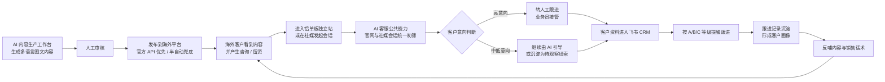
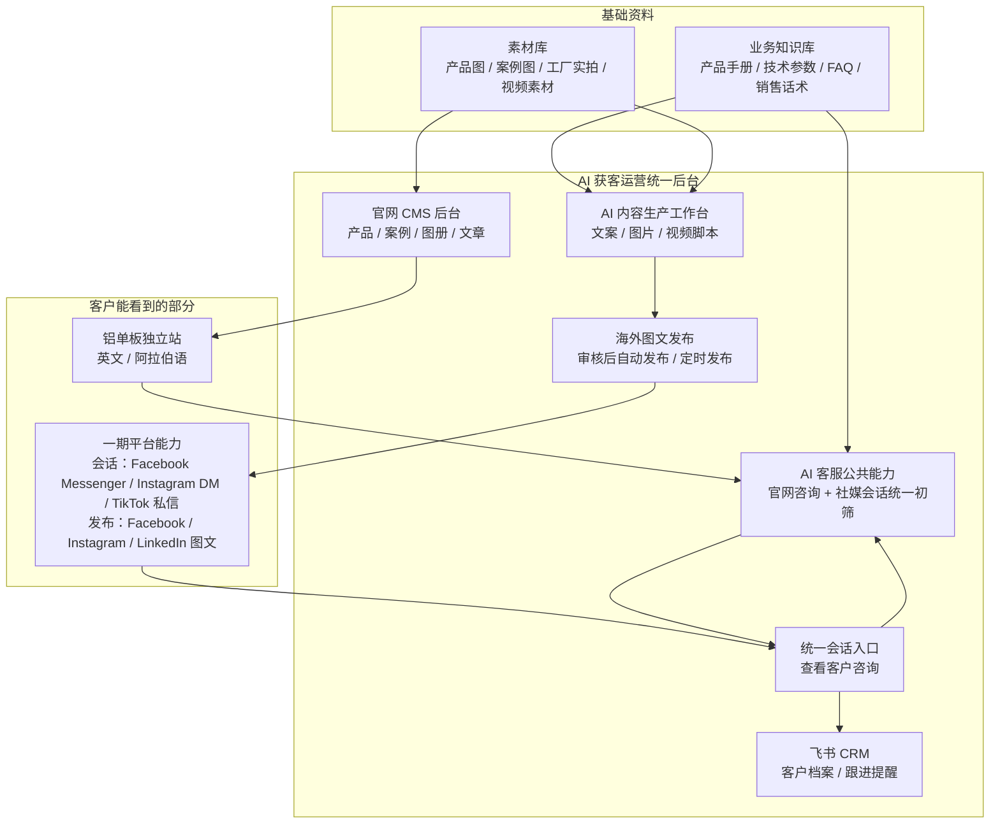
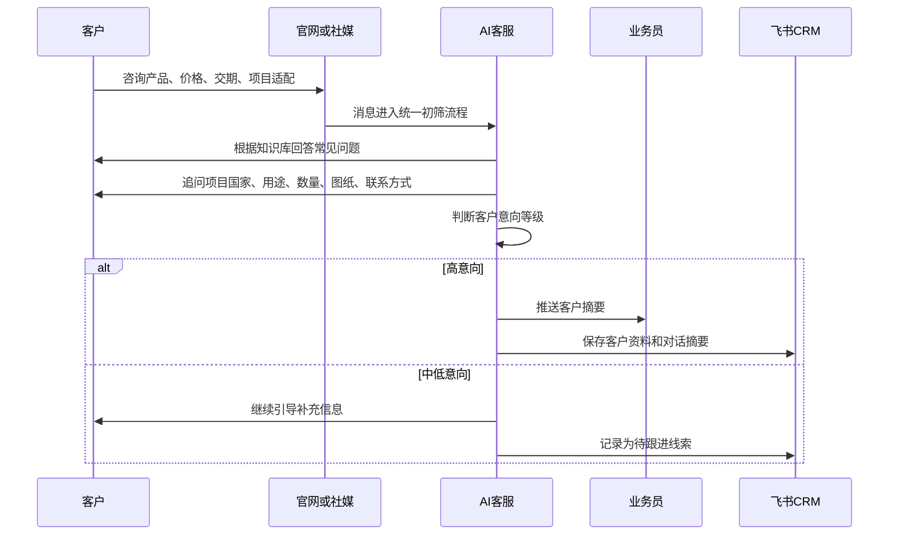
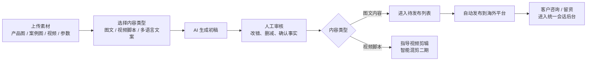
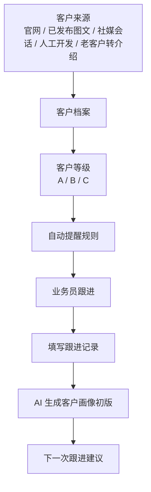
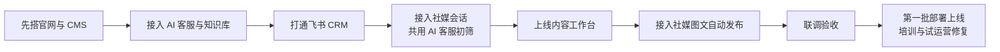

# 建材出海 AI 获客系统一期需求说明文档

版本：v1.2

日期：2026-07-20

用途：客户确认 / 合同附件 / 合作开发交接  
整理依据：一期开发范围确认表、2026-06-16 与 2026-06-17 两次需求沟通纪要、易飞轮与光年触达竞品资料

---

## 1. 一期要解决什么问题

客户当前的核心目标不是一次性做一个很重的系统，而是先把“海外获客 - 咨询筛选 - 客户沉淀 - 跟进提醒 - 内容持续发布”这条链路跑通。

一期交付后，希望达到以下效果：

| 目标                   | 说明                                                                                                                      |
| ---------------------- | ------------------------------------------------------------------------------------------------------------------------- |
| 建立新的铝单板单品官网 | 聚焦铝单板，不再像旧官网一样产品过杂；面向海外 ToB 客户展示产品、案例、工厂实力和联系方式                                 |
| 用 AI 承接客户咨询     | AI 客服作为公共能力，同时承接官网咨询和首批海外平台会话消息，先回复常见问题、判断意向，再把高意向客户交给业务员           |
| 用飞书管理客户跟进     | 客户资料、来源、等级、跟进记录沉淀到飞书，避免客户被遗忘                                                                  |
| 提高社媒运营效率       | AI 辅助生成多语言图文内容，人工审核后对接海外平台自动发布；视频脚本用于指导剪辑                                           |
| 验证首批海外平台接入   | 会话接入 Facebook Messenger、Instagram DM、TikTok 私信；图文发布接入 Facebook、Instagram、LinkedIn；官网闭环必达，第三方平台按账号资产、官方 API、权限审核和技术 PoC 结果条件交付，自动接入优先、半自动兜底 |

一句话概括：

> 一期不是追求“大而全”，而是先做一套能让小团队真正用起来的海外获客闭环。

---

## 2. 一期整体业务流程

---

## 3. 一期功能范围总览

| 序号 | 模块                             | 一期做什么                                                                                                                     | 主要交付物                                                      |
| ---: | -------------------------------- | ------------------------------------------------------------------------------------------------------------------------------ | --------------------------------------------------------------- |
|    1 | 方案梳理与竞品调研               | 复核会议记录，参考易飞轮、光年触达等竞品，确认一期边界和验收口径                                                               | 一期范围说明、模块边界、资料清单                                |
|    2 | 铝单板产品独立站与 CMS 后台      | 建设英文 / 阿拉伯语独立站，后台可维护产品、案例、图册、技术参数、文章                                                          | 官网前台、内容管理后台                                          |
|    3 | SEO / GEO 与多语言基础结构       | 设置 Google SEO 基础字段、关键词框架、英文 / 阿语页面结构、内容更新入口                                                        | 页面结构、SEO 字段、关键词入口                                  |
|    4 | AI 客服与业务知识库              | AI 客服作为公共能力，支持官网咨询和首批海外社媒会话统一初筛、FAQ、产品知识库、技术参数、销售话术、意向筛选、转人工             | AI 客服入口、知识库、初筛规则、转人工规则                       |
|    5 | 海外社媒会话消息接入             | 官网聊天确定性交付；Facebook Messenger、Instagram DM、TikTok 私信按账号、授权、地区及审核条件接入统一会话，统一查看咨询、AI 初筛、人工接管并沉淀线索 | 统一会话模型、官网会话闭环、平台 PoC 记录、可用连接器或降级方案 |
|    6 | AI 内容生产工作台                | 生成多语言图文内容、社媒配图、视频脚本 / 剪辑指导，管理素材；图文内容进入待发布流程                                            | 内容生成工作台、素材库、待发布内容                              |
|    7 | 飞书 CRM 与跟进提醒              | 客户档案、来源渠道、A/B/C 分级、跟进记录、生日提醒、新增客户提醒、客户画像初版                                                 | 飞书客户表、跟进表、提醒规则                                    |
|    8 | 海外社媒发布接入                 | Facebook、Instagram、LinkedIn 图文发布；官方 API 优先，受限时交付审核、格式化、素材下载和人工发布辅助流程                     | 发布入口、审核与发布记录、可用连接器、半自动兜底流程            |
|    9 | 第一批部署上线、培训与试运营修复 | 将一期功能部署上线，完成基础使用培训，并在首轮试运营中处理关键问题和必要调整                                                   | 上线环境、培训说明、试运营修复记录                              |

---

## 4. 一期系统结构图

平台范围说明：WhatsApp 不纳入一期系统接入、Webhook、自动回复或发布能力；二期再评估网页插件等替代接入。官网如保留 WhatsApp 外链，仅为静态联系方式，不代表已接入统一会话系统。

---

## 5. 后台产品形态决策

一期采用“一个运营门户、一个技术控制平面、同一账号与后端”的形态：

- `/dashboard` 是客户日常使用的“AI 获客运营后台”，按模块挂载业务工作流；
- `/admin` 是 Payload 技术后台，处理复杂 CMS 表单、用户、凭据、模型路由和故障兜底；
- 两个入口复用同一 Payload Auth、RBAC、Collections、领域服务和 PostgreSQL，不是两个分散系统。

用户只登录一次。日常工作优先在 `/dashboard` 完成，必要时进入有权限的 `/admin` 页面。

| 后台菜单    | 主要用途                                                                                  |
| ----------- | ----------------------------------------------------------------------------------------- |
| 工作台首页  | 查看待处理会话、待审核内容、待发布内容、新增线索和跟进提醒                                |
| 官网内容    | 管理首页、产品、案例、文章、图册、技术参数等官网 CMS 内容                                 |
| AI 内容生产 | 生成多语言图文内容、社媒配图、视频脚本，管理素材库                                        |
| 发布管理    | 审核图文内容、设置发布时间、自动发布到海外平台、查看发布记录                              |
| 会话管理    | 统一查看官网和海外社媒咨询，由 AI 客服初筛，人工接管高意向客户                            |
| 知识库      | 管理 FAQ、产品参数、销售话术、意向判断规则，为 AI 客服和内容生产共用                      |
| 平台账号    | 管理 Facebook、Instagram、TikTok 会话账号及 Facebook、Instagram、LinkedIn 发布账号的授权、PoC 和接入状态 |

采用统一后台的原因：

| 原因             | 说明                                                                          |
| ---------------- | ----------------------------------------------------------------------------- |
| 链路天然连续     | 内容生产 -> 图文发布 -> 客户咨询 -> AI 初筛 -> 飞书沉淀，本来就是一条业务链路 |
| 知识库需要共用   | AI 客服和内容生产都依赖产品资料、FAQ、技术参数、销售话术，不能多处重复维护    |
| 小团队更容易使用 | 客户团队人数少，一个入口、一个账号、一个菜单体系，更容易培训和坚持使用        |
| 便于开发分工     | Portal Core 提供统一模块契约；双方按 owner 独立实现页面、读模型和领域命令     |

边界说明：

| 项目     | 一期处理                                                                     |
| -------- | ---------------------------------------------------------------------------- |
| 飞书 CRM | 不重复造完整 CRM，后台只做线索入口、同步状态和必要跳转；详细跟进仍以飞书为主 |
| 权限控制 | 复用现有 Admin / Operator / Sales 服务端权限；菜单隐藏不构成授权              |
| 多租户   | 一期只服务当前客户，不做多企业 SaaS 化后台                                   |
| 技术后台 | `/admin` 长期保留为复杂配置与回退入口，不作为最终日常运营体验目标           |

---

## 6. 各模块需求说明

### 6.1 方案梳理与竞品调研

这一部分是开发前的确认工作，用来避免双方对“一期到底做什么”理解不一致。

| 内容         | 说明                                           |
| ------------ | ---------------------------------------------- |
| 会议记录复核 | 复核两次需求沟通内容，确认真实业务目标         |
| 竞品参考     | 参考易飞轮、光年触达等产品，但不照搬其全部能力 |
| 一期边界确认 | 明确哪些功能一期做，哪些放到二期或运营服务     |
| 验收口径确认 | 每个模块交付后，客户如何判断“能用、可验收”     |

客户需提供：

| 资料             | 用途                                                                   |
| ---------------- | ---------------------------------------------------------------------- |
| 竞品资料         | 对齐客户看过并认可的能力                                               |
| 现有官网链接     | 判断旧站问题、新站内容迁移范围                                         |
| 客户确认官网原型 | 已提供 `references/website-prototype/`，作为正式官网 UI / 交互验收基准 |
| 现有账号情况     | 判断社媒接入和发布可行性                                               |

---

### 6.2 铝单板产品独立站与 CMS 后台

新官网定位为“铝单板单品独立站”，只做展示和询盘承接，不做在线下单。

| 页面 / 功能     | 一期内容                                                                      |
| --------------- | ----------------------------------------------------------------------------- |
| 首页            | 展示公司定位、铝单板核心卖点、项目能力、联系入口                              |
| 产品            | 展示铝单板分类、应用场景、工艺、可定制能力                                    |
| 案例            | 展示项目效果图、工厂生产实拍、细节图                                          |
| 关于我们        | 展示公司背景、供应链能力、服务市场                                            |
| 联系我们        | 邮箱、表单、社媒链接、AI 客服入口；如保留 WhatsApp 外链，仅作静态联系方式，不代表系统接入 |
| 图册 / 技术参数 | 预留下载入口，方便 ToB 客户了解资料                                           |
| News / Blog     | 一期必做内容更新入口，保持客户确认原型中的导航和页面，用于 SEO 和品牌内容沉淀 |
| CMS 后台        | 甲方可维护产品、案例、文章、图册、技术参数                                    |

官网 UI / 交互验收基线：

- `references/website-prototype/` 是甲方提供并确认的正式官网 UI / 交互验收基准，不是普通参考站，也不允许开发阶段自行重新设计。
- 正式实现使用 Next.js / Payload 重写，但必须高保真还原原型的视觉层级、版式、色彩、字体、间距、组件状态、导航、Hero 轮播、产品筛选、规格表、表单状态、桌面 / 平板 / 移动响应式，以及英文 LTR 和阿拉伯语 RTL 效果。
- 原型中的首页、About、Products、Projects、News、Contact 页面及对应导航均为一期 P0 范围；正式站采用 `/en/...`、`/ar/...` 多语言 URL 不视为视觉或交互偏离。
- 允许替换的内容仅限占位联系方式、外部演示图片、示例产品 / 案例 / 新闻、模拟表单成功态和纯客户端路由 / 数据逻辑；这些内容必须替换为甲方确认素材、CMS 数据、服务端渲染和真实询盘持久化流程。
- 正式上线不得保留 demo / fake 数据、空社媒链接或外部图片热链。任何有意改变原型视觉或交互的方案，必须先取得甲方确认。

语言范围：

| 语言     | 一期处理                           |
| -------- | ---------------------------------- |
| 英文     | 必做                               |
| 阿拉伯语 | 必做                               |
| 中文     | 不开放前台访问，可作为内部维护参考 |

客户需提供：

| 资料        | 用途                                                                   |
| ----------- | ---------------------------------------------------------------------- |
| 品牌资料    | Logo、品牌名、公司介绍、联系方式                                       |
| 产品图      | 官网产品展示                                                           |
| 案例图      | 项目案例展示                                                           |
| 工厂实拍    | 增强真实性和信任感                                                     |
| 技术参数    | 产品详情页和下载资料                                                   |
| UI 验收基准 | 已确认的 `references/website-prototype/`；用于官网高保真还原和视觉验收 |

---

### 6.3 SEO / GEO 与多语言基础结构

这部分不是承诺短期排名，而是给网站后续自然流量打基础。

| 内容                | 一期做法                                         |
| ------------------- | ------------------------------------------------ |
| Google SEO 基础字段 | 页面标题、描述、关键词、图片说明等基础设置       |
| 关键词框架          | 围绕铝单板、目标市场、应用场景整理基础关键词     |
| 多语言页面结构      | 英文 / 阿语页面地址和内容结构清晰，方便后续维护  |
| 内容更新入口        | News / Blog 可持续发布产品、案例、安装、行业内容 |
| GEO 友好结构        | 页面内容便于 AI 搜索 / 问答工具理解和引用        |

客户需确认：

| 资料         | 用途                               |
| ------------ | ---------------------------------- |
| 目标市场     | 例如迪拜、沙特、卡塔尔、美国、澳洲 |
| 主推关键词   | 确认最想抢占的搜索词               |
| 产品英文名   | 避免后续翻译口径不统一             |
| 产品阿语命名 | 确认面向中东市场的表达方式         |

---

### 6.4 AI 客服与业务知识库

AI 客服是一期的公共能力，不只放在官网。官网独立站咨询、首批接入的海外平台会话消息，都会进入同一套 AI 初筛流程：先回答常见问题、收集客户需求、判断意向，再把高意向客户转给人工。

一期功能：

| 功能           | 说明                                                             |
| -------------- | ---------------------------------------------------------------- |
| FAQ 回复       | 回答产品、材料、应用、定制、交期、运输等常见问题                 |
| 产品知识库     | 基于产品手册、技术参数、案例资料回答问题                         |
| 销售话术       | 按外贸沟通习惯生成友好回复                                       |
| 2-3 轮意向筛选 | 尽量快速判断客户是否值得人工接管                                 |
| 高意向转人工   | 将客户资料、需求摘要推送给业务员                                 |
| 多语言回复     | 支持英文和阿语基础回复                                           |
| 多渠道共用     | 官网咨询和首批海外平台会话使用同一套知识库、初筛规则和转人工规则 |

客户需提供：

| 资料         | 用途                       |
| ------------ | -------------------------- |
| 产品手册     | AI 回答产品问题            |
| 常见问题     | 构建 FAQ                   |
| 销售话术     | 统一回复风格               |
| 技术参数     | 避免回答不准确             |
| 历史聊天记录 | 学习真实客户问法           |
| 意向判断标准 | 判断哪些客户要优先交给人工 |

---

### 6.5 海外社媒会话消息接入

一期会话范围已经确认：官网聊天，以及 Facebook Messenger、Instagram DM、TikTok 私信。系统先建立统一会话模型和官网聊天闭环，再把三类社媒连接器接入同一套 AI 初筛流程。第三方实接仍取决于甲方账号资产、平台开放权限、App Review、地区政策和开发期 PoC 结果。

会话平台与交付级别：

| 渠道 / 平台        | 前置条件                                                                 | 一期交付口径                                                                                                  |
| ------------------ | ------------------------------------------------------------------------ | ------------------------------------------------------------------------------------------------------------- |
| 官网聊天           | 域名和官网可用                                                           | P0 必达：进入统一会话入口，由 AI 客服初筛并可转人工 / 入飞书                                                  |
| Facebook Messenger | Facebook 企业 / 商业账号（主页）、Meta Messenger 权限、App Review        | P1 条件性交付：条件满足时接入统一会话；受阻时交付 fixture、配置说明和阻塞证据                                |
| Instagram DM       | Instagram 企业 / 商业账号、Facebook 主页绑定、Meta Messaging 权限、审核 | P1 条件性交付：条件满足时接入统一会话；受阻时交付 fixture、配置说明和阻塞证据                                |
| TikTok 私信        | TikTok 商业账号、官方私信 API 对目标地区 / 账号开放、应用授权及审核      | P1 条件性交付：条件满足时接入统一会话；受阻时交付 fixture、配置说明和阻塞证据，不再作为仅调研的 P2 项         |

LinkedIn 私信不在一期自动会话范围；WhatsApp（包括 Cloud API）不在一期系统接入范围，二期再评估网页插件等替代接入。

一期功能：

| 功能             | 说明                                                   |
| ---------------- | ------------------------------------------------------ |
| 统一查看客户咨询 | 减少多平台来回切换                                     |
| AI 客服初筛      | 使用与官网一致的知识库、问答逻辑、意向判断和转人工规则 |
| 人工接管         | 高意向客户由业务员继续沟通                             |
| 线索沉淀         | 有价值的客户进入飞书 CRM                               |
| 会话摘要         | 自动整理客户需求，方便业务员快速接手                   |

重要边界：

| 边界                       | 说明                                                                                                                         |
| -------------------------- | ---------------------------------------------------------------------------------------------------------------------------- |
| 平台权限依赖               | 三类社媒会话能否自动接入取决于账号类型、平台权限、接口审核、地区政策和实际测试结果                                           |
| 一期会话范围               | 仅为 Facebook Messenger、Instagram DM、TikTok 私信；LinkedIn 私信不在一期自动接入范围                                        |
| WhatsApp 二期处理          | 不建设一期 WhatsApp connector、Webhook、自动回复或发布能力；二期再评估网页插件等替代接入                                    |
| 第三方阻塞不等于软件未交付 | 甲方按时提供账号和授权后，如仍受平台审核或政策阻塞，以连接器代码、模拟测试、配置说明和阻塞证据作为对应项验收材料             |

---

### 6.6 AI 内容生产工作台

内容工作台服务于社媒运营，目标是降低生产内容和发布内容的时间成本。一期重点做图文内容生产并对接海外平台自动发布，通过持续发布内容获取客资；视频脚本用于指导人工或半人工剪辑，智能混剪和视频自动发布规划到二期。

一期功能：

| 功能       | 说明                                                           |
| ---------- | -------------------------------------------------------------- |
| 多语言文案 | 根据平台和市场生成英文 / 阿语文案                              |
| 社媒配图   | 基于产品、案例、应用场景生成或辅助优化配图                     |
| 图文待发布 | 图文内容审核后进入发布队列，对接海外平台自动发布               |
| 视频脚本   | 生成短视频脚本、标题、字幕方向，用于指导人工 / 半人工剪辑      |
| 剪辑辅助   | 生成剪辑建议、分镜、字幕文案；智能混剪和视频自动发布不纳入一期 |
| 素材库     | 管理产品素材、案例素材、参考样例、内容风格                     |
| 人工审核   | 内容必须先审核再发布，避免事实错误                             |

客户需提供：

| 资料         | 用途                                                  |
| ------------ | ----------------------------------------------------- |
| 产品素材     | 生成产品内容                                          |
| 案例素材     | 生成案例内容                                          |
| 目标平台样例 | 对齐 Facebook、Instagram、LinkedIn 图文内容风格      |
| 内容风格要求 | 确定专业、简洁、工程感或品牌感等方向                  |

---

### 6.7 飞书 CRM 与跟进提醒

飞书 CRM 是一期客户管理的核心，不上重型 CRM，先用轻量方式解决“客户不丢、跟进不断”。

客户档案字段建议：

| 字段         | 说明                                                     |
| ------------ | -------------------------------------------------------- |
| 客户名称     | 公司或联系人名称                                         |
| 国家 / 地区  | 判断目标市场价值                                         |
| 来源渠道     | 官网、Facebook Messenger、Instagram DM、TikTok 私信、Facebook / Instagram / LinkedIn 图文发布、人工录入等 |
| 需求产品     | 例如铝单板、双曲铝单板、天花、外立面等                   |
| 项目阶段     | 咨询、报价、图纸沟通、样品、成交、沉睡等                 |
| 客户等级     | A / B / C                                                |
| 负责人       | 当前跟进人员                                             |
| 下次跟进时间 | 自动提醒依据                                             |
| 最近跟进记录 | 方便团队接手                                             |
| 客户画像     | AI 根据记录生成的客户摘要                                |

跟进提醒规则：

| 客户等级 | 建议频率          |
| -------- | ----------------- |
| A 类客户 | 每周跟进 1 次     |
| B 类客户 | 每两周跟进 1 次   |
| C 类客户 | 每 15 天跟进 1 次 |

一期提醒内容：

| 提醒类型            | 说明                      |
| ------------------- | ------------------------- |
| 新增客户提醒        | 有新线索进入时提醒负责人  |
| 跟进到期提醒        | 到了跟进日期自动提醒      |
| 生日 / 特殊日期提醒 | 有资料时可做客户关怀      |
| 高意向客户提醒      | AI 判断为高意向时优先提示 |

客户需提供：

| 资料         | 用途                     |
| ------------ | ------------------------ |
| 飞书账号     | 建表、授权、提醒         |
| 客户字段     | 确认客户表要记录哪些信息 |
| 跟进频率     | 确认 A/B/C 规则          |
| 跟单人员名单 | 确认提醒给谁             |

---

### 6.8 海外社媒发布接入

发布接入的目标是让内容生产平台产出的图文内容可以对接海外平台自动发布，减少人工重复复制粘贴，并通过内容触达获取客资。内容仍需人工审核，不做完全无人值守发布；视频内容的一键混剪和视频自动发布规划在二期。

已确认的图文发布平台与交付级别：

| 平台            | 前置条件                                                                 | 一期交付口径                                                                           |
| --------------- | ------------------------------------------------------------------------ | -------------------------------------------------------------------------------------- |
| Facebook 图文   | Facebook 企业账号、主页、Meta Content Publishing 权限及审核             | 官方 API 优先；条件满足时支持审核后发布 / 定时发布                                     |
| Instagram 图文  | Instagram 企业账号、Facebook 主页绑定、Meta Content Publishing 权限及审核 | 与 Facebook 组成 Meta 发布包；官方 API 条件满足时自动发布                              |
| LinkedIn 图文   | 账号类型不限制；甲方账号及应用获得所需发布 API 权限                      | API 可用则自动发布；否则交付审核、平台格式化、素材打包下载、复制文案和人工发布辅助流程 |

TikTok 发布、视频自动发布和 WhatsApp 发布均不属于一期范围。LinkedIn 的一期范围是图文发布，不包含私信自动读写。

一期功能：

| 功能           | 说明                                                   |
| -------------- | ------------------------------------------------------ |
| 内容待发布列表 | AI 生成并审核后的内容进入列表                          |
| 人工审核       | 审核文案、图片、事实、平台适配                         |
| 图文自动发布   | 将审核后的图文内容发布到 Facebook、Instagram、LinkedIn |
| 定时发布       | 对支持的平台做发布时间安排                             |
| 发布记录       | 记录发布平台、时间、内容、状态                         |
| 客资来源记录   | 后续客户从已发布内容咨询时，尽量记录来源平台和内容线索 |

边界说明：

| 边界               | 说明                                                                                               |
| ------------------ | -------------------------------------------------------------------------------------------------- |
| 平台规则优先       | 自动发布能力以平台允许范围和实际测试为准                                                           |
| 账号安全优先       | 不承诺规避封号、验证码、风控限制                                                                   |
| 不包含账号注册养号 | 账号注册、养号、封号恢复不属于一期开发范围                                                         |
| 视频发布二期       | 一期不做智能混剪和视频自动发布；视频脚本仅用于指导剪辑                                             |
| 降级验收           | 因官方权限或审核受限无法自动发布时，以完整审核流、平台格式化、素材下载、人工发布辅助和阻塞记录验收 |

---

## 7. 一期验收口径

| 模块             | 可验收标准                                                                                                                                  |
| ---------------- | ------------------------------------------------------------------------------------------------------------------------------------------- |
| 独立站           | 英文 / 阿语前台可访问，核心页面完整；视觉、交互、响应式和 RTL 高保真还原 `references/website-prototype/`；后台可新增 / 修改产品、案例、文章 |
| SEO / GEO 基础   | 核心页面具备标题、描述、关键词、清晰页面结构和内容更新入口                                                                                  |
| AI 客服          | 能基于知识库回答常见问题，能同时处理官网咨询和首批海外平台会话消息，收集客户需求并判断高意向客户                                            |
| 会话接入         | 官网聊天完整闭环必达；Facebook Messenger、Instagram DM、TikTok 私信按前置条件完成实接或 PoC；受第三方阻塞的连接器提供 fixture、配置说明和阻塞证据 |
| 内容工作台       | 能生成多语言社媒图文内容和视频脚本；图文内容支持进入待发布流程，视频脚本用于指导剪辑                                                        |
| 飞书 CRM         | 客户档案、跟进记录、A/B/C 分级、提醒规则可正常使用                                                                                          |
| 发布接入         | 发布审核、平台格式化、任务和日志必达；Facebook / Instagram / LinkedIn 图文在 API 条件满足时自动发布，受限时按半自动辅助流程验收              |
| 部署培训与试运营 | 一期功能部署到可访问环境，完成客户基础操作培训，并修复首轮试运营中影响使用的关键问题                                                        |

---

## 8. 一期不包含内容

以下内容不建议写入一期交付承诺，后续可作为二期或运营服务单独评估：

| 不包含项                         | 原因                                                                             |
| -------------------------------- | -------------------------------------------------------------------------------- |
| 保证 Google 排名或询盘数量       | SEO 和询盘受市场、内容、投放、竞争等因素影响                                     |
| 广告投放代运营                   | 属于运营服务，不是一期开发                                                       |
| 海外账号注册、养号、封号恢复     | 属于账号运营和风控服务                                                           |
| 全球客户数据库采购               | 类似光年触达的资源型能力，不属于本期自研系统                                     |
| WhatsApp 系统接入                | WhatsApp Cloud API、网页插件及其他替代方案均不在一期；二期再评估                   |
| 大规模 Email 群发营销            | 涉及账号池、合规和资源成本，另行评估                                               |
| 复杂客户归属和提成结算           | 当前团队规模小，一期暂不需要                                                     |
| 多租户 SaaS 复制系统             | 等客户自身流程跑通后再产品化                                                     |
| 完全无人审核自动发布             | AI 内容可能出错，一期保留人工审核                                                |
| 智能混剪和视频自动发布           | 一期只生成视频脚本和剪辑建议，智能混剪、视频成片自动生产、视频自动发布规划在二期 |
| 电商在线下单 / 支付              | 本项目是 ToB 定制询盘站，不做电商商城                                            |

---

## 9. 甲方需提前准备的资料清单

| 类型         | 具体资料                                                             | 优先级 |
| ------------ | -------------------------------------------------------------------- | ------ |
| 官网资料     | Logo、品牌名、公司介绍、联系方式、目标市场                           | 高     |
| 产品资料     | 铝单板产品分类、技术参数、产品图、应用场景                           | 高     |
| 案例资料     | 项目案例、效果图、工厂实拍、可公开项目说明                           | 高     |
| AI 客服资料  | FAQ、销售话术、历史聊天记录、意向判断标准                            | 高     |
| 社媒资料     | Facebook / Instagram 企业账号、TikTok 商业账号、LinkedIn 图文发布权限及账号现状 | 高     |
| 官网 UI 基准 | 客户已确认的 `references/website-prototype/`，任何主动改版需另行确认 | 高     |
| 飞书资料     | 飞书账号、团队成员、客户字段、跟进频率                               | 高     |
| 翻译口径     | 产品英文名、阿语名称、重点关键词                                     | 中     |

---

## 10. 合作开发者交接说明

一期按 Portal Core 和业务模块拆分，方便两名开发者在同一基座上独立迭代。

| 板块            | 负责内容                                                                                          | 与其他板块的接口                                                                                                                           | 负责人                                    |
| --------------- | ------------------------------------------------------------------------------------------------- | ------------------------------------------------------------------------------------------------------------------------------------------ | ----------------------------------------- |
| Portal Core     | `/dashboard` 登录、首页、Shell、模块注册、权限呈现、共享 UI、基础设置入口、视觉与集成验收        | 为所有业务模块提供公共契约；不实现协作者的领域逻辑                                                                                         | jueyunai                                  |
| 官网与 CMS      | 官网页面、后台内容管理、多语言页面、图册 / 参数下载                                               | 向 AI 客服公共能力提供官网咨询入口；向 SEO 和知识/内容模块提供已审核内容                                                                    | jueyunai                                  |
| SEO / GEO 基础  | 页面标题、描述、关键词、多语言 URL、内容更新结构                                                  | 依赖官网页面和客户关键词                                                                                                                   | jueyunai                                  |
| AI 客服与知识库 | 业务知识库、AI 调试、FAQ/参数/话术、AI 客服公共能力                                           | 消费 Portal Core；向官网、统一会话和内容模块提供稳定 contract                                                                        | xuemusi                                  |
| AI 内容与社媒   | AI 内容生产/审核、海外图文发布、Facebook/Instagram/TikTok/LinkedIn 账号与连接器                 | 消费素材/CMS；提供 capability/publish/status 和平台 readiness contract                                                                        | xuemusi                                  |
| 统一会话        | 官网/社媒会话入口、客服初筛结果、人工接管、回复、解决和审计                                       | 消费 AI 客服与平台会话 contract；向线索/飞书模块提供稳定会话关联                                                               | xuemusi                                  |
| 飞书 CRM        | 客户表、跟进表、提醒、客户画像初版                                                                | 接收官网 AI 客服、社媒会话 AI 初筛、图文发布后产生的线索                                                                                   | jueyunai                                  |
| 素材与内容基础  | 产品图、案例图、工厂实拍、PDF、视频素材索引和官网内容 Hub                                         | 向知识库与 AI 内容生产提供受控素材；复杂编辑继续复用 Payload                                                                               | jueyunai                                  |

"方案梳理与竞品调研"和"第一批部署上线、培训与试运营修复"不属于上表业务板块，统一由 jueyunai 收尾；上线验收需两人共同确认。

门户模块继续采用接口解耦、mock 先行：jueyunai 先冻结 Portal module manifest、共享 UI、状态、
错误与视觉契约；xuemusi 负责红圈模块的页面、读模型、领域服务和后续迭代。双方共同 review
跨模块 TypeScript contract、schema、错误码、状态枚举和 fixture。真实数据库和平台账号条件满足后
再替换 adapter，不把第三方 token、模型 key 或 SDK 暴露给浏览器。

具体到 Portal 开发任务和协作边界，见
[`模块化运营门户实施计划`](../plans/2026-07-29-modular-admin-portal-implementation.md)、
[`一期开发实施计划`](../plans/2026-07-16-一期开发实施计划.md) 和 [`CONTRIBUTING.md`](../../CONTRIBUTING.md)。

建议先对齐 3 个基础数据结构：

| 数据     | 关键字段                                                                     |
| -------- | ---------------------------------------------------------------------------- |
| 客户线索 | 姓名 / 公司、国家、联系方式、来源渠道、需求摘要、意向等级、负责人            |
| 会话记录 | 平台、账号、客户、消息内容、AI 摘要、是否转人工、关联客户                    |
| 内容记录 | 平台、语言、文案、图片素材、视频脚本、审核状态、发布时间、发布结果、客资来源 |

开发顺序建议：

第一阶段联调最小闭环：

> 客户在官网或首批海外社媒平台咨询 -> AI 客服公共能力判断为高意向 -> 生成客户摘要 -> 写入飞书 -> 提醒业务员 -> 业务员填写跟进记录。

第二阶段联调闭环：

> AI 生成一条英文图文社媒内容 -> 人工审核 -> 自动发布 / 定时发布到平台 -> 有客户咨询或留资 -> 会话进入统一入口 -> AI 客服初筛 -> 线索进入飞书。

上线阶段：

> 完成第一批功能部署 -> 给客户做基础操作培训 -> 客户进入首轮试运营 -> 修复影响使用的关键问题和必要配置调整。

---

## 11. 风险与前置确认

| 风险                  | 说明                                   | 建议处理                           |
| --------------------- | -------------------------------------- | ---------------------------------- |
| 社媒接口权限不确定    | 平台会限制私信、发布、自动化能力       | 开发前先用客户账号做可行性测试     |
| AI 回复准确性依赖资料 | 资料越完整，AI 越稳定                  | 客户优先整理产品手册、FAQ、话术    |
| 多语言质量需人工确认  | 特别是阿语专业表达                     | 关键页面和销售话术建议人工校对     |
| 飞书使用习惯          | 客户团队平时更多用微信                 | 至少负责人和跟单人员要进入飞书流程 |
| 自动发布有账号风控    | 验证码、登录状态、平台限制会影响稳定性 | 一期保留人工审核和辅助发布兜底     |

---

## 12. 一期成功标准

一期成功不是“所有平台全自动”，而是满足以下标准：

1. 客户有一个自主可控、可持续维护的铝单板海外独立站。
2. 官网咨询和首批海外平台会话消息能由 AI 先接待，并把高意向客户交给人工。
3. 客户资料能进入飞书，业务员能按提醒持续跟进。
4. 运营人员能用 AI 更快生产多语言图文内容，并审核后自动发布到首批海外平台。
5. 首批海外平台的会话消息能进入统一后台，并由 AI 客服按官网一致流程完成初筛。
6. 发布后的内容能承接客户咨询 / 留资，并尽量关联到来源平台和内容。
7. 客户完成基础培训后，可以按流程进行官网内容维护、内容生成、发布审核、会话处理和飞书跟进。
8. 首轮试运营中影响使用的关键问题完成修复。
9. 后续是否投流、扩账号、复制到更多产品线，有数据和流程依据。

---

## 13. 附：一期范围确认表

| 序号 | 模块                             | 周期估算 | 费用估算 |
| ---: | -------------------------------- | -------: | -------: |
|    1 | 方案梳理与竞品调研               |     1 天 |        0 |
|    2 | 铝单板产品独立站与 CMS 后台      |     3 天 |     2400 |
|    3 | SEO / GEO 与多语言基础结构       |   1.5 天 |     1200 |
|    4 | AI 客服与业务知识库              |     3 天 |     2400 |
|    5 | 海外社媒会话消息接入             |     5 天 |     4000 |
|    6 | AI 内容生产工作台                |     3 天 |     2400 |
|    7 | 飞书 CRM 与跟进提醒              |   1.5 天 |     1200 |
|    8 | 海外社媒图文发布接入             |     3 天 |     2400 |
|    9 | 第一批部署上线、培训与试运营修复 |     2 天 |     1600 |
|      | 合计                             |    23 天 |    17600 |

说明：以上为根据一期确认表整理的开发范围口径；第三方平台费用、模型 API 费用、服务器费用、社媒账号成本、广告投放费用不包含在开发费用内。
