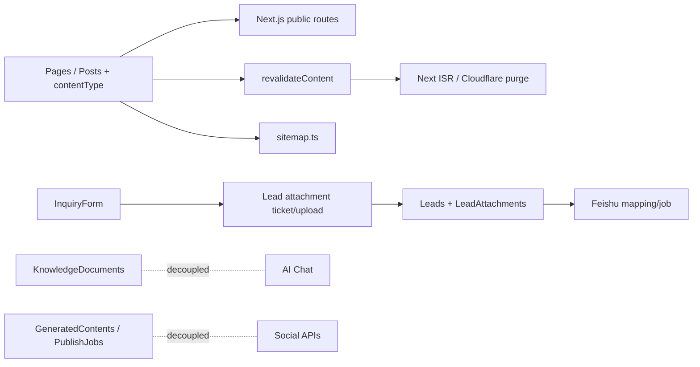

# Website/CMS v1.7 Design

## 架构边界

## 数据与路由设计

- `Posts` 保持集合级 slug 唯一，新增 `contentType`（建议 `news | knowledge`，默认 `news`）或等价稳定标识；既有 News 数据默认不变。
- `getPosts`、`getPostBySlug` 增加显式内容类型过滤；Knowledge 使用 `/[locale]/knowledge` 和 `/[locale]/knowledge/[slug]`，News 继续使用 `/news`。
- `revalidateContent.ts` 的 `localizedPaths('posts', doc)` 根据内容类型返回 News 或 Knowledge 列表/详情路径。
- `sitemap.ts` 按内容类型写入 URL；阿语条目由最小完整度谓词控制，英文条目保持现有规则。
- Capabilities/For Professionals 复用 `Pages` 或页面 manifest，增加结构化 blocks/数组字段；固定 TSX 骨架只消费已验证字段，缺失字段隐藏区块。

## 导航与询盘

- `SiteHeader` 的静态项改为固定顺序；Logo 进入 Home，CTA 进入 `/contact`，按钮文案从 `quote` 改为 `uploadDrawing`（英文/阿语均提供本地化值）。
- InquiryForm 保留匿名 ticket/upload/associate 链路；附件为 optional，使用现有 API，新增进度/取消/单文件重试状态，不改变 Lead 幂等和 Feishu 稳定链接。

## 安全、性能与运维

- 继续使用 Portal 鉴权下载和私有存储；不得生成公开 CDN 文件 URL。
- 阿语技术值统一以 `dir="ltr"` 容器渲染；回退不等于可索引，hreflang/sitemap 只接受达到完整度的阿语页面。
- Portal 徽标采用单次批量查询或 SQL 聚合；加入查询次数断言。
- 附件清理仍由 `scripts/` 手动执行，支持 `--dry-run`、统计、失败退出码和审计日志；不接入 worker 周期调度。

## 测试策略

- 单元：contentType 路由分流、revalidate path、sitemap、阿语完整度、导航顺序、CTA 文案、结构化字段校验。
- 集成：Posts/Pages Portal CRUD、Knowledge 发布缓存失效、附件进度状态与批量徽标查询。
- E2E：英文/阿语公开导航、News 旧 URL、Knowledge 发布后可见、无图纸询盘、附件失败重试、未登录附件下载跳转。

## 版本锚定

- Next.js `16.2.6`、Payload `3.86.0`、React `19.2.6`、Tailwind CSS `4.3.3`。
- 只使用仓库已安装依赖；不引入新的上传库或后台调度框架。
